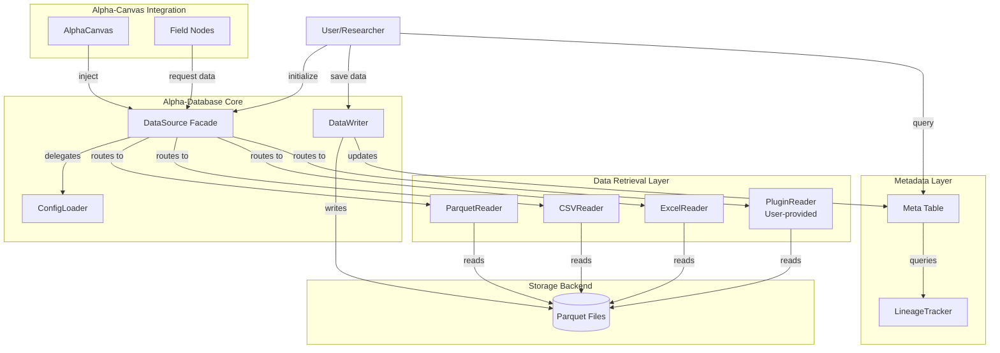
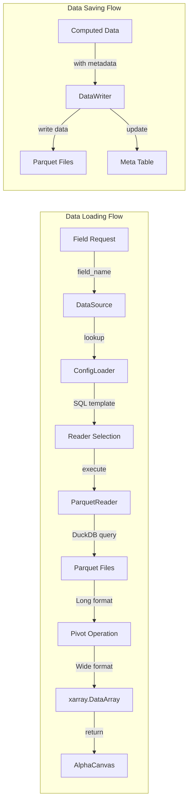
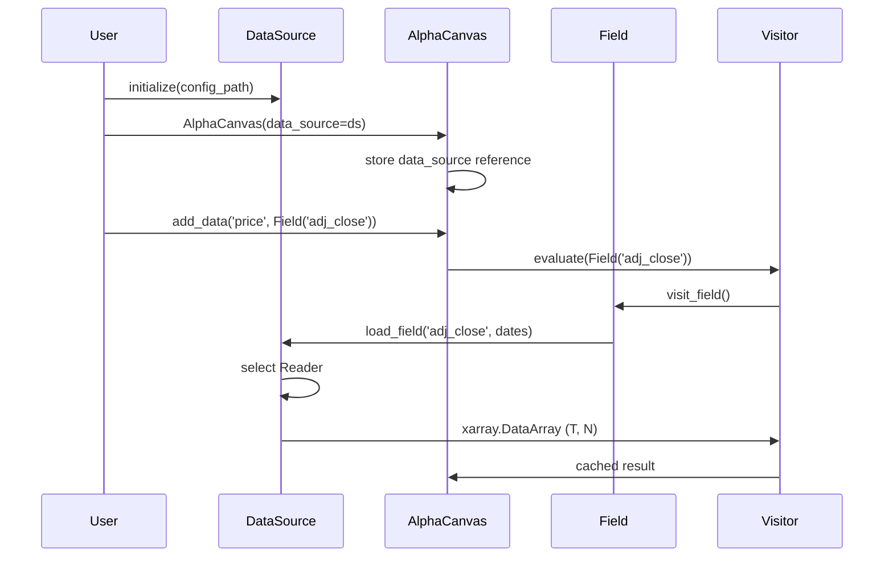

# Alpha-Database 아키텍처 (Architecture)

## 1. 시스템 개요

### 1.1. 컴포넌트 다이어그램 (Simplified)



### 1.2. 데이터 흐름 다이어그램



## 2. 핵심 컴포넌트

### A. `DataSource`: 통합 데이터 퍼사드 (Facade) 🏛️

**역할**: 모든 데이터 소스를 통합하는 단일 인터페이스입니다. alpha-canvas의 "데이터 의존성 주입(Dependency Injection)" 진입점입니다.

**소유 컴포넌트**:
1. **`ConfigLoader`**: alpha-database 자체 config loader (alpha-canvas와 독립적)
2. **`ReaderRegistry`**: Reader 인스턴스 매핑 및 라우팅 (plugin 지원)
3. **`DataLoader`**: Long→Wide 피벗팅 및 xarray 변환

**중요**: alpha-database는 alpha-canvas의 config에 의존하지 않습니다. 자체 ConfigLoader를 가지며, alpha-canvas에 Dependency Injection으로 주입됩니다.

**책임**:
- Config 기반 Reader 자동 선택
- 파라미터 치환 (`start_date`, `end_date`)
- 데이터 형식 통일 (xarray.DataArray 반환)
- alpha-canvas와의 통합 인터페이스 제공
- **Plugin Reader 등록 및 관리**

### B. `BaseReader`: Reader 추상 인터페이스 📖

**역할**: 모든 데이터 소스 Reader의 공통 인터페이스입니다.

**설계 원칙**:
- **독립 구현**: 각 Reader는 완전히 독립적 (상속 계층 최소화)
- **일관된 출력**: 모두 Long 포맷 DataFrame 반환
- **파라미터 통일**: `query`, `params` 인터페이스 표준화

**Core vs Plugin Architecture**:

**Core Readers** (alpha-database 패키지에 포함):
- **ParquetReader**: DuckDB SQL on Parquet files
- **CSVReader**: CSV files
- **ExcelReader**: Generic Excel files

**특징**:
- 모든 설치에 포함 (필수)
- 외부 의존성 최소화
- 높은 안정성 및 backward compatibility 보장

**Additional Readers** 
- **alpha-database-fnguide**: FnGuide Excel reader 
- **alpha-database-bloomberg**: Bloomberg reader 

### C. `DataWriter`: 단일 데이터 저장 인터페이스 💾

**역할**: 모든 타입(field, alpha, factor)의 데이터를 영구 저장합니다.

**설계 철학**:
- **단일 인터페이스**: `write()` 메서드 하나로 모든 타입 처리
- **명시적 타입**: `data_type` 파라미터로 타입 지정
- **명시적 의존성**: 사용자가 `dependencies` 제공
- **자동 버전 관리**: alpha/factor는 자동 버전 관리

**사용 패턴**:
```python
writer = DataWriter(base_path='./data')

# Field 저장
writer.write(
    dataset_name='fundamental',
    field_name='pbr',
    data=pbr_array,
    data_type='field',
    dependencies=['adj_close', 'book_value']  # Explicit!
)

# Alpha 저장 (auto-versioning)
writer.write(
    dataset_name='momentum_ma5_rank',
    data_type='alpha',
    data={
        'signal': signal_array,
        'weights': weights_array,
        'returns': returns_array
    },
    dependencies=['returns'],  # Explicit!
    metadata={'expression': expr_dict, ...}  # Pre-serialized by alpha-canvas
)

# Factor 저장
writer.write(
    dataset_name='fama_french_smb',
    data_type='factor',
    data=factor_returns,  # (T,) time series
    dependencies=['adj_close', 'book_value'],  # Explicit!
    metadata={...}
)
```

**책임**:
- Parquet 파일로 데이터 저장
- Meta Table 자동 업데이트
- 버전 관리 (alpha/factor)
- Schema evolution (field)
- Upsert 로직

### D. `Meta Table`: 중앙 메타데이터 레지스트리 📊

**역할**: 모든 데이터 엔티티(field, alpha, factor)의 메타데이터를 **단일 Parquet 테이블**로 관리합니다.

**스키마**:
```python
{
    'name': str,           # 'fundamental.pbr', 'momentum_v1'
    'type': str,           # 'field', 'alpha', 'factor'
    'location': str,       # File path
    'dependencies': list,  # User-provided list of field names
    'created': datetime,
    'updated': datetime,
    'description': str,
    'tags': list,
    'version': int         # For alphas/factors (optional)
}
```

**설계 철학**:
- **단순성**: 복잡한 ORM 대신 Parquet 테이블 사용
- **효율성**: DuckDB SQL로 빠른 쿼리
- **확장성**: 스키마 진화 용이
- **명시적**: 자동 추출 없음, 사용자 제공 데이터만 저장

### E. `LineageTracker`: 의존성 그래프 관리 🔗

**역할**: 명시적으로 제공된 의존성을 추적하고 impact analysis를 제공합니다.

**핵심 기능**:
1. **find_dependents()**: 특정 필드에 의존하는 모든 엔티티 찾기
2. **find_dependencies()**: 특정 엔티티가 의존하는 모든 필드 찾기 (1-level, non-recursive)
3. **get_impact()**: 데이터 변경 시 영향 받는 엔티티 (위상 정렬)
4. **get_lineage()**: 전체 계보 경로 반환 (명시적 링크만)

**중요**: **Expression 파싱 없음!** 사용자가 `write()` 시 제공한 `dependencies`만 사용합니다.

**구현 방식**:
- Meta Table의 `dependencies` 컬럼 활용
- 그래프 순회 알고리즘 (DFS/BFS)
- 순환 의존성 감지

## 3. 데이터 모델 아키텍처

### A. Config-Driven Data Loading

**설계 목표**:
- **선언적 정의**: YAML로 데이터 소스 정의
- **동적 파라미터**: 런타임 날짜 범위 주입
- **소스 독립성**: Reader 구현 숨김

**Config 구조**:
```yaml
field_name:
  reader: parquet | csv | excel | fnguide_excel  # Plugin도 가능
  query: SQL template with {start_date}, {end_date}
  time_col: date
  asset_col: security_id
  value_col: field_value
```

**데이터 흐름**:
```
ConfigLoader (YAML 파싱)
    ↓
DataSource (Reader 선택)
    ↓
BaseReader.read() (소스별 로직)
    ↓
Long DataFrame (date, security_id, value)
    ↓
DataLoader.pivot() (Wide 변환)
    ↓
xarray.DataArray (T, N)
```

### B. Single Writer Pattern

**설계 목표**:
- **단순성**: 하나의 `write()` 메서드로 모든 타입 처리
- **명시성**: `data_type` 파라미터로 명확한 타입 지정
- **확장성**: 새 타입 추가 시 메서드 추가 불필요

**타입별 처리 로직**:
```python
class DataWriter:
    def write(
        self,
        dataset_name: str,
        data: Union[xr.DataArray, Dict[str, xr.DataArray]],
        data_type: Literal['field', 'alpha', 'factor'],
        dependencies: List[str],  # Explicit!
        metadata: Optional[Dict] = None,
        field_name: Optional[str] = None  # For 'field' type
    ):
        if data_type == 'field':
            self._write_field(...)
        elif data_type == 'alpha':
            self._write_alpha(...)
        elif data_type == 'factor':
            self._write_factor(...)
        else:
            raise ValueError(f"Unknown data_type: {data_type}")
        
        # Always update meta table
        self._update_meta_table(...)
```

### C. Explicit Dependency Model

**설계 철학**: **Explicit over Implicit**

**사용자가 제공**:
```python
writer.write(
    ...,
    dependencies=['adj_close', 'book_value']  # User explicitly provides
)
```

**alpha-database가 하지 않는 것**:
- ❌ Expression tree 파싱
- ❌ Field 자동 추출
- ❌ 재귀적 의존성 계산

**이유**:
1. **단순성**: Expression 구조를 몰라도 됨
2. **Loose Coupling**: alpha-canvas와 독립적
3. **명확성**: 사용자가 의존성을 명시적으로 관리
4. **유지보수성**: Expression 변경에 영향 받지 않음

**Alpha-canvas Integration (Visitor Pattern)**:
```python
# alpha-canvas에서 의존성 추출 (Visitor Pattern 사용)
expr = Rank(TsMean(Field('returns'), window=5))

# Option 1: Visitor로 직접 추출
extractor = DependencyExtractor()
expr.accept(extractor)
dependencies = list(set(extractor.dependencies))
# Returns: ['returns']

# Option 2: Convenience wrapper 사용
dependencies = expr.get_field_dependencies()  # Internally uses DependencyExtractor
# Returns: ['returns']

# alpha-database에 명시적 전달
writer.write(..., dependencies=dependencies)
```

### D. Meta Table Architecture

**설계 철학**:
- **단일 진실 소스(Single Source of Truth)**: 모든 메타데이터를 하나의 테이블에
- **간단한 스키마**: 관계형 복잡도 최소화
- **쿼리 친화적**: DuckDB SQL로 유연한 검색

**자동 업데이트 메커니즘**:
```
DataWriter.write() 호출
    ↓
데이터 저장 (Parquet)
    ↓
Meta Table 레코드 생성/업데이트
    ↓
의존성 정보 저장 (user-provided)
```

**쿼리 패턴**:
```python
# Type 필터링
meta.query(type='alpha')

# 의존성 검색
meta.find_dependents('adj_close')

# Tag 검색
meta.search(tags__contains='momentum')

# Lineage (1-level, explicit links only)
lineage = meta.get_lineage('momentum_v1')
# Returns: {'momentum_v1': ['returns']}  # From user-provided dependencies
```

## 4. 통합 아키텍처

### A. Alpha-Canvas 통합

**통합 패턴**: Dependency Injection



**Backward Compatibility**:
- **Phase 1**: Dual mode (alpha-canvas 내장 loader 유지)
- **Phase 2**: 모든 테스트를 alpha-database로 전환
- **Phase 3**: 내장 loader 제거

### B. Alpha-Lab 통합

**통합 패턴**: Read-Only Data Consumer


**데이터 흐름**:
1. alpha-canvas가 알파 계산
2. 사용자가 alpha-database로 결과 저장
3. alpha-lab이 저장된 데이터를 로드하여 분석
4. alpha-lab은 alpha-canvas 내부 접근 금지 (공개 API만)

## 5. 기능별 아키텍처 구현 및 상태

### 📋 **P0: Data Retrieval - PLANNED**

**상태**: 설계 완료, 구현 대기

**컴포넌트**:
- ConfigLoader (alpha-canvas에서 포팅)
- DataLoader (alpha-canvas에서 포팅)
- DataSource facade (NEW)
- ParquetReader, CSVReader, ExcelReader (NEW)
- Plugin registration system (NEW)

**통합 지점**:
- AlphaCanvas 생성자에 `data_source` 파라미터 추가
- Field 노드가 DataSource 호출하도록 수정

---

### 📋 **P1: Data Storage - PLANNED**

**상태**: 설계 완료, 구현 대기

**컴포넌트**:
- DataWriter (단일 인터페이스, NEW)
- Meta Table (central registry, NEW)
- LineageTracker (explicit dependencies only, NEW)

**Alpha-canvas 통합 (Visitor Pattern)** ✅ COMPLETED (2025-01-23):
- ✅ `SerializationVisitor` 구현 (Expression → dict)
- ✅ `DeserializationVisitor` 구현 (dict → Expression)
- ✅ `DependencyExtractor` 구현 (Field dependencies)
- ✅ Convenience wrappers: `Expression.to_dict()`, `Expression.from_dict()`, `Expression.get_field_dependencies()`
- ✅ alpha-database는 직렬화된 결과(dict)만 저장 (ready for integration)

---

### 📋 **P2: Lineage Tracking - PLANNED**

**상태**: 설계 완료, 구현 대기

**컴포넌트**:
- LineageTracker (graph algorithms)
- 명시적 의존성 그래프 구조
- Impact analysis tools

**알고리즘**:
- DFS/BFS for dependency traversal (1-level)
- Topological sort for impact order
- Cycle detection

## 6. 설계 원칙 및 근거

### 6.1. 왜 Plugin Architecture인가?

**원칙**: Core readers만 내장, 특수 readers는 plugin으로 제공합니다.

**근거**:
1. **유지보수성**: 특수 포맷이 변경되어도 core 영향 없음
2. **확장성**: 사용자가 자유롭게 reader 추가
3. **책임 분리**: alpha-database는 표준 포맷만 지원
4. **경량화**: 불필요한 의존성 제거

### 6.2. 왜 Single Writer인가?

**원칙**: `DatasetWriter`, `AlphaWriter`, `FactorWriter` 3개 대신 `DataWriter` 하나 사용합니다.

**근거**:
1. **단순성**: 저장 로직은 대부분 동일, 메타데이터만 다름
2. **일관성**: 모든 타입이 동일한 인터페이스 사용
3. **확장성**: 새 타입 추가 시 클래스 추가 불필요
4. **명시성**: `data_type` 파라미터로 의도 명확

**트레이드오프**:
- ✅ 단순한 API
- ✅ 적은 코드 중복
- ❌ 타입별 특화 메서드 없음 (metadata로 해결)

### 6.3. 왜 Explicit Dependencies인가?

**원칙**: Expression 자동 파싱 대신 사용자가 dependencies 제공합니다.

**근거**:
1. **Loose Coupling**: alpha-canvas Expression 구조를 몰라도 됨
2. **단순성**: 복잡한 파싱 로직 불필요
3. **명확성**: 사용자가 의존성을 명시적으로 관리
4. **유연성**: Expression 외 다른 소스도 지원 가능

**Alpha-canvas 지원 (Visitor Pattern)**:
```python
# alpha-canvas가 DependencyExtractor Visitor 제공
expr = Rank(TsMean(Field('returns'), window=5))

# Visitor로 의존성 추출
deps = expr.get_field_dependencies()  # Internally uses DependencyExtractor visitor
# Returns: ['returns']

# 사용자가 alpha-database에 명시적 전달
writer.write(..., dependencies=deps)
```

### 6.4. 왜 Data Fetching을 제외했나?

**원칙**: 외부 API 데이터 수집은 alpha-database 범위 밖입니다.

**근거**:
1. **책임 분리**: Database는 영속성, Fetching은 ETL
2. **복잡도 감소**: API 통합, 재시도, 스케줄링은 별도 도구의 역할
3. **단순성**: alpha-database는 이미 저장된 데이터만 다룸
4. **유연성**: 사용자가 선호하는 ETL 도구 사용 가능

**대안**:
- 사용자가 별도 스크립트로 데이터 수집
- 수집된 데이터를 alpha-database로 저장
- 예: `ccxt` 직접 사용 → Parquet 저장 → alpha-database로 로드

### 6.5. 왜 Expression Serialization을 제외했나?

**원칙**: Expression 직렬화는 alpha-canvas의 책임입니다.

**근거**:
1. **책임 분리**: Expression은 alpha-canvas의 핵심 개념
2. **Loose Coupling**: alpha-database는 Expression 구조를 몰라도 됨
3. **변경 용이성**: Expression 구조 변경 시 alpha-database 영향 없음
4. **명시성**: alpha-canvas가 Visitor Pattern으로 직렬화 제공

**Visitor Pattern for Serialization** ✅ IMPLEMENTED (2025-01-23):

alpha-canvas는 **Visitor Pattern**을 사용하여 Expression 직렬화를 구현했습니다:

```python
# In alpha-canvas (alpha-canvas의 책임)

# 1. Visitor로 직렬화
expr = Rank(TsMean(Field('returns'), window=5))
serializer = SerializationVisitor()
expr_dict = expr.accept(serializer)
# Returns: {
#   'type': 'Rank',
#   'child': {
#     'type': 'TsMean',
#     'child': {'type': 'Field', 'name': 'returns'},
#     'window': 5
#   }
# }

# 2. Convenience wrapper (optional)
expr_dict = expr.to_dict()  # Internally calls SerializationVisitor

# 3. alpha-database는 결과만 저장
writer.write(..., metadata={'expression': expr_dict})
```

**Visitor Pattern 이점**:
1. ✅ **Separation of Concerns**: Expression 클래스는 직렬화 로직과 분리
2. ✅ **확장성**: 새 직렬화 형식(YAML, Binary) 추가 시 새 visitor만 추가
3. ✅ **유지보수성**: 직렬화 로직이 `SerializationVisitor` 한 곳에 집중
4. ✅ **기존 인프라 활용**: `EvaluateVisitor`와 동일한 패턴 사용

**Alpha-canvas 구현 구조**:
```
alpha_canvas/core/serialization.py (NEW)
├── SerializationVisitor     # Expression → dict
├── DeserializationVisitor   # dict → Expression
└── DependencyExtractor      # Extract Field dependencies

alpha_canvas/core/expression.py (UPDATED)
└── Expression.to_dict()     # Convenience wrapper (calls SerializationVisitor)
```

### 6.6. 왜 Dependency Injection인가?

**원칙**: AlphaCanvas가 DataSource를 내부 생성하지 않고 외부에서 주입받습니다.

**근거**:
1. **Loose Coupling**: alpha-canvas와 alpha-database 분리
2. **테스트 용이**: Mock DataSource로 테스트 가능
3. **유연성**: 런타임에 DataSource 교체 가능
4. **SOLID 원칙**: Dependency Inversion Principle

**패턴**:
```python
# Explicit, testable, flexible
ds = DataSource(config_path='config/data.yaml')
rc = AlphaCanvas(data_source=ds)
```

---

## 7. 미래 확장

### 7.1. Multi-Backend Support (P3)

**목표**: Parquet 외 PostgreSQL, ClickHouse 등 지원

**아키텍처**:
- Reader 인터페이스는 동일 유지
- Backend별 최적화 쿼리 구현
- Config에서 backend 선택 가능

### 7.2. Data Quality Checks (P3)

**목표**: 데이터 무결성 자동 검증

**기능**:
- Null 비율 체크
- Outlier 감지
- Schema 검증
- 시계열 갭 감지

### 7.3. Advanced Plugin System (P3)

**목표**: Plugin 생태계 구축

**기능**:
- Plugin marketplace
- Version management
- Dependency resolution

---

**Architecture Version**: 2.0 (Simplified)  
**Last Updated**: 2025-01-23  
**Core Principle**: **alpha-database는 데이터 CRUD와 쿼리에만 집중합니다.**
