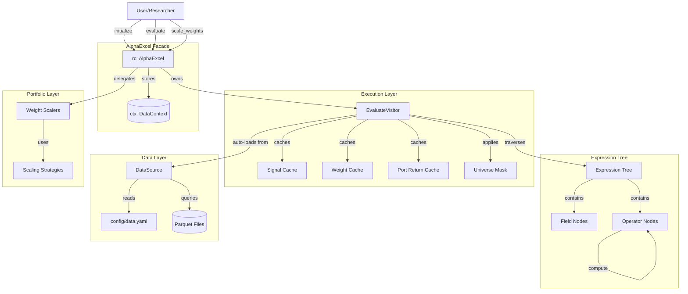
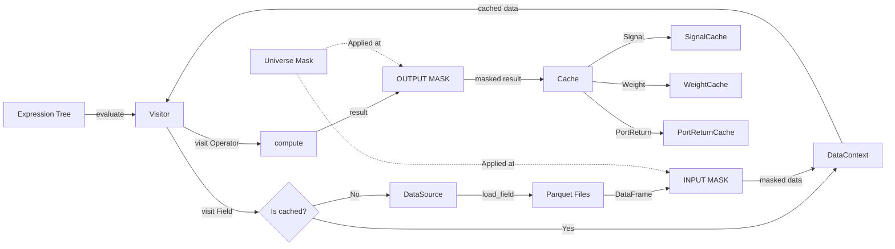
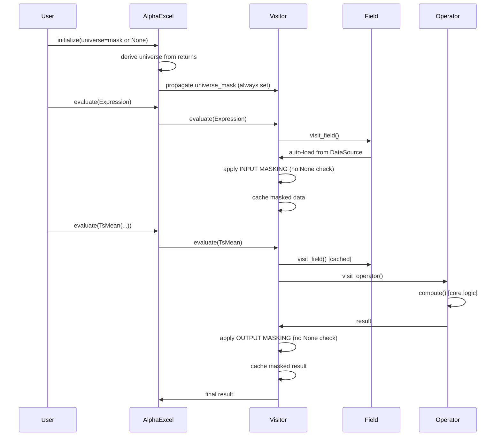
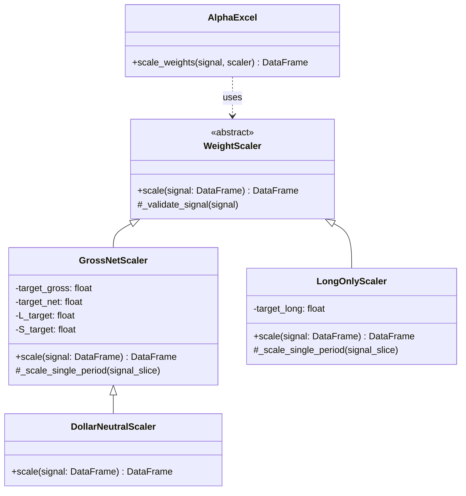

# 2. 아키텍처 (Architecture)

## 2.0. 개요

alpha-excel은 **Facade**, **Composite**, **Visitor** 디자인 패턴을 기반으로 설계되었습니다. 핵심은 **pandas 기반 데이터 모델**과 **자동 로딩** 메커니즘입니다.

### 2.0.1. 전체 시스템 아키텍처



### 2.0.2. 데이터 흐름 아키텍처



---

## 2.1. 핵심 컴포넌트

### A. `AlphaExcel` (`rc` 인스턴스): Facade 패턴

**역할:** `rc` 인스턴스는 "시그널 캔버스"로서 모든 작업을 위한 **단일 진입점(Facade)**입니다.

**핵심 컴포넌트:**
1. **`rc.ctx` (State):** `DataContext` 인스턴스. `(time, asset)` 형태의 모든 데이터를 pandas DataFrame으로 `dict` 형식으로 저장합니다.
2. **`rc._evaluator` (Executor):** `EvaluateVisitor`의 인스턴스. `Expression` "트리"를 "방문"하여 "평가"합니다.
3. **`rc._data_source` (DataSource):** `alpha_database.DataSource` 인스턴스. Parquet 파일에서 데이터를 로딩합니다.
4. **`rc._universe_mask` (Universe):** `(T, N)` Boolean DataFrame. 모든 연산에 자동 적용됩니다.

**API 메서드:**
- `rc.evaluate(expr)`: Expression 평가 및 자동 데이터 로딩
- `rc.scale_weights(signal, scaler)`: 시그널을 포트폴리오 가중치로 변환
- `rc.get_signal(step)`: 특정 step의 signal 반환
- `rc.get_weights(step)`: 특정 step의 weights 반환
- `rc.get_port_return(step)`: 특정 step의 portfolio return 반환

---

### B. `Expression` 트리: Composite 패턴

**역할:** "수식" 또는 "트리"입니다. **Composite 패턴**으로 데이터 흐름을 표현합니다.

**구조:**
- `Expression`은 모든 노드의 부모 인터페이스입니다.
- **Leaf (잎):** `Field('close')`는 단일 데이터 소스 노드입니다.
- **Composite (가지):** `TsMean(Field('close'), 10)`는 단일 또는 여러 `Expression` 인스턴스를 자식으로 가지는 트리 구조입니다.

**특징:**
- `Expression` 인스턴스는 항상 데이터(`(T, N)` 형태)를 반환할 준비가 되어 있으며, "수식 자체"를 담고 있을 뿐입니다.

**예시:**
```python
from alpha_excel import Field, TsMean, Rank

# Leaf node
returns = Field('returns')

# Composite node
ma5 = TsMean(returns, window=5)

# Nested composite
signal = Rank(ma5)
```

---

### C. `Visitor` 패턴: 순회 및 평가

**역할:** `Expression` 트리(트리)를 "방문(visit)"하여 **데이터 흐름 및 평가 로직**을 처리합니다.

**`EvaluateVisitor`:** `rc` 인스턴스(`rc._evaluator`)가 소유하며, `Expression` 트리를 순회하며 다음을 처리합니다:

1. **트리 순회(Traversal):** Depth-first로 모든 노드를 차례로 방문
2. **자동 로딩(Auto-loading):** Field 노드 방문 시 DataSource에서 데이터 로딩
3. **계산 위임(Delegation):** 각 연산의 `compute()` 메서드를 호출하여 실제 계산 수행
4. **Universe 적용(Universe Application):** 입력 시와 출력 시 universe mask 자동 적용
5. **상태 수집(State Collection):** 중간 결과를 캐시에 저장하여 추적 가능

**방문 메서드:**
- `visit_field()`: Field 노드 처리 (자동 로딩 + INPUT MASKING)
- `visit_operator()`: 연산자 노드 처리 (계산 + 캐싱 + OUTPUT MASKING)
- `visit_constant()`: Constant 노드 처리 (상수 DataFrame 생성)

**자동 로딩 메커니즘:**
```python
def visit_field(self, field: Field) -> pd.DataFrame:
    # 1. 캐시 확인
    if field.name in self.ctx:
        data = self.ctx[field.name]
    else:
        # 2. DataSource에서 로딩
        data = self._data_source.load_field(
            field.name,
            self.start_date,
            self.end_date
        )
        # 3. INPUT MASKING
        data = data.where(self._universe_mask, np.nan)
        # 4. 캐시에 저장
        self.ctx[field.name] = data

    return data
```

---

### D. Operator 책임 분리

**설계 원칙:** 각 연산(`Expression`)은 순수한 계산 로직만 `compute()` 메서드로 제공합니다.

**Visitor의 역할:**
- 트리 순회 로직
- 데이터 로딩
- 캐싱 관리
- Universe masking

**Operator의 역할:**
- 순수 계산 로직 (`compute()` 메서드)
- Visitor 패턴 준수 (`accept()` 메서드)

**장점:**
1. **단일 책임 원칙(SRP):** Visitor는 순회만, Operator는 계산만
2. **테스트 용이성:** `compute()` 메서드를 독립적으로 테스트 가능
3. **유지보수성:** Visitor가 변경되어도 Operator는 영향 없음
4. **확장성:** 새로운 연산 추가 시 Visitor 수정 불필요

---

## 2.2. 데이터 모델 아키텍처

### A. `DataContext`

`DataContext`는 `alpha-excel`의 핵심 데이터 컨테이너로, 모든 중간 **dict-like 인스턴스**입니다.

**좌표(Coordinates):** 모든 데이터는 `(dates, assets)` 좌표를 공유합니다 (pandas Index 기반).

**데이터 저장(Data Variables):**
- `rc.ctx['name']` 형식으로 DataFrame 접근 가능
- Field 방문 시 자동으로 DataSource에서 로딩하여 저장
- 예시: `rc.ctx['returns']`는 최초 방문 시 자동 로딩됨

**사용 예시:**
```python
# AlphaExcel 초기화
rc = AlphaExcel(data_source=ds, start_date='2024-01-01', end_date='2024-12-31')

# Expression 평가 시 자동으로 ctx에 저장
result = rc.evaluate(Field('returns'))

# 직접 접근 가능
returns_data = rc.ctx['returns']  # pandas DataFrame (T, N)
```

---

### B. 자동 로딩 패턴 (Auto-Loading Pattern)

**Lazy Loading:**
- Field 최초 참조 시에만 DataSource.load_field() 호출
- 이미 로딩된 데이터는 DataContext에서 재사용
- 불필요한 데이터 로딩 방지로 성능 최적화

**자동 로딩 흐름:**
```
Field('returns') 방문
    ↓
DataContext에 'returns' 존재?
    ↓ (No)
DataSource.load_field('returns')
    ↓
Parquet 파일 쿼리
    ↓
Long → Wide 변환 (date × security_id → time × asset)
    ↓
INPUT MASKING (universe 적용)
    ↓
DataContext에 저장 (캐싱)
```

**장점:**
- **효율성:** 필요한 데이터만 로딩
- **투명성:** 사용자는 데이터 로딩을 의식할 필요 없음
- **캐싱:** 동일 Field 재사용 시 즉시 반환

---

### C. Universe Masking

**Investable Universe**는 alpha-excel의 핵심 개념입니다. 모든 데이터와 결과는 universe를 기준으로 필터링됩니다.

#### 1. 핵심 전략: Double Masking

**설계 원칙:** 신뢰 체인(Trust Chain)을 구축하여 모든 데이터가 universe를 보장하도록 합니다.

**INPUT MASKING (입력 마스킹):** `visit_field()`에서 데이터 로딩 시 적용
- 모든 데이터가 시스템에 진입하는 순간 마스킹
- `result = result.where(universe_mask, np.nan)`

**OUTPUT MASKING (출력 마스킹):** `visit_operator()`에서 연산 결과 시 적용
- 연산 결과가 출력되기 전에 universe를 보장하도록 재적용
- Operator 결과에 대한 마스킹 보장

#### 2. 불변성 (Immutability)

- **최초 설정만 가능:** `AlphaExcel(universe=...)` 초기화 시 한 번만 설정
- **변경 불가:** 한번 설정된 universe는 변경 불가 (read-only property로 제공)
- **이유:** 일관성 있는 PnL 분석과 재현성을 위해 고정된 universe 필요

#### 3. None 처리 간소화

**기존 방식 (alpha-canvas):** `if self._universe_mask is not None:` 체크 필요

**alpha-excel 방식:** AlphaExcel 초기화 시 반드시 universe_mask 설정
- 명시적 설정: 사용자가 DataFrame으로 제공
- 자동 파생: `~returns.isna()`로 자동 생성

**결과:** 모든 코드에서 None 처리 간소화됨

#### 4. 아키텍처 흐름



#### 5. 멱등성 (Idempotency)

**특징:** Double masking이 멱등성을 가짐 (데이터 중복 마스킹 안전)
```python
data.where(mask, np.nan).where(mask, np.nan) == data.where(mask, np.nan)
```
마스킹된 데이터를 재마스킹해도 결과 동일

#### 6. Auto-Loading 통합

- **자동 로딩된 데이터도 마스킹:** Field 노드에서 데이터 로딩 후 즉시 INPUT MASKING 적용
- **일관성:** 모든 데이터 진입점(최초 로딩, 캐시 로딩)에서 동일하게 마스킹

---

### D. 데이터 로딩 아키텍처 (Data Loading Architecture)

**DataSource 컴포넌트**는 Parquet 파일 기반 데이터 계층을 담당합니다.

#### 1. 핵심 개념

- **파일 기반 DB:** MVP에서는 Parquet 파일을 DB로 사용
- **Config 기반:** `config/data.yaml`에 데이터 소스 정의
- **형식 변환:** alpha_database가 Long 포맷을 Wide 포맷 `(T, N)`으로 변환
- **pandas 출력:** pandas DataFrame으로 출력 (xarray 변환 불필요)

#### 2. 아키텍처 흐름

```
config/data.yaml (Field 정의)
        ↓
DataSource.load_field(field_name)
        ↓
   DuckDB 쿼리
   (Parquet 파일 읽기)
        ↓
   Long → Wide 변환
   (date × security_id → time × asset)
        ↓
   pandas.DataFrame 출력 (T, N)
        ↓
   EvaluateVisitor (INPUT MASKING)
        ↓
   DataContext에 캐시
```

#### 3. Visitor 통합 흐름

**Field 노드 방문 로직:**
1. **캐시 확인:** DataContext에 이미 로딩된 데이터인지 확인
2. **자동 로딩:** 없으면 DataSource.load_field()를 호출하여 Parquet에서 로딩
3. **Reindex:** dates와 assets로 reindex하여 차원 정렬
4. **INPUT MASKING:** Universe mask 적용 (반드시 적용, None 처리 불필요)
5. **캐싱:** DataContext에 저장하여 재사용

**핵심 특징:**
- **Lazy Loading:** 필요할 때만 Parquet 파일 읽기
- **Caching:** 한 번 로딩한 데이터는 DataContext에 캐시
- **Universe Integration:** 데이터 진입 즉시 자동 마스킹

---

## 2.3. 기능별 아키텍처 상세 설명

### F1: 자동 데이터 로딩 (Config-Driven Auto-Loading)

**구현 방식:** DataSource + Auto-loading + Lazy evaluation

**동작 흐름:**
1. `rc` 초기화 시 DataSource 인스턴스를 전달받습니다.
2. `rc.evaluate(TsMean(Field('returns'), 5))` 호출 시:
   - `EvaluateVisitor`가 `Field('returns')` 노드를 방문
   - DataContext에 'returns'가 없으면 자동으로 DataSource.load_field('returns') 호출
   - 로딩된 데이터는 INPUT MASKING 적용
   - DataContext에 캐시
3. 이후 동일 Field 호출 시 캐시에서 재사용

**핵심 구현:** DataSource 통합, Field 자동 로딩, 캐싱

---

### F2: Expression-Only API

**구현 방식:** 명시적 데이터 등록 단계 제거, Expression 평가로 완결

**비교:**
```python
# 기존 방식 (명시적 등록 필요)
rc.add_data('returns', Field('returns'))
rc.add_data('ma5', TsMean(Field('returns'), 5))
result = rc.data['ma5']

# alpha-excel 방식 (Expression only)
result = rc.evaluate(TsMean(Field('returns'), 5))
```

**핵심 구현:** evaluate() 메서드만으로 완결

---

### F3: Triple-Cache Architecture

**구현 방식:** 캐시 기반 step 추적, 계층적 재계산 아키텍처

#### 1. 핵심 개념

캐시 구조가 견고하고(robust), 예측 가능하며(predictable), 타입 안전합니다(type-safe).

#### 2. Stateful Visitor

`rc._evaluator` (Visitor)는 **"Stateful(상태 유지)"** 인스턴스입니다.

#### 3. Triple-Cache 구조

`EvaluateVisitor`는 PnL 추적을 위해 세 가지 캐시를 관리합니다:

**Signal Cache (영속적):**
```python
_signal_cache: dict[int, tuple[str, pd.DataFrame]]
```
- 키: **캐시 step 좌표** (0부터 순차)
- 값: `(노드_이름, signal_DataFrame)` 튜플
- **영속성:** scaler 변경 시에도 재사용 (불변성)

**Weight Cache (갱신 가능):**
```python
_weight_cache: dict[int, tuple[str, Optional[pd.DataFrame]]]
```
- 키: **캐시 step 좌표** (0부터 순차)
- 값: `(노드_이름, weights_DataFrame or None)` 튜플
- **갱신성:** scaler 변경 시 재계산됨
- **Optional:** scaler가 제공되지 않으면 None으로 저장

**Portfolio Return Cache (갱신 가능):**
```python
_port_return_cache: dict[int, tuple[str, Optional[pd.DataFrame]]]
```
- 키: **캐시 step 좌표** (0부터 순차)
- 값: `(노드_이름, port_return_DataFrame or None)` 튜플
- **갱신성:** scaler 변경 시 재계산됨
- **Shape:** `(T, N)` 형태 (position-level returns)

#### 4. 캐싱 로직

Visitor는 `Expression` 트리를 **Depth-first 순회**하면서 **각 노드를 평가할 때마다 중간 결과를 순차적으로 캐시**합니다.

**예시 Expression:** `Rank(TsMean(Field('returns'), 3))`
- `signal_cache[0]` = `('Field_returns', DataFrame(...))`
- `signal_cache[1]` = `('TsMean', DataFrame(...))`
- `signal_cache[2]` = `('Rank', DataFrame(...))`
- scaler가 제공되면 각 step의 `weight_cache[i]`와 `port_return_cache[i]`도 저장

#### 5. Triple-Cache 사용 패턴

```python
# 최초 평가 with scaler
result = rc.evaluate(expr, scaler=DollarNeutralScaler())

# 각 step의 signal, weight, port_return 접근
for step in range(len(rc._evaluator._signal_cache)):
    name, signal = rc._evaluator.get_cached_signal(step)
    name, weights = rc._evaluator.get_cached_weights(step)
    name, port_return = rc._evaluator.get_cached_port_return(step)

    if weights is not None:
        daily_pnl = port_return.sum(axis=1)
        sharpe = daily_pnl.mean() / daily_pnl.std() * np.sqrt(252)
        print(f"Step {step} ({name}): Sharpe = {sharpe:.2f}")

# Scaler 변경 (재평가하지 않고 signal 재사용)
result = rc.evaluate(expr, scaler=GrossNetScaler(2.0, 0.3))
# signal_cache 동일 유지, weight_cache와 port_return_cache만 재계산
```

#### 6. Triple-Cache 핵심 장점

- **효율성:** Scaler 변경 시 signal 재계산 불필요 (캐시 재사용)
- **추적성:** 모든 step에서 signal, weight, port_return 개별 접근 가능
- **연구 친화성:** 각 signal의 독립적인 성능을 비교 검증 가능
- **분석 준비:** 단계별 attribution 분석 가능
- **선택성:** weight와 port_return 캐싱은 선택적 (scaler 없으면 None)

---

### F4: 가중치 스케일링 (Weight Scaling)

**구현 방식:** Strategy Pattern 기반의 가중치 정규화 전략

#### 1. 아키텍처 설계

**Strategy Pattern** 기반의 가중치 정규화 전략을 설계합니다.



#### 2. 대표 전략: GrossNetScaler

**제약 조건:**
- 입력: `target_gross` ($G$), `target_net` ($N$)
- 출력: Long/Short 목표 계산
  $$L_{\text{target}} = \frac{G + N}{2}, \quad S_{\text{target}} = \frac{G - N}{2}$$

**스케일링 흐름 (완전 벡터화):**
```
Signal (T, N) with arbitrary values
    ↓
Separate positive/negative (vectorized)
    ↓
Normalize: s_pos/sum(s_pos), |s_neg|/sum(|s_neg|)  [handle 0/0 → NaN → 0]
    ↓
Apply targets: weights = norm_pos * L_target - norm_neg * |S_target|
    ↓
Calculate actual_gross per row (vectorized)
    ↓
Scale to meet target: weights * (target_gross / actual_gross)
    ↓
Convert computational NaN to 0 (fillna before universe mask)
    ↓
Apply universe mask (preserves signal NaN)
    ↓
Weights (T, N) satisfying gross constraint
```

#### 3. Facade 통합

```python
class AlphaExcel:
    def scale_weights(
        self,
        signal: pd.DataFrame,
        scaler: WeightScaler
    ) -> pd.DataFrame:
        """Scale signal to portfolio weights.

        Args:
            signal: DataFrame with signal values
            scaler: WeightScaler strategy (REQUIRED - no default)

        Returns:
            (T, N) DataFrame with portfolio weights
        """
        # Apply scaling strategy (delegation)
        weights = scaler.scale(signal)
        return weights
```

---

### F5: 백테스트 (Backtesting)

**구현 방식:** Shift-mask 워크플로우, Position-level returns, Triple-cache 통합

#### 1. Shift-Mask 워크플로우

```python
# 백테스트 로직 (완전 벡터화):
# 1. Shift: 다음날 signal로 포지션 형성
weights_shifted = weights.shift(1)  # pandas shift (axis=0)

# 2. Re-mask: 최신 universe로 재마스킹 (universe 변화 가능성 대응)
final_weights = weights_shifted.where(universe_mask)

# 3. Element-wise multiply: 포지션별 수익 계산
port_return = final_weights * returns  # (T, N) shape 유지!
```

#### 2. Position-Level Returns (Shape 유지)

- Portfolio return은 `(T, N)` shape으로 유지 (자산 레벨 보존)
- Winner/loser 분석 가능 (어떤 자산이 PnL 기여?)
- On-demand 집계: `daily_pnl = port_return.sum(axis=1)`

#### 3. API 메서드

- `rc.get_port_return(step)`: Position-level returns `(T, N)` DataFrame
- `rc.get_daily_pnl(step)`: Daily PnL `(T,)` Series (on-demand 집계)
- `rc.get_cumulative_pnl(step)`: Cumulative PnL `(T,)` Series (cumsum 적용)

#### 4. Re-Masking의 중요성 (NaN Pollution 방지)

**문제:** 과거 시점에 universe에서 제외된 자산에 weight가 NaN → `NaN * return = NaN` → PnL이 NaN
**해결책:** Shift 후 최신 universe로 re-mask → 제거된 자산은 포지션 0으로
**효과:** 모든 시뮬레이션에서 NaN pollution 방지 확인

---

### F6: Serialization

**구현 방식:** SerializationVisitor, DeserializationVisitor, DependencyExtractor

**주요 컴포넌트:**

1. **SerializationVisitor:** Expression → JSON-compatible dict
   - 트리 구조를 재귀 순회
   - Nested structure 유지

2. **DeserializationVisitor:** dict → Expression 복원
   - Type dispatch로 올바른 Expression 생성
   - Recursive reconstruction

3. **DependencyExtractor:** Field 의존성 추출
   - 데이터 로딩 준비 용이
   - Lineage 추적

**사용 패턴:**
```python
# Serialization
expr = Rank(TsMean(Field('returns'), 5))
expr_dict = expr.to_dict()

# Deserialization
expr_loaded = Expression.from_dict(expr_dict)

# Dependency extraction
deps = expr.get_field_dependencies()  # ['returns']
```

---

## 2.4. 설계 원칙 및 근거

### 2.4.1. 왜 pandas DataFrame인가?

1. **친숙성(Familiarity):** 리서처들 대부분이 pandas에 익숙함
2. **생태계(Ecosystem):** 풍부한 pandas 라이브러리 활용 가능
3. **간결성(Simplicity):** xarray 학습 곡선 제거
4. **성능(Performance):** pandas의 벡터화 연산으로 충분히 빠름

### 2.4.2. 왜 자동 로딩인가?

1. **간결성(Conciseness):** add_data() 제거로 코드량 50% 감소
2. **명확성(Clarity):** Expression에만 집중, 데이터 흐름 자동
3. **효율성(Efficiency):** Lazy loading + caching으로 필요한 데이터만 로딩
4. **직관성(Intuitiveness):** "필드를 참조하면 자동으로 로딩" 자연스러운 경험

### 2.4.3. 왜 Universe Mask None 처리를 간소화했는가?

1. **보장(Guarantee):** AlphaExcel 초기화 시 반드시 universe_mask 설정
2. **간결성(Simplicity):** 모든 코드에서 중복 체크 제거
3. **성능(Performance):** 조건 분기 제거로 약간의 성능 향상
4. **명확성(Clarity):** 코드 읽기 쉬워짐

### 2.4.4. 왜 Triple-Cache인가?

1. **효율성(Efficiency):** Scaler 변경 시 signal 재계산 불필요
2. **추적성(Traceability):** 모든 step에서 signal, weight, port_return 접근
3. **연구 친화성(Research-Friendly):** 각 시그널의 성능을 비교 검증 가능
4. **분석 준비(Analytics-Ready):** 단계별 attribution 분석 가능

---
