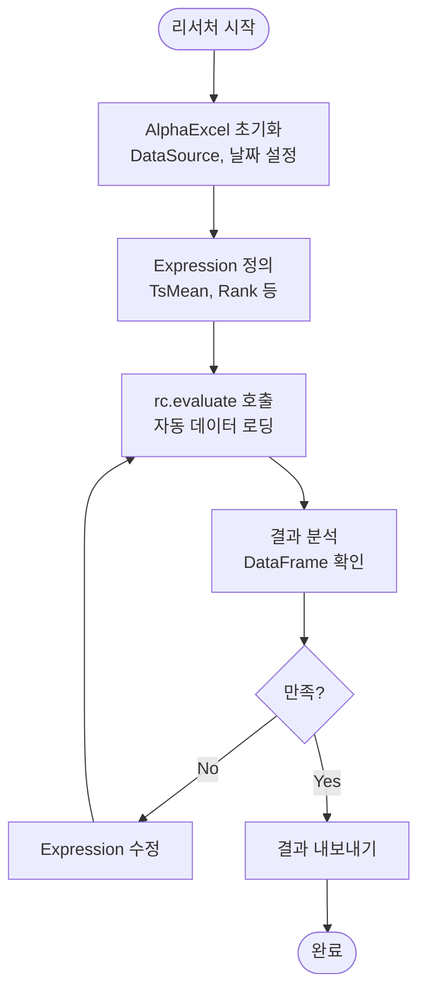
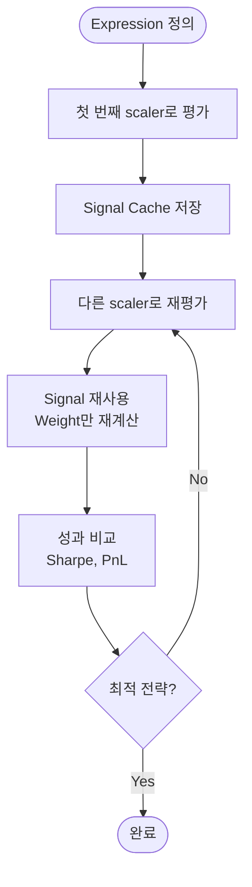
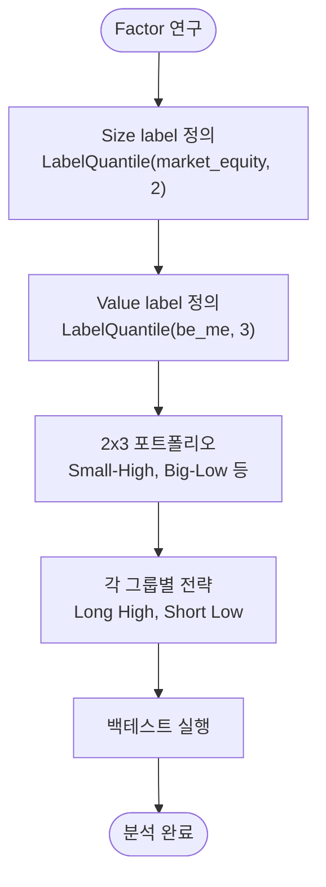

# Alpha Excel - Product Requirement Document (PRD)

## 1.1. 개요

### 제품 비전

**alpha-excel**은 퀀트 리서처를 위한 pandas 기반 시그널 생성 및 백테스트 엔진입니다. Excel처럼 직관적인 Expression API를 통해 빠르고 간결하게 알파 시그널을 생성하고, 포트폴리오 전략을 백테스트할 수 있습니다.

**핵심 가치 제안:**
- **Excel-like Expression API**: 수식처럼 간결하고 직관적인 시그널 생성
- **Config-Driven Auto-Loading**: alpha-database 기반 데이터 자동 로딩
- **Expression Trace**: 시그널 → 가중치 → 수익률 변화 과정 추적
- **Auto Universe Masking**: Field 로딩과 결과 반환 시 자동 유니버스 필터링
- **Label Quantile**: Fama-French Factor 스타일의 cross-sectional 그룹핑

### 배경

기존 xarray 기반의 alpha-canvas는 다차원 데이터 처리에 강력하지만, 불필요한 복잡성(xarray 학습 곡선, 명시적 데이터 등록)으로 인해 빠른 프로토타이핑에 장벽이 있었습니다. alpha-excel은 pandas 중심의 간결한 API로 이러한 복잡성을 제거하고, 리서처가 Expression에만 집중할 수 있도록 설계되었습니다.

---

## 1.2. 대상 사용자 (User Persona)

**페르소나:** 퀀트 리서처 / 데이터 분석가

**특징:**
- Python 및 pandas에 익숙함
- 빠른 프로토타이핑을 원함 (최소한의 설정)
- Expression 중심의 선언적 API 선호
- 시그널 생성부터 백테스트까지 신속한 iteration 필요
- Fama-French Factor 같은 학술적 전략 구현 필요

---

## 1.3. 핵심 데이터 모델

### pandas DataFrame (T, N)

alpha-excel의 모든 데이터는 `(T, N)` (시간, 자산) 형태의 pandas DataFrame입니다:
- **행 (T)**: 시계열 인덱스 (date)
- **열 (N)**: 자산 식별자 (ticker, security_id 등)

**장점:**
- pandas 생태계와 완벽 호환
- 직관적인 데이터 조작 (`.rolling()`, `.rank()` 등)
- 빠른 벡터화 연산 및 rolling 연산 혼합 가능

**예시:**
```python
# Returns 데이터: (T, N) DataFrame
#           AAPL    MSFT    GOOGL
# 2024-01-02  0.01   0.02   -0.01
# 2024-01-03 -0.02   0.00    0.03
# ...
```

---

## 1.4. 주요 기능 요구사항

### F1: Config-Driven 자동 데이터 로딩

**요구사항:**
- Field 참조 시 alpha-database DataSource에서 자동으로 데이터 로딩
- `config/data.yaml`에 정의된 데이터 소스 사용
- 명시적 데이터 등록 불필요 (No `add_data()`)

**사용 예시:**
```python
from alpha_database import DataSource
from alpha_excel import AlphaExcel, Field, TsMean

# DataSource 초기화 (config/ 디렉토리)
ds = DataSource('config')

# AlphaExcel 초기화
rc = AlphaExcel(
    data_source=ds,
    start_date='2024-01-01',
    end_date='2024-12-31'
)

# Expression 정의만으로 데이터 자동 로딩
expr = TsMean(Field('returns'), window=5)
result = rc.evaluate(expr)  # 'returns' 자동 로딩
```

**핵심 메커니즘:**
- Visitor 패턴: Expression 순회 시 Field 노드 감지
- Lazy Loading: Field 최초 참조 시 DataSource.load() 호출
- Caching: 동일 Field 재사용 시 캐시에서 로딩

---

### F2: Excel-like Expression API

**요구사항:**
- 수식처럼 직관적한 Expression 조합
- Nested Expression 지원 (TsMean, Rank, Add, Subtract 등)
- pandas method 기반 구현 (vectorized + rolling 혼합)

**지원 연산:**
- **Time-series**: `TsMean`, `TsStd`, `TsRank`, `TsDelta`
- **Cross-sectional**: `Rank`, `Demean`, `Neutralize`
- **Arithmetic**: `Add`, `Subtract`, `Multiply`, `Divide`
- **Logical**: `Greater`, `Less`, `Equal`

**사용 예시:**
```python
from alpha_excel import Field, TsMean, Rank, Subtract

# 5일 이동평균 모멘텀 시그널
ma5 = TsMean(Field('returns'), window=5)
ma20 = TsMean(Field('returns'), window=20)
momentum = Subtract(ma5, ma20)

# Cross-sectional 순위화
signal = Rank(momentum)

# 평가
result = rc.evaluate(signal)
```

**구현 원칙:**
- pandas method 우선 사용 (`.rolling()`, `.rank()` 등)
- Vectorized 연산과 rolling 연산 혼합 가능
- Universe masking 자동 적용

---

### F3: Expression Trace (신호 → 가중치 → 수익률)

**요구사항:**
- Expression 평가 과정의 각 단계를 추적
- Triple-Cache 아키텍처:
  - **Signal Cache**: 모든 중간 시그널 저장 (영속적)
  - **Weight Cache**: Scaler 적용 후 포트폴리오 가중치 (갱신 가능)
  - **Portfolio Return Cache**: 가중치 기반 포트폴리오 수익률 (갱신 가능)

**사용 예시:**
```python
from alpha_excel.portfolio import DollarNeutralScaler

# Expression 정의
expr = Rank(TsMean(Field('returns'), window=5))

# Scaler와 함께 평가 (자동 백테스트)
result = rc.evaluate(expr, scaler=DollarNeutralScaler())

# 단계별 추적
for step in range(len(rc._evaluator._signal_cache)):
    name, signal = rc.get_signal(step)          # 시그널
    name, weights = rc.get_weights(step)        # 가중치
    name, port_return = rc.get_port_return(step)  # 수익률

    if weights is not None:
        sharpe = calculate_sharpe(port_return)
        print(f"Step {step} ({name}): Sharpe = {sharpe:.2f}")
```

**핵심 메커니즘:**
- Scaler 변경 시 Signal Cache는 재사용, Weight/Return만 재계산
- 다양한 전략 빠르게 비교 가능 (동일 시그널, 다른 스케일링)

---

### F4: Auto Universe Masking

**요구사항:**
- Field 로딩 시 자동으로 universe mask 적용
- Expression output 반환 시 자동으로 universe mask 적용
- 초기화 시 한 번 설정, 모든 연산에 자동 반영

**지원 형식:**
- `pd.DataFrame`: Boolean mask (T, N) 직접 제공
- `None`: Returns에서 자동 파생 (`~returns.isna()`)

**사용 예시:**
```python
# 예시 1: 자동 유니버스 (returns 기반)
rc = AlphaExcel(ds, start_date='2024-01-01', end_date='2024-12-31')
# universe = ~returns.isna()

# 예시 2: 커스텀 유니버스 (가격/거래량 필터)
price = Field('close')
volume = Field('volume')
universe_mask = (price > 5.0) & (volume > 100000)
rc = AlphaExcel(ds, start_date='2024-01-01', universe=universe_mask)

# 모든 연산 자동 마스킹
expr = Rank(TsMean(Field('returns'), 5))
result = rc.evaluate(expr)  # universe 외 영역은 NaN
```

**핵심 메커니즘:**
- Field 로딩 시: `data.where(universe, np.nan)`
- Expression 출력 시: `output.where(universe, np.nan)`
- Cross-sectional 연산 (Rank, Demean)은 universe 내에서만 수행

---

### F5: Label Quantile (Fama-French Factor)

**요구사항:**
- Cross-sectional quantile 기반 그룹 라벨링
- Fama-French Factor 스타일의 포트폴리오 구성 지원
- On-the-fly group assignment (동적 그룹핑)

**사용 예시:**

```python
from alpha_excel import Field, LabelQuantile

# Size factor: Market Equity를 [Small, Big] 2그룹으로 분류
size_labels = LabelQuantile(
    Field('market_equity'),
    q=2,
    labels=['Small', 'Big']
)

# Value factor: BE/ME를 [Low, Medium, High] 3그룹으로 분류
value_labels = LabelQuantile(
    Field('be_me'),
    q=3,
    labels=['Low', 'Medium', 'High']
)

# 2x3 포트폴리오 구성 (Small-High, Big-Low 등)
# 각 (date, ticker)에 대해 그룹 라벨 할당
size_groups = rc.evaluate(size_labels)    # (T, N) DataFrame of ['Small', 'Big']
value_groups = rc.evaluate(value_labels)  # (T, N) DataFrame of ['Low', 'Medium', 'High']

# 특정 그룹 필터링 (예: Small-High 포트폴리오)
small_high_mask = (size_groups == 'Small') & (value_groups == 'High')
```

**기능 세부사항:**
- **Input**: Continuous characteristics (market_equity, be_me 등)
- **Output**: Categorical labels (T, N) DataFrame
  ```
  #           AAPL    MSFT    GOOGL
  # 2024-01-02  "Big"   "Small"  "Big"
  # 2024-01-03  "Big"   "Small"  "Small"
  ```
- **Cross-sectional**: 매 시점마다 독립적으로 quantile 계산
- **Universe aware**: Universe mask 내에서만 quantile 계산

**구현 방식:**
```python
class LabelQuantile(Expression):
    def __init__(self, child: Expression, q: int, labels: List[str]):
        self.child = child
        self.q = q
        self.labels = labels

    def accept(self, visitor):
        # pandas qcut을 cross-sectional 적용
        # data.apply(lambda row: pd.qcut(row, q=self.q, labels=self.labels, duplicates='drop'), axis=1)
        pass
```

**활용 사례:**
```python
# Fama-French SMB (Small Minus Big) Factor
size_labels = LabelQuantile(Field('market_equity'), q=2, labels=['Small', 'Big'])
size_groups = rc.evaluate(size_labels)

# Small 포트폴리오와 Big 포트폴리오의 수익률 차이
returns = Field('returns')
small_returns = returns.where(size_groups == 'Small').mean(axis=1)
big_returns = returns.where(size_groups == 'Big').mean(axis=1)
smb_factor = small_returns - big_returns
```

---

### F6: 가중치 스케일링 및 백테스트

**요구사항:**
- 다양한 포트폴리오 스케일링 전략 지원
- Forward-bias 방지 (shift-mask workflow)
- Position-level returns 유지 및 on-demand 집계

**Scaler 전략:**
- `DollarNeutralScaler`: Long=1.0, Short=-1.0
- `GrossNetScaler`: 커스텀 gross/net exposure
- `LongOnlyScaler`: Long-only 전략

**사용 예시:**
```python
from alpha_excel.portfolio import DollarNeutralScaler

# 백테스트 실행
expr = Rank(TsMean(Field('returns'), 5))
result = rc.evaluate(expr, scaler=DollarNeutralScaler())

# Position-level returns (T, N)
port_return = rc.get_port_return(step=-1)  # 마지막 단계

# Daily PnL (T,)
daily_pnl = rc.get_daily_pnl(step=-1)

# Cumulative PnL (T,)
cum_pnl = rc.get_cumulative_pnl(step=-1)

# Sharpe Ratio
sharpe = daily_pnl.mean() / daily_pnl.std() * np.sqrt(252)
```

**백테스트 메커니즘:**
1. **Signal → Weights**: Scaler.scale(signal) → 가중치 정규화
2. **Forward Shift**: weights.shift(1) → 다음날 포지션
3. **Universe Mask**: weights.where(universe, 0) → 유효 포지션만
4. **Returns**: weights * returns → position-level returns
5. **Aggregation**: .sum(axis=1) → daily PnL

---

### F7: Serialization

**요구사항:**
- Expression 저장 및 복원
- 데이터 의존성 추출

**사용 예시:**
```python
# Expression 정의
expr = Rank(TsMean(Field('returns'), 5))

# Serialization
expr_dict = expr.to_dict()
# {'type': 'Rank', 'child': {'type': 'TsMean', 'child': {'type': 'Field', 'name': 'returns'}, 'window': 5}}

# Deserialization
expr_loaded = Expression.from_dict(expr_dict)

# 의존성 추출
deps = expr.get_field_dependencies()  # ['returns']
```

---

## 1.5. 사용자 워크플로우

### 워크플로우 1: 기본 시그널 생성



### 워크플로우 2: 백테스트 및 전략 비교



### 워크플로우 3: Fama-French Factor 구성



---

## 1.6. 구현 원칙

### pandas Method 우선 사용

**원칙:**
- Vectorized 연산과 rolling 연산 혼합
- pandas의 효율적인 built-in method 활용
- 커스텀 구현은 최소화

**예시:**
```python
# TsMean: pandas rolling mean
def ts_mean(data: pd.DataFrame, window: int) -> pd.DataFrame:
    return data.rolling(window=window).mean()

# Rank: pandas rank
def rank(data: pd.DataFrame) -> pd.DataFrame:
    return data.rank(axis=1, pct=True)

# Demean: pandas cross-sectional mean subtraction
def demean(data: pd.DataFrame) -> pd.DataFrame:
    return data.sub(data.mean(axis=1), axis=0)
```

### Visitor Pattern

**원칙:**
- Expression 순회 시 각 노드 방문
- Field 노드에서 데이터 자동 로딩
- 연산 노드에서 결과 계산 및 캐싱

**구현:**
```python
class Evaluator:
    def visit_Field(self, field: Field) -> pd.DataFrame:
        # DataSource에서 자동 로딩
        data = self.data_source.load(field.name, self.start_date, self.end_date)
        # Universe masking
        return data.where(self.universe, np.nan)

    def visit_TsMean(self, ts_mean: TsMean) -> pd.DataFrame:
        child_data = ts_mean.child.accept(self)
        result = child_data.rolling(window=ts_mean.window).mean()
        # Cache signal
        self._signal_cache.append((ts_mean.name, result))
        return result
```

---

## 1.7. MVP 범위

### 포함됨 (Implemented)

- ✅ **Config-driven auto-loading**: alpha-database DataSource 기반
- ✅ **Excel-like Expression API**: TsMean, Rank, Arithmetic 등
- ✅ **Triple-cache architecture**: Signal, Weight, Portfolio Return
- ✅ **Auto universe masking**: Field 로딩 및 output 시 자동 적용
- ✅ **Portfolio backtesting**: DollarNeutral, GrossNet, LongOnly Scaler
- ✅ **Serialization**: Expression to/from dict

### 추가 예정 (Planned)

- 🔜 **Label Quantile**: Fama-French Factor 그룹핑
- 🔜 **Group operations**: GroupNeutralize, GroupDemean (industry 등)
- 🔜 **String universe**: 'univ100', 'univ200' 등 사전 정의 유니버스

### 제외됨 (Out of Scope)

- ❌ **Signal Canvas**: NumPy-style assignment
- ❌ **xarray 지원**: pandas only
- ❌ **명시적 데이터 등록**: No `add_data()`

---

## 1.8. 성공 지표

**정성적 지표:**
- 리서처가 5분 내 첫 시그널 생성 가능
- Expression 코드 라인 수 50% 감소
- pandas만으로 모든 연산 가능 (xarray 학습 불필요)

**정량적 지표:**
- 백테스트 속도: 10년 데이터, 1000개 자산 기준 < 10초
- 캐시 효율: Scaler 변경 시 재계산 시간 < 1초
- 메모리 효율: Triple-cache 사용 시 메모리 증가 < 2배

---
