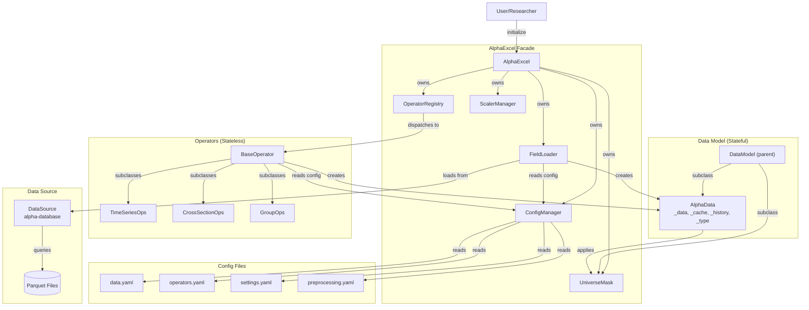
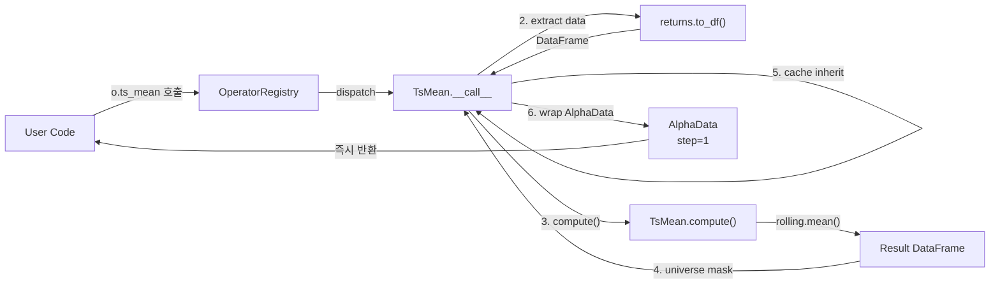
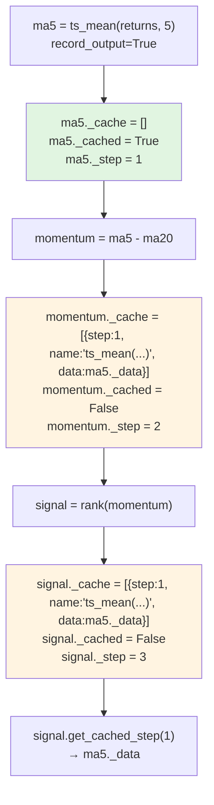

# Alpha Excel v2.0 - Architecture Document

## 2.0. 개요

alpha-excel v2.0은 **Eager Execution**, **Stateful Data Model**, **Type-Aware System**, **Config-Driven Design**을 기반으로 v1.0의 성능과 사용성 문제를 해결합니다.

**핵심 아키텍처 변경:**
- ❌ Visitor 패턴 (Lazy) → ✅ Eager execution
- ❌ Stateless Expression → ✅ Stateful AlphaData + Stateless Operators
- ❌ 전체 캐싱 (triple-cache) → ✅ 선택적 캐싱 (cache inheritance)
- ❌ Class import 필요 → ✅ Method-based API (registry)
- ❌ 하드코딩된 설정 → ✅ Config-driven (YAML)

### 2.0.1. 전체 시스템 아키텍처



### 2.0.2. Eager Execution 데이터 흐름 (v1.0 대비)

**v1.0 (Lazy Execution):**
```
Expression 트리 구축 → evaluate() 호출 → Visitor 순회 → 모든 노드 평가 → 결과 반환
(지연 평가: 트리 구축 시점에는 계산 안 함)
```

**v2.0 (Eager Execution):**
```
f('returns') → 즉시 DataSource 쿼리 → AlphaData 반환
↓
o.ts_mean(returns, 5) → 즉시 compute() → AlphaData 반환
↓
o.rank(ma5) → 즉시 compute() → AlphaData 반환
(각 단계마다 즉시 계산 및 결과 반환)
```

**Eager 흐름 상세:**


### 2.0.3. Cache Inheritance 흐름



**핵심:**
- `record_output=True`로 캐싱된 step만 downstream `_cache`에 자동 복사됨
- momentum._cached = False이므로 signal._cache에는 ma5만 포함 (momentum은 불포함)
- Cache는 `List[CachedStep]` 구조로 step collision 방지

---

## 2.1. 핵심 컴포넌트 상세 설계

### A. DataModel (Parent Class)

**역할:** UniverseMask와 AlphaData의 공통 부모 클래스. DataFrame을 보유하며 시간/자산 축 메타데이터 제공.

#### 클래스 구조

```python
class DataModel(ABC):
    """Base class for data-holding objects (UniverseMask, AlphaData)."""

    _data: pd.DataFrame       # (T, N) DataFrame
    _data_type: str          # 'numeric', 'group', 'weight', 'mask', etc.

    @property
    def start_time(self) -> pd.Timestamp: ...

    @property
    def end_time(self) -> pd.Timestamp: ...

    @property
    def time_list(self) -> pd.DatetimeIndex: ...

    @property
    def security_list(self) -> pd.Index: ...

    def __len__(self) -> int:
        """Number of time periods."""
        return len(self._data)
```

**Design Note:** "time" 용어 사용 (not "date") → 암호화폐 분봉 데이터 등 지원 고려

---

### B. AlphaData (Stateful Data Model)

**역할:** pandas DataFrame을 wrapping하며 **연산 히스토리**, **타입 정보**, **upstream 캐시**를 추적하는 상태 유지 데이터 모델

#### 1. 클래스 구조

```python
from typing import List, Dict, Optional
from dataclasses import dataclass

@dataclass
class CachedStep:
    """Cached step data structure."""
    step: int
    name: str              # Expression like "ts_mean(returns, 5)"
    data: pd.DataFrame

class AlphaData(DataModel):
    """Stateful data model with history tracking and cache inheritance."""

    # Inherited from DataModel
    _data: pd.DataFrame
    _data_type: str

    # AlphaData-specific
    _step_counter: int
    _step_history: List[Dict]
    _cached: bool
    _cache: List[CachedStep]  # List to avoid key collision

    def __init__(self, data, data_type='numeric', step_counter=0, ...): ...
```

**Cache Key Collision 해결:**
```python
# 문제: Dict[int, DataFrame]는 step collision 발생
a = f('returns')               # step = 0
b = ts_mean(a, 5, record=True)    # step = 1
c = rank(a, record=True)          # step = 1 (also!) → collision!

# 해결: List[CachedStep]
d = b + c
d._cache = [
    CachedStep(step=1, name="ts_mean(returns, 5)", data=b._data),
    CachedStep(step=1, name="rank(returns)", data=c._data)
]
```

#### 2. 주요 메서드

```python
def to_df(self) -> pd.DataFrame: ...
def to_numpy(self) -> np.ndarray: ...

# Arithmetic operators
def __add__(self, other) -> 'AlphaData': ...
def __sub__(self, other) -> 'AlphaData': ...
def __mul__(self, other) -> 'AlphaData': ...
def __truediv__(self, other) -> 'AlphaData': ...
def __pow__(self, other) -> 'AlphaData': ...   # **

# Cache access
def get_cached_step(self, step_id: int) -> Optional[pd.DataFrame]:
    """Retrieve cached data by step number."""
    for cached in self._cache:
        if cached.step == step_id:
            return cached.data.copy()
    return None
```

#### 3. Step Counter Logic (Multi-Input)

**Rule:** Multi-input operator의 step counter는 **max(input_step_counters) + 1**

```python
# Example: group_neutralize(ts_mean(f('returns'), 3), f('subindustry'))

returns = f('returns')                   # step = 0
subindustry = f('subindustry')          # step = 0
ma3 = o.ts_mean(returns, 3)             # step = 1

result = o.group_neutralize(ma3, subindustry)
# result._step_counter = max(1, 0) + 1 = 2
```

#### 4. Type 전파 규칙

| 연산 | Input Type | Output Type | 예시 |
|------|-----------|-------------|------|
| Arithmetic (+, -, *, /) | numeric | numeric | ma5 - ma20 |
| TsMean, TsStd | numeric | numeric | ts_mean(returns, 5) |
| Rank, Demean | numeric | numeric | rank(signal) |
| GroupNeutralize | numeric, group | numeric | group_neutralize(signal, industry) |
| ConcatGroups | group, group | group | concat_groups(sector, industry) |
| to_weights() | numeric | weight | ae.to_weights(signal) |
| to_portfolio_returns() | weight | port_return | ae.to_portfolio_returns(w) |

**Operators 속성:**
```python
class ConcatGroups(BaseOperator):
    input_types = ['group', 'group']
    output_type = 'group'
```

---

### C. BaseOperator (Stateless Operators)

**역할:** 순수 계산 로직을 제공하는 stateless operator 기반 클래스.

#### 1. 클래스 계층 구조

```
BaseOperator (ABC)
├── TimeSeriesOperator
│   ├── TsMean, TsStd, TsRank
│   ├── TsMax, TsMin, TsSum
│   └── TsCorr, TsCovariance
├── CrossSectionOperator
│   ├── Rank, Demean, Scale
├── GroupOperator
│   ├── GroupNeutralize (NumPy)
│   ├── GroupRank (Pandas)
│   ├── GroupSum, GroupMean
│   ├── ConcatGroups
│   └── LabelQuantile
├── ArithmeticOperator
│   ├── Add, Subtract, Multiply, Divide
│   └── Power, Abs, Log
└── LogicalOperator
    ├── Greater, Less, Equal
    └── And, Or, Not
```

#### 2. Finer-Grained Dependency Injection

**Design Rationale:**
- Interface Segregation Principle: Operators depend ONLY on what they need
- Lower coupling: No dependency on AlphaExcel facade
- Better testability: Can test operators with minimal setup
- Explicit dependencies: Clear what each operator requires

```python
class BaseOperator(ABC):
    """Base class for all operators with explicit dependencies.

    Operators receive only what they need:
    - universe_mask: For applying output masking
    - config_manager: For reading operator-specific configs
    - registry: For operator composition (optional, set by OperatorRegistry)
    """

    input_types: List[str] = ['numeric']  # Expected input types
    output_type: str = 'numeric'          # Output type
    prefer_numpy: bool = False

    def __init__(self,
                 universe_mask: UniverseMask,
                 config_manager: ConfigManager,
                 registry: Optional['OperatorRegistry'] = None):
        """Initialize operator with required dependencies.

        Args:
            universe_mask: For applying output masking
            config_manager: For reading operator-specific configs
            registry: For operator composition (set by OperatorRegistry)
        """
        self._universe_mask = universe_mask
        self._config_manager = config_manager
        self._registry = registry  # Can be None initially

    def __call__(self, *inputs, record_output=False, **params) -> AlphaData:
        """6-Step Pipeline with explicit dependencies."""
        # 1. Validate types
        self._validate_types(inputs)

        # 2. Extract data (DataFrame or numpy array)
        data_list = [self._extract_data(inp) for inp in inputs]

        # 3. Compute (subclass implements)
        result_data = self.compute(*data_list, **params)

        # 4. Apply OUTPUT mask (direct access)
        result_data = self._universe_mask.apply_mask(result_data)

        # 5. Inherit cache
        inherited_cache = self._inherit_caches(inputs)

        # 6. Construct AlphaData
        step_counter = self._compute_step_counter(inputs)
        return AlphaData(
            data=result_data,
            data_type=self.output_type,
            step_counter=step_counter,
            cached=record_output,
            cache=inherited_cache
        )

    @abstractmethod
    def compute(self, *data, **params):
        """Pure computation logic (subclass implements)."""
        pass

    def _validate_types(self, inputs: Tuple[AlphaData, ...]):
        """Check input types match expected types."""
        if len(inputs) != len(self.input_types):
            raise TypeError(f"Expected {len(self.input_types)} inputs, got {len(inputs)}")

        for i, (inp, expected_type) in enumerate(zip(inputs, self.input_types)):
            if inp._data_type != expected_type:
                raise TypeError(
                    f"Input {i}: expected {expected_type}, got {inp._data_type}"
                )

    def _extract_data(self, alpha_data: AlphaData):
        """Extract DataFrame or numpy array based on prefer_numpy."""
        if self.prefer_numpy:
            return alpha_data.to_numpy()
        return alpha_data.to_df()
```

**Operator Composition Example:**
```python
class TsZscore(BaseOperator):
    """Example showing registry usage for composition."""

    def __call__(self, data: AlphaData, window: int, **kwargs) -> AlphaData:
        if self._registry is None:
            raise RuntimeError("Registry not set - cannot perform composition")

        # Use registry for composition
        mean = self._registry.ts_mean(data, window=window)
        std = self._registry.ts_std(data, window=window)
        zscore = (data - mean) / std
        return zscore
```

#### 3. Cache Inheritance Logic

```python
def _inherit_caches(self, inputs: Tuple[AlphaData, ...]) -> List[CachedStep]:
    """Merge caches from inputs, adding cached inputs themselves."""
    merged = []

    for inp in inputs:
        # 1. Copy upstream caches
        merged.extend(inp._cache)

        # 2. If THIS input is cached, add it
        if inp._cached:
            cached_step = CachedStep(
                step=inp._step_counter,
                name=inp._build_expression_string(),
                data=inp._data.copy()
            )
            merged.append(cached_step)

    return merged
```

#### 4. Step Counter Calculation

```python
def _compute_step_counter(self, inputs: Tuple[AlphaData, ...]) -> int:
    """Use max of input step counters + 1."""
    return max(inp._step_counter for inp in inputs) + 1
```

---

### D. OperatorRegistry (Method-Based API)

**역할:** 모든 operator를 method로 제공하는 통합 레지스트리. Import 불필요.

#### 1. Auto-Discovery with Explicit Dependencies

**Design Rationale:**
- Registry receives dependencies (universe_mask, config_manager)
- Passes these to operators during instantiation
- Sets registry reference after instantiation (circular dependency handling)
- No dependency on AlphaExcel facade

```python
import inspect
from alpha_excel.ops import timeseries, crosssection, group, arithmetic, logical

class OperatorRegistry:
    """Registry with explicit dependencies for operator instantiation."""

    def __init__(self,
                 universe_mask: UniverseMask,
                 config_manager: ConfigManager):
        """Initialize registry with operator dependencies.

        Args:
            universe_mask: Passed to all operators for masking
            config_manager: Passed to all operators for configs
        """
        self._universe_mask = universe_mask
        self._config_manager = config_manager
        self._operators: Dict[str, BaseOperator] = {}
        self._discover_operators()

    def _discover_operators(self):
        """Auto-discover and instantiate operators with dependencies."""
        modules = [timeseries, crosssection, group, arithmetic, logical]

        for module in modules:
            for name, obj in inspect.getmembers(module, inspect.isclass):
                if issubclass(obj, BaseOperator) and obj is not BaseOperator:
                    # Convert CamelCase to snake_case
                    method_name = self._camel_to_snake(name)

                    # Instantiate with explicit dependencies
                    operator_instance = obj(
                        universe_mask=self._universe_mask,
                        config_manager=self._config_manager,
                        registry=None  # Set later to avoid circular dependency
                    )

                    # Now set registry reference for composition
                    operator_instance._registry = self

                    self._operators[method_name] = operator_instance

    def _camel_to_snake(self, name: str) -> str:
        """TsMean → ts_mean, GroupNeutralize → group_neutralize"""
        import re
        s1 = re.sub('(.)([A-Z][a-z]+)', r'\1_\2', name)
        return re.sub('([a-z0-9])([A-Z])', r'\1_\2', s1).lower()
```

#### 2. Method Dispatch

```python
def __getattr__(self, name: str):
    """Dynamic method access (o.ts_mean, o.rank, etc.)"""
    if name in self._operators:
        return self._operators[name]
    raise AttributeError(f"Operator '{name}' not found. Use list_operators() to see available.")

def list_operators(self) -> List[str]:
    """List all available operators."""
    return sorted(self._operators.keys())
```

#### 3. Operator Composition 지원

**문제:** Compound operator (예: TsZscore)가 다른 operator를 호출하려면?
**해결:** `self._registry` 참조

```python
class TsZscore(BaseOperator):
    output_type = 'numeric'
    input_types = ['numeric']

    def __call__(self, data: AlphaData, window: int, **kwargs) -> AlphaData:
        # Registry를 통해 기존 operator 호출
        mean = self._registry.ts_mean(data, window=window)
        std = self._registry.ts_std(data, window=window)

        # AlphaData arithmetic operators 활용
        zscore = (data - mean) / std
        return zscore
```

---

### E. AlphaExcel (Facade)

**역할:** 시스템의 단일 진입점이자 Dependency Coordinator. 컴포넌트를 생성하고 의존성을 명시적으로 주입.

**Design Rationale:**
- Facade pattern retained, but role changed from "component container" to "dependency coordinator"
- Components receive only what they need (finer-grained DI)
- Components don't know about facade - lower coupling
- Cleaner separation of concerns

#### 초기화 순서 (Dependency Coordinator)

```python
class AlphaExcel:
    """Lightweight facade that wires dependencies.

    Facade creates components and injects dependencies explicitly.
    Components don't depend on AlphaExcel - only on specific dependencies.
    """

    def __init__(self, start_time, end_time, universe=None, config_path='config'):
        # 1. Timestamps
        self._start_time = pd.Timestamp(start_time)
        self._end_time = pd.Timestamp(end_time)

        # 2. ConfigManager (FIRST - others depend on it)
        self._config_manager = ConfigManager(config_path)

        # 3. DataSource
        self._data_source = DataSource(config_path)

        # 4. UniverseMask (before others need it)
        self._universe_mask = self._initialize_universe(universe)

        # 5. FieldLoader (inject dependencies explicitly)
        self._field_loader = FieldLoader(
            data_source=self._data_source,
            universe_mask=self._universe_mask,
            config_manager=self._config_manager
        )

        # 6. OperatorRegistry (inject dependencies explicitly)
        self._ops = OperatorRegistry(
            universe_mask=self._universe_mask,
            config_manager=self._config_manager
        )

        # 7. ScalerManager
        self._scaler_manager = ScalerManager()
```

#### Property Accessors

```python
@property
def field(self):
    """f = ae.field; returns = f('returns')"""
    return self._field_loader.load

@property
def ops(self):
    """o = ae.ops; ma5 = o.ts_mean(returns, 5)"""
    return self._ops
```

#### Scaler Management

```python
def set_scaler(self, scaler_class, **params):
    """
    Set active scaler with parameters.

    Example:
        ae.set_scaler(GrossNetScaler, gross=2.0, net=0.5)
        ae.set_scaler(DollarNeutralScaler)
    """
    if isinstance(scaler_class, str):
        scaler_class = self._scaler_manager._scalers[scaler_class]

    scaler_instance = scaler_class(**params) if params else scaler_class()
    self._scaler_manager.set_scaler(scaler_instance)

def to_long_returns(self, weights: AlphaData) -> AlphaData:
    """Long positions returns only."""
    ...

def to_short_returns(self, weights: AlphaData) -> AlphaData:
    """Short positions returns only."""
    ...
```

---

### F. FieldLoader (Auto-Loading with Type Awareness)

**역할:** DataSource에서 field를 로딩하고 타입별 변환 적용. ConfigManager를 통해 data.yaml 읽기.

**Design Rationale:**
- Depends only on: DataSource, UniverseMask, ConfigManager
- No dependency on AlphaExcel facade
- Can be tested independently with mocked dependencies

#### Loading Pipeline with Explicit Dependencies

```python
class FieldLoader:
    """Field loader with explicit dependencies.

    Receives only what it needs for field loading:
    - data_source: For loading field data
    - universe_mask: For applying output masking
    - config_manager: For reading field configs and preprocessing rules
    """

    def __init__(self,
                 data_source: DataSource,
                 universe_mask: UniverseMask,
                 config_manager: ConfigManager):
        """Initialize field loader.

        Args:
            data_source: For loading field data
            universe_mask: For applying output masking
            config_manager: For reading field configs and preprocessing rules
        """
        self._ds = data_source
        self._universe_mask = universe_mask
        self._config_manager = config_manager
        self._cache: Dict[str, AlphaData] = {}  # Field cache

    def load(self, name: str, start_time=None, end_time=None) -> AlphaData:
        """
        6-Step Pipeline:
        1. Check cache
        2. Load from DataSource
        3. Apply forward-fill (from preprocessing.yaml)
        4. Convert to category (if group)
        5. Apply OUTPUT MASK
        6. Construct AlphaData(step=0, cached=True)
        """
        # Step 1
        if name in self._cache:
            return self._cache[name]

        # Step 2
        field_config = self._config_manager.get_field_config(name)
        if not field_config:
            raise ValueError(f"Field '{name}' not found in data.yaml")

        data_df = self._ds.load_field(name, start_time, end_time)

        # Step 3
        data_type = field_config.get('data_type', 'numeric')
        preprocessing_config = self._config_manager.get_preprocessing_config(data_type)

        if preprocessing_config.get('forward_fill', False):
            data_df = data_df.ffill()

        # Step 4
        if data_type == 'group':
            data_df = data_df.astype('category')

        # Step 5 (OUTPUT MASK - direct access)
        data_df = self._universe_mask.apply_mask(data_df)

        # Step 6
        alpha_data = AlphaData(
            data=data_df,
            data_type=data_type,
            step_counter=0,
            cached=True,
            cache=[],
            step_history=[{'step': 0, 'expr': f'Field({name})', 'op': 'field'}]
        )

        self._cache[name] = alpha_data
        return alpha_data

    def clear_cache(self):
        """Clear field cache."""
        self._cache.clear()
```

---

### G. UniverseMask (Single Masking Strategy)

**역할:** OUTPUT masking만 적용. Field도 output mask 적용하므로 모든 operator input은 이미 masked 상태 보장.

```python
class UniverseMask(DataModel):
    """Universe masking with single OUTPUT masking strategy."""

    def __init__(self, mask: pd.DataFrame):
        self._data = mask           # Boolean DataFrame (T, N)
        self._data_type = 'mask'

    def apply_mask(self, data: pd.DataFrame) -> pd.DataFrame:
        """
        OUTPUT MASKING: Applied to:
        - FieldLoader output (Field level)
        - BaseOperator output (Operator level)

        Since Field applies this mask, all operator inputs are guaranteed masked.
        """
        return data.where(self._data, np.nan)
```

**Integration Points (with Finer-Grained DI):**
- FieldLoader: `data_df = self._universe_mask.apply_mask(data_df)` (direct access via constructor)
- BaseOperator: `result_data = self._universe_mask.apply_mask(result_data)` (direct access via constructor)
- Backtesting: AlphaExcel methods access `self._universe_mask.apply_mask(weights_shifted)` directly

---

### H. ScalerManager

**역할:** Scaler 등록 및 관리.

```python
class ScalerManager:
    def __init__(self):
        self._scalers = {
            'DollarNeutral': DollarNeutralScaler,
            'LongOnly': LongOnlyScaler,
            'GrossNet': GrossNetScaler  # Class, not instance
        }
        self._active_scaler = None

    def set_scaler(self, scaler_instance: WeightScaler):
        """Set active scaler (already instantiated)."""
        self._active_scaler = scaler_instance
```

---

### I. BacktestEngine (Backtesting Logic)

**역할:** Portfolio returns 계산 및 long/short 분석 지원. Facade로부터 분리된 독립 컴포넌트.

**Design Rationale:**
- **Separation of Concerns**: Backtesting business logic을 facade에서 분리
- **Explicit Dependencies**: field_loader, universe_mask, config_manager만 의존
- **Extensibility**: 향후 기능(다양한 return 계산 방식, position sizing) 확장 가능
- **Testability**: Facade 없이도 독립적으로 테스트 가능

#### MVP Implementation (Phase 3.5)

**Core Features:**
- Load pre-calculated returns from data.yaml ('returns' field)
- Shift weights forward 1 day (avoid lookahead bias)
- Apply universe masking (OUTPUT masking)
- Element-wise multiplication: weights × returns
- Support long/short return splits

**Explicit Dependencies (Finer-Grained DI):**
```python
class BacktestEngine:
    """Backtesting engine with explicit dependencies.

    Receives only what it needs:
    - field_loader: For loading returns data
    - universe_mask: For applying output masking
    - config_manager: For reading backtest configs

    Does NOT depend on AlphaExcel facade.
    """

    def __init__(self,
                 field_loader: FieldLoader,
                 universe_mask: UniverseMask,
                 config_manager: ConfigManager):
        self._field_loader = field_loader
        self._universe_mask = universe_mask
        self._config_manager = config_manager
        self._returns_cache = None  # Lazy load returns data
```

#### Methods

```python
def compute_returns(self, weights: AlphaData) -> AlphaData:
    """
    Compute portfolio returns from weights.

    Process:
    1. Load returns data (lazy load + cache)
    2. Shift weights forward 1 day (avoid lookahead)
    3. Apply universe mask to shifted weights
    4. Apply universe mask to returns
    5. Element-wise multiply: weights × returns
    6. Wrap in AlphaData(type='port_return')

    Returns:
        AlphaData with data_type='port_return'
    """
    ...

def compute_long_returns(self, weights: AlphaData) -> AlphaData:
    """
    Compute returns for long positions only (weights > 0).

    Process:
    1. Filter weights: keep only positive values
    2. Call compute_returns() with filtered weights

    Returns:
        AlphaData with data_type='port_return'
    """
    ...

def compute_short_returns(self, weights: AlphaData) -> AlphaData:
    """
    Compute returns for short positions only (weights < 0).

    Process:
    1. Filter weights: keep only negative values
    2. Call compute_returns() with filtered weights

    Returns:
        AlphaData with data_type='port_return'
    """
    ...

def _load_returns(self) -> pd.DataFrame:
    """
    Lazy load returns data from config.

    MVP: Load pre-calculated 'returns' field from data.yaml.
    Future: Support different return types (open-close, vwap, etc.)

    Returns:
        Returns DataFrame (T, N)
    """
    ...
```

#### Integration with Facade

**Facade 역할: Thin delegation only (no business logic)**
```python
class AlphaExcel:
    def __init__(self, ...):
        # ... existing initialization ...

        # Phase 3.5: Initialize BacktestEngine with explicit dependencies
        self._backtest_engine = BacktestEngine(
            field_loader=self._field_loader,
            universe_mask=self._universe_mask,
            config_manager=self._config_manager
        )

    # Thin delegation methods (no business logic)
    def to_portfolio_returns(self, weights: AlphaData) -> AlphaData:
        """Delegate to BacktestEngine."""
        return self._backtest_engine.compute_returns(weights)

    def to_long_returns(self, weights: AlphaData) -> AlphaData:
        """Delegate to BacktestEngine."""
        return self._backtest_engine.compute_long_returns(weights)

    def to_short_returns(self, weights: AlphaData) -> AlphaData:
        """Delegate to BacktestEngine."""
        return self._backtest_engine.compute_short_returns(weights)
```

#### Configuration

**Config file: `config/backtest.yaml`** (NEW - 5th config file)
```yaml
# Backtesting Configuration
# Controls return calculation and position sizing

# Return calculation (MVP)
return_calculation:
  field: 'returns'  # Field to load for returns data

# Future settings (placeholders for post-MVP):
# return_calculation:
#   type: 'open_close'
#   open_field: 'fnguide_adj_open'
#   close_field: 'fnguide_adj_close'
#
# position_sizing:
#   method: 'shares'  # 'weights' or 'shares'
#   book_size: 1000000
#   price_field: 'fnguide_adj_close'
```

#### Future Enhancements (Beyond MVP)

**이러한 기능들은 BacktestEngine에 추가될 예정:**

1. **Advanced Return Calculation:**
   - Open-close returns: `(close_t - open_t) / open_t`
   - VWAP-based returns: Institutional execution simulation
   - Custom execution prices

2. **Share-Based Position Sizing:**
   - Convert dollar weights → integer share counts
   - Requires `book_size` parameter and `adj_close` data
   - More realistic (no fractional shares)

3. **Transaction Costs:**
   - Commission fees
   - Slippage modeling
   - Market impact

4. **Risk Management:**
   - Position limits
   - Turnover constraints
   - Leverage limits

5. **Multi-Period Backtesting:**
   - Multi-day holding periods
   - Rebalancing schedules
   - Cash management

**See PRD section 1.6 for detailed specifications.**

---

### J. ConfigManager (Config-Driven Design)

**역할:** 4개 YAML 파일 읽기 및 시스템 전체 설정 제공.

```python
class ConfigManager:
    def __init__(self, config_path='config'):
        self._operators_config = self._load_yaml('operators.yaml')
        self._settings_config = self._load_yaml('settings.yaml')
        self._data_config = self._load_yaml('data.yaml')
        self._preprocessing_config = self._load_yaml('preprocessing.yaml')

    def get_field_config(self, field_name: str) -> Dict:
        """From data.yaml: data_type, query, etc."""
        ...

    def get_preprocessing_config(self, data_type: str) -> Dict:
        """From preprocessing.yaml: forward-fill rules."""
        return self._preprocessing_config.get(data_type, {})

    def get_operator_config(self, operator_name: str) -> Dict:
        """From operators.yaml: min_periods_ratio, etc."""
        ...

    def get_setting(self, key: str, default=None) -> Any:
        """From settings.yaml: buffer_days, etc."""
        ...
```

#### Config Files 구조

**preprocessing.yaml** (NEW):
```yaml
# Type-based preprocessing rules
numeric:
  forward_fill: false

group:
  forward_fill: true  # Monthly → Daily expansion

weight:
  forward_fill: false

mask:
  forward_fill: false
```

**data.yaml** (unchanged - data retrieval only):
```yaml
returns:
  data_type: numeric
  query: >
    SELECT date, symbol, return FROM ...

fnguide_industry_group:
  data_type: group
  query: >
    SELECT date, symbol, industry_group FROM ...
```

**operators.yaml** (unchanged):
```yaml
timeseries:
  defaults:
    min_periods_ratio: 0.5
```

**settings.yaml** (unchanged):
```yaml
data_loading:
  buffer_days: 252
```

---

### K. Type System

**역할:** 데이터 타입 정의 및 검증.

#### Type Definitions

```python
class DataType:
    NUMERIC = 'numeric'
    GROUP = 'group'
    WEIGHT = 'weight'
    PORT_RETURN = 'port_return'
    MASK = 'mask'              # Changed from EVENT
    BOOLEAN = 'boolean'
    OBJECT = 'object'
```

#### Validation (via Class Attributes)

```python
class GroupNeutralize(BaseOperator):
    input_types = ['numeric', 'group']
    output_type = 'numeric'

class ConcatGroups(BaseOperator):
    input_types = ['group', 'group']
    output_type = 'group'
```

---

## 2.2. 기능별 아키텍처 상세

### F1: Config-Driven Auto-Loading

**Flow:**
```
User: f('returns')
  ↓
FieldLoader → ConfigManager.get_field_config('returns') → {data_type: 'numeric'}
  ↓
ConfigManager.get_preprocessing_config('numeric') → {forward_fill: false}
  ↓
DataSource.load_field() → DataFrame
  ↓
No forward-fill (numeric type)
  ↓
OUTPUT MASK
  ↓
AlphaData(step=0, type='numeric', cached=True)
```

---

### F2: Eager Execution

**Trade-offs:**

| Aspect | Lazy (v1.0) | Eager (v2.0) |
|--------|-------------|--------------|
| 성능 | Visitor 순회 오버헤드 | Visitor 오버헤드 제거 |
| 디버깅 | Expression만 보임 | 중간 결과 즉시 확인 |
| 메모리 | 모든 step 자동 캐싱 | 선택적 캐싱 |

---

### F3: On-Demand Caching with Cache Inheritance

**Cache Collision 해결:**
```python
# Problem: Dict[int, DataFrame]
b = ts_mean(a, 5, record=True)   # step=1
c = rank(a, record=True)         # step=1 → COLLISION!

# Solution: List[CachedStep]
d = b + c
d._cache = [
    CachedStep(step=1, name="ts_mean(...)", data=...),
    CachedStep(step=1, name="rank(...)", data=...)
]
```

---

### F4: Weight Scaling

```python
ae.set_scaler(GrossNetScaler, gross=2.0, net=0.5)
weights = ae.to_weights(signal)
```

---

### F5: Backtesting (Shift-Mask Workflow)

```python
def to_portfolio_returns(self, weights):
    weights_shifted = weights.to_df().shift(1)
    weights_masked = self._universe_mask.apply_mask(weights_shifted)  # Re-mask
    returns_masked = self._universe_mask.apply_mask(self._returns)
    return AlphaData(data=weights_masked * returns_masked, data_type='port_return', ...)
```

---

### F6: Type-Aware System

```yaml
# preprocessing.yaml defines type-based forward-fill
group:
  forward_fill: true

# Operators declare types
class GroupNeutralize:
    input_types = ['numeric', 'group']
    output_type = 'numeric'
```

---

### F7: Operator Registry & Method-Based API

Auto-discovery → `o.ts_mean()`, `o.rank()` → No imports

---

### F8: Group Operations Optimization

NumPy scatter-gather algorithm for improved performance (see `docs/research/faster-group-operations.md`)

---

## 2.3. 성능 최적화

### A. NumPy Scatter-Gather

**Algorithm:**
1. **Scatter:** 데이터를 그룹별로 흩뿌림 (np.add.at)
2. **Aggregate:** 그룹별 통계량 계산
3. **Gather:** 통계량을 원래 shape로 모음

**Performance:** NumPy scatter-gather는 pandas groupby보다 significantly faster (상세 벤치마크는 `docs/research/faster-group-operations.md` 참조)

---

### B. Category dtype for Groups

**Why:**
- 메모리: 문자열 대비 메모리 절감
- 속도: Integer indexing → NumPy scatter-gather와 완벽 호환
- Pandas: category dtype는 내부적으로 integer codes 사용

**Integration:**
```python
# FieldLoader
if data_type == 'group':
    data_df = data_df.astype('category')

# GroupOperator
group_codes = group_df.cat.codes.values  # Integer array
```

---

### C. Pandas vs NumPy Selection

| Operator | prefer_numpy | Reason |
|----------|-------------|---------|
| TsMean | False | pandas rolling (C optimized) |
| Rank | False | pandas rank (C optimized) |
| GroupNeutralize | True | Custom scatter-gather |
| GroupSum | True | np.add.at() |

---

### D. Memory Efficiency

**v1.0 (Triple-Cache):**
- 모든 step의 signal, weight, port_return 자동 캐싱
- 높은 메모리 사용량

**v2.0 (On-Demand Caching):**
- `record_output=True`로 선택적 캐싱
- Cache inheritance로 downstream 접근
- 메모리 사용량 대폭 감소

---

## 2.4. 설계 원칙 및 근거

### 2.4.1. 왜 Eager Execution인가?

**장점:**
1. **디버깅 용이:** 중간 결과 즉시 확인 가능
2. **성능:** Visitor 순회 오버헤드 제거
3. **메모리 제어:** 사용자가 캐싱 결정
4. **자연스러운 Python:** 각 연산이 즉시 실행

**단점:**
1. **Serialization 어려움:** 계산 완료 후에는 Expression 복원 어려움
   - 해결: step_history로 부분적 재구성
2. **전체 최적화 불가:** 트리 전체를 보고 최적화 불가
   - 판단: 개발 경험이 더 중요

**결론:** 리서처의 빠른 iteration과 디버깅이 Serialization보다 중요 → Eager 선택

---

### 2.4.2. 왜 Method-Based API인가?

**v1.0 문제:**
```python
from alpha_excel.ops.timeseries import TsMean, TsStd, TsRank
from alpha_excel.ops.crosssection import Rank, Demean
from alpha_excel.ops.group import GroupNeutralize
# 여러 import 필요
```

**v2.0 해결:**
```python
o = ae.ops
o.ts_mean(), o.ts_std(), o.rank(), o.group_neutralize()
# Import 불필요
```

**장점:**
1. **편의성:** Import 불필요
2. **발견 가능성:** IDE 자동완성
3. **일관성:** 모든 operator가 동일한 인터페이스

---

### 2.4.3. 왜 Stateful Data Model인가?

**v1.0 (Stateless Expression):**
- Expression은 "수식"만 저장, 데이터 없음
- evaluate() 시점에 데이터 생성
- 히스토리 추적 불가

**v2.0 (Stateful AlphaData):**
- 데이터 + 히스토리 + 캐시 모두 저장
- 각 단계의 AlphaData가 자신의 계보 알고 있음
- Cache inheritance로 upstream 데이터 접근

**Why:** Eager execution에서는 데이터를 즉시 생성하므로, 이를 state로 보관하는 것이 자연스러움.

---

### 2.4.4. 왜 On-Demand Caching인가?

**v1.0 문제:**
- 모든 step 자동 캐싱
- 높은 메모리 사용량

**v2.0 해결:**
- `record_output=True`로 선택적 캐싱
- Cache inheritance로 downstream 접근
- 메모리 사용량 감소

**Why:** 대부분의 중간 결과는 재사용 안 함 → 필요한 것만 캐싱

---

### 2.4.5. 왜 Type-Aware System인가?

**문제:**
- v1.0은 타입 없음 → 잘못된 연산 런타임 에러
- Forward-fill 전략을 하드코딩

**해결:**
- 각 데이터에 타입 명시 (numeric, group, weight, etc.)
- data.yaml에서 타입 정의 → 자동 처리
- BaseOperator가 타입 검증

**Why:** 조기 에러 발견 + 자동화된 데이터 처리

---

### 2.4.6. 왜 Config-Driven Design인가?

**Before (Hardcoded):**
```python
# 코드에 하드코딩
if field_name == 'fnguide_industry_group':
    data = data.ffill()  # Forward fill
    data = data.astype('category')
```

**After (Config-Driven):**
```yaml
# preprocessing.yaml
group:
  forward_fill: true
```

**장점:**
1. **유연성:** 코드 변경 없이 동작 변경
2. **명확성:** 모든 설정이 한 곳에
3. **확장성:** 새 field 추가 = YAML 추가

---

### 2.4.7. 왜 List[CachedStep]인가?

Dict는 step collision 발생 → List로 해결

---

### 2.4.8. 왜 Single Masking인가?

Field가 OUTPUT mask 적용 → 모든 operator input은 이미 masked → 중복 masking 불필요

---

### 2.4.9. 왜 DataModel Parent Class인가?

UniverseMask와 AlphaData가 공통 속성 공유 (시간/자산 축 메타데이터) → DRY principle

---

### 2.4.10. 왜 Finer-Grained Dependency Injection인가?

**문제 (Facade Dependency):**
- 초기 v2.0 설계: 모든 operator가 AlphaExcel facade 참조
- Facade 내부 구조 변경 시 모든 operator 영향받음
- **Interface Segregation Principle (ISP) 위반:** Operator가 필요하지 않은 facade 전체에 의존
- **Operator 단독 테스트 어려움:** Facade 없이는 operator 테스트 불가
- **Phased implementation 불가능:** Facade 없이는 operator 구현 불가 (순환 의존성)
- **Higher coupling:** Component들이 facade 내부 구조에 결합

**해결 (Finer-Grained DI):**

Components receive ONLY what they need:
- **BaseOperator needs:** `universe_mask` (masking), `config_manager` (configs), `registry` (composition - optional)
- **FieldLoader needs:** `data_source` (data), `universe_mask` (masking), `config_manager` (configs)
- **OperatorRegistry needs:** `universe_mask`, `config_manager` (to pass to operators)
- **AlphaExcel becomes:** Dependency coordinator that wires components

**장점:**

1. **Interface Segregation Principle:** 필요한 것만 의존
   ```python
   # Before: Operator depends on entire facade
   class TsMean(BaseOperator):
       def __init__(self, alpha_excel):
           self._ae = alpha_excel  # Has everything, needs only universe_mask

   # After: Operator depends only on what it needs
   class TsMean(BaseOperator):
       def __init__(self, universe_mask, config_manager, registry=None):
           self._universe_mask = universe_mask
           self._config_manager = config_manager
           self._registry = registry
   ```

2. **Lower Coupling:** Components don't know about facade
   - Facade 구조 변경해도 components 영향 없음
   - Components는 stable interface에만 의존

3. **Better Testability:** 최소한의 setup으로 테스트 가능
   ```python
   # Test operator without facade
   mask = UniverseMask(...)
   config = ConfigManager(...)
   operator = TsMean(mask, config)
   result = operator(alpha_data)
   ```

4. **Phased Implementation:** Facade 없이도 component 구현 가능
   - Phase 1: Core components (types, data_model, config, alpha_data, universe_mask)
   - Phase 1.5: Operator infrastructure (base_operator, field_loader) ← Can implement now!
   - Phase 2: Concrete operators
   - Phase 3: Facade & Registry

5. **Explicit Dependencies:** 각 component의 요구사항 명확
   - Constructor signature가 dependencies 명시
   - 무엇을 필요로 하는지 한눈에 파악

**Trade-off:**

❌ **Wiring이 조금 더 복잡:**
```python
# Before: 1 argument
operator = TsMean(alpha_excel)

# After: 3 arguments
operator = TsMean(universe_mask, config_manager, registry)
```

✅ **하지만 AlphaExcel facade가 wiring 담당하므로 사용자는 영향 없음:**
```python
# User code is the same
ae = AlphaExcel(...)
o = ae.ops
result = o.ts_mean(data, window=5)  # No difference for users!
```

✅ **장기적으로 유지보수 더 쉬움:**
- Facade 변경 → Components 영향 없음
- Components 독립적으로 테스트 가능
- 명확한 dependency graph

**결론:** Lower coupling과 testability가 wiring 편의성보다 중요. SOLID principles 준수.

---

## 2.5. 구현 단계 (Revised with Finer-Grained DI)

### Phase 1: Core Foundation (COMPLETE ✅)
**Dependencies:** None (standalone components)

1. ✅ Types (types.py) - DataType constants
2. ✅ DataModel (data_model.py) - Parent class
3. ✅ ConfigManager (config_manager.py) - 4 YAML file loader
4. ✅ AlphaData (alpha_data.py) - Stateful data model with List[CachedStep]
5. ✅ UniverseMask (universe_mask.py) - Single output masking
6. ✅ Project structure - Directories and __init__.py files

**Status:** 73 tests passing, committed

---

### Phase 1.5: Operator Infrastructure (COMPLETE ✅)
**Dependencies:** Phase 1 components (universe_mask, config_manager, alpha_data)

**Design Rationale:** With finer-grained DI, we can now implement operator infrastructure WITHOUT the facade!

1. ✅ preprocessing.yaml - Type-based preprocessing config
2. ✅ BaseOperator (ops/base.py) - Abstract base with `__init__(universe_mask, config_manager, registry=None)`
3. ✅ FieldLoader (core/field_loader.py) - Field loading with `__init__(data_source, universe_mask, config_manager)`
4. ✅ MockDataSource (tests/mocks/) - Testing without real Parquet files
5. ✅ Phase 1.5 integration test - End-to-end validation

**Components Implemented:**
- **BaseOperator:** 6-step pipeline (validate → extract → compute → mask → cache → wrap), 23 tests
- **FieldLoader:** 6-step loading pipeline with type-aware preprocessing, 17 tests
- **MockDataSource:** Mimics DataSource interface for isolated testing, 12 tests
- **Integration Test:** 11 tests validating end-to-end workflows

**Status:** 136 tests passing (73 Phase 1 + 63 Phase 1.5), committed

---

### Phase 2: Concrete Operators (COMPLETE ✅)
**Dependencies:** Phase 1.5 (base_operator)

**Scope:** Phase 2 implements **representative operators only** to validate the operator infrastructure. Additional operators will be implemented after Phase 3 (Facade & Registry) is complete.

All operators inherit from BaseOperator and receive `(universe_mask, config_manager, registry=None)`:

1. **Time-series operators:**
   - ✅ TsMean (11 tests) - Committed
   - TsStd, TsRank - After Phase 3
   - TsMax, TsMin, TsSum - After Phase 3
   - TsCorr, TsCovariance - After Phase 3

2. **Cross-section operators:**
   - ✅ Rank (8 tests) - Committed
   - Demean, Scale - After Phase 3

3. **Group operators:**
   - ✅ GroupRank (10 tests) - Committed (uses pandas groupby for Phase 2)
   - GroupNeutralize (NumPy optimized) - After Phase 3
   - GroupSum, GroupMean - After Phase 3
   - ConcatGroups, LabelQuantile - After Phase 3

4. **Arithmetic/Logical operators:**
   - ✅ Arithmetic operators implemented via AlphaData magic methods (Phase 1)
   - Comparison operators (>, <, >=, <=, ==, !=) - After Phase 3 with logical operators
   - Logical operators (And, Or, Not) - After Phase 3

**Status:** 165 tests passing (73 Phase 1 + 63 Phase 1.5 + 29 Phase 2), committed
**Note:** Operators can be implemented and tested independently without facade

---

### Phase 3: Facade & Registry (Broken into 6 mini-phases)

Phase 3 is large, so it's divided into 6 sequential mini-phases with clear dependencies.

**Dependency Graph:**
```
Phase 3.1 (Scalers) ────────────┐
                                ↓
Phase 3.2 (ScalerManager) ──────┼──────┐
                                │      ↓
Phase 2 (Operators) ────────┐   │      │
                            ↓   │      │
Phase 3.3 (Registry) ───────┼───┘      │
                            ↓          │
Phase 3.4 (Facade Core) ────┼──────────┘
                            ↓
Phase 3.5 (Backtesting) ────┤
                            ↓
Phase 3.6 (Integration) ────┘
```

---

#### Phase 3.1: Portfolio Scalers Foundation (COMPLETE ✅)
**Dependencies:** None (standalone)
**Tests:** 25 tests passing

**Components Implemented:**
1. ✅ **WeightScaler base** (`portfolio/base.py`)
   - Abstract base for all scalers
   - Interface: `scale(signal: AlphaData) -> AlphaData`
   - Works with AlphaData (not raw DataFrame)
   - 8 tests validating abstract behavior

2. ✅ **Concrete Scalers** (`portfolio/scalers.py`)
   - `GrossNetScaler(gross=1.0, net=0.0)` - Target gross/net exposure (6 tests)
     - Split-and-scale algorithm: demean → split positive/negative → scale independently
     - Long exposure = (gross + net) / 2, Short exposure = (gross - net) / 2
   - `DollarNeutralScaler()` - Shorthand for GrossNetScaler(gross=2.0, net=0.0) (5 tests)
     - Common market-neutral strategy preset
   - `LongOnlyScaler(target_gross=1.0)` - Long-only with target exposure (6 tests)
     - Zero out negative signals, scale positive signals

**Implementation Details:**
- All scalers use fully vectorized pandas/numpy operations (no Python loops)
- Preserve AlphaData step history and cache inheritance
- Return AlphaData with data_type='weight'
- Follow Strategy Pattern for extensibility

**Files:**
- `src/alpha_excel2/portfolio/base.py`
- `src/alpha_excel2/portfolio/scalers.py`
- `tests/test_alpha_excel2/test_portfolio/test_weight_scaler_base.py` (8 tests)
- `tests/test_alpha_excel2/test_portfolio/test_scalers.py` (17 tests)

**Status:** Committed (b7f55dd)

---

#### Phase 3.2: ScalerManager (COMPLETE ✅)
**Dependencies:** Phase 3.1 (WeightScaler)
**Tests:** 15 tests passing

**Components Implemented:**
1. ✅ **ScalerManager** (`portfolio/scaler_manager.py`)
   - Registry of built-in scalers: 'GrossNet', 'DollarNeutral', 'LongOnly'
   - `set_scaler(scaler_class_or_name, **params)` - Set active scaler with runtime params
   - `get_active_scaler()` - Retrieve current scaler instance
   - `list_scalers()` - Show available scalers
   - Supports setting by class or string name with clear error messages

**Implementation Details:**
- Accepts both class references and string names
- Instantiates scalers with runtime parameters
- Maintains single active scaler instance
- Ready for integration with AlphaExcel facade (Phase 3.4)

**Tests Breakdown:**
- Initialization and registry population (3 tests)
- Setting scalers by class/name with parameters (5 tests)
- Getting active scaler instance (4 tests)
- Integration workflows: set → get → apply (3 tests)

**Files:**
- `src/alpha_excel2/portfolio/scaler_manager.py`
- `tests/test_alpha_excel2/test_portfolio/test_scaler_manager.py` (15 tests)

**Status:** Committed (8e54bd3)

---

#### Phase 3.3: OperatorRegistry (COMPLETE ✅)
**Dependencies:** Phase 2 operators (TsMean, Rank, GroupRank)
**Tests:** 26 tests passing

**Components Implemented:**
1. **OperatorRegistry** (`core/operator_registry.py`)
   - Auto-discovery: Scans all modules in `ops/` directory dynamically
   - Category tracking: Stores module name for each operator (timeseries, crosssection, group)
   - Name conversion: CamelCase → snake_case with collision detection (TsMean → ts_mean)
   - Instantiate operators: `Operator(universe_mask, config_manager, registry=None)`
   - Set registry reference: `operator._registry = self` (circular dependency handling)
   - Method dispatch: `__getattr__` enables `o.ts_mean()` syntax
   - `list_operators()` - Returns sorted list with categories: "ts_mean (timeseries)"
   - `list_operators_by_category()` - Returns dict grouped by category
   - Error handling: RuntimeError on name collision, warning on empty modules

**Implementation Details:**
- Dynamic module scanning using `importlib` and `inspect`
- Regex-based CamelCase → snake_case conversion handles edge cases
- Detects duplicate operator names before registration
- Logs warning for modules with no operators (continues processing)
- Operators receive finer-grained dependencies (universe_mask, config_manager, registry)
- Registry reference set after instantiation to avoid circular dependency

**Method-Based API:**
```python
o = ae.ops  # After Phase 3.4 integration
ma5 = o.ts_mean(returns, window=5)
ranked = o.rank(ma5)
sector_ranked = o.group_rank(returns, sectors)

# Discovery
print(o.list_operators())
# ['group_rank (group)', 'rank (crosssection)', 'ts_mean (timeseries)']
```

**Tests Breakdown (26 tests):**
- Initialization and dependency storage (3 tests)
- Auto-discovery of Phase 2 operators (5 tests)
- Name conversion including edge cases (4 tests)
- Name collision detection (2 tests)
- Empty module warning tests (2 tests)
- Method dispatch via __getattr__ (3 tests)
- Dependency injection verification (3 tests)
- Operator listing with categories (4 tests)

**Files:**
- `src/alpha_excel2/core/operator_registry.py` (180 lines)
- `tests/test_alpha_excel2/test_core/test_operator_registry.py` (424 lines, 26 tests)
- `src/alpha_excel2/core/__init__.py` (added OperatorRegistry export)

**Status:** Committed (a51d00f)

---

#### Phase 3.4: AlphaExcel Facade (Core) (COMPLETE ✅)
**Dependencies:** Phase 3.3 (OperatorRegistry), Phase 1-2 (core components)
**Tests:** 29 tests passing

**Components Implemented:**
1. ✅ **AlphaExcel Facade** (`core/facade.py`)
   - Dependency coordinator initialization order:
     1. Timestamps (start_time - REQUIRED, end_time - OPTIONAL, None = latest data)
     2. ConfigManager (FIRST - others depend on it)
     3. DataSource
     4. UniverseMask (default 1x1, or custom provided)
     5. FieldLoader (inject: data_source, universe_mask, config_manager, default dates)
     6. OperatorRegistry (inject: universe_mask, config_manager)
   - Property accessors:
     - `ae.field` → FieldLoader.load (with default date range)
     - `ae.ops` → OperatorRegistry
   - Date handling: end_time=None loads to latest available data
   - **NO backtesting methods yet** (Phase 3.5)

**Implementation Details:**
- FieldLoader extended to accept default_start_time and default_end_time
- Dates automatically applied when field is loaded without explicit dates
- Universe masking applied at both field loading and operator output
- All 29 tests covering initialization, properties, helpers, and integration

**Tests Breakdown (29 tests):**
- Part 1: Constructor tests (10 tests) - Initialization with various parameters
- Part 2: Property accessors (6 tests) - `ae.field` and `ae.ops` functionality
- Part 3: Helper methods (5 tests) - Universe and date validation
- Part 4: Integration (8 tests) - End-to-end workflows with field loading and operators

**Files:**
- `src/alpha_excel2/core/facade.py`
- `src/alpha_excel2/core/field_loader.py` (updated for default dates)
- `tests/test_alpha_excel2/test_core/test_facade.py`

**Status:** Committed (Next: Phase 3.5 Backtesting Methods)

---

#### Phase 3.5: Backtesting Methods (with Separated BacktestEngine)
**Dependencies:** Phase 3.2 (ScalerManager), Phase 3.4 (Facade core)
**Estimated Tests:** ~35 tests (20 BacktestEngine + 15 integration)

**Key Architectural Change:**
- ❌ **Before**: Backtesting logic directly in facade methods
- ✅ **After**: Separated `BacktestEngine` component with facade delegation
- **Benefit**: Maintains v2.0's "thin coordinator" principle

**Components:**

1. **NEW: BacktestEngine** (`portfolio/backtest_engine.py`)
   - **Role**: All backtesting business logic isolated here
   - **Dependencies**: field_loader, universe_mask, config_manager (explicit, finer-grained)
   - **Methods**:
     - `compute_returns(weights: AlphaData) -> AlphaData`
       - Load returns data (lazy load + cache)
       - Shift weights forward 1 day (avoid lookahead)
       - Apply universe masks to weights and returns
       - Element-wise multiply: weights × returns
       - Return AlphaData(type='port_return')
     - `compute_long_returns(weights: AlphaData) -> AlphaData`
       - Filter weights > 0, then call compute_returns()
     - `compute_short_returns(weights: AlphaData) -> AlphaData`
       - Filter weights < 0, then call compute_returns()
   - **Configuration**: Reads from `config/backtest.yaml`
   - **Testable**: Independently testable without facade
   - **Extensible**: Future features (open-close, shares) have clear home

2. **Extend AlphaExcel Facade** (`core/facade.py`) - **THIN DELEGATION ONLY**
   - Add to `__init__()`:
     - `_scaler_manager = ScalerManager()`
     - `_backtest_engine = BacktestEngine(field_loader, universe_mask, config_manager)`
   - **Delegation methods** (no business logic):
     - `set_scaler(scaler, **params)` → Delegate to ScalerManager
     - `to_weights(signal: AlphaData)` → Delegate to ScalerManager.get_active_scaler().scale()
     - `to_portfolio_returns(weights)` → Delegate to BacktestEngine.compute_returns()
     - `to_long_returns(weights)` → Delegate to BacktestEngine.compute_long_returns()
     - `to_short_returns(weights)` → Delegate to BacktestEngine.compute_short_returns()

3. **Configuration File** (`config/backtest.yaml`) - NEW (5th config file)
   - MVP: Specify returns field name
   - Future: Return calculation type, position sizing method, transaction costs

**Implementation Breakdown:**

**Phase 3.5a: BacktestEngine Component**
- Implement BacktestEngine class (~150 lines)
- Write unit tests (20 tests):
  - Initialization and dependency storage (3 tests)
  - compute_returns() functionality (4 tests)
  - Weight shifting and lookahead avoidance (2 tests)
  - Universe masking application (2 tests)
  - compute_long_returns() filtering (3 tests)
  - compute_short_returns() filtering (3 tests)
  - AlphaData wrapping (type, step, history, cache) (3 tests)

**Phase 3.5b: Facade Integration**
- Extend facade with 5 delegation methods (~50 lines)
- Create backtest.yaml config
- Write integration tests (15 tests):
  - Facade initialization with BacktestEngine (2 tests)
  - set_scaler() delegation (2 tests)
  - to_weights() delegation (3 tests)
  - to_portfolio_returns() delegation (3 tests)
  - to_long_returns() and to_short_returns() (3 tests)
  - End-to-end workflow: signal → weights → returns (2 tests)

**Files:**
- `src/alpha_excel2/portfolio/backtest_engine.py` (NEW - BacktestEngine class)
- `config/backtest.yaml` (NEW - backtesting configuration)
- `src/alpha_excel2/core/facade.py` (extend with delegation methods)
- `tests/test_alpha_excel2/test_portfolio/test_backtest_engine.py` (NEW - 20 tests)
- `tests/test_alpha_excel2/test_core/test_backtesting.py` (15 integration tests)
- `src/alpha_excel2/portfolio/__init__.py` (export BacktestEngine)

---

#### Phase 3.6: Integration & Validation
**Dependencies:** All previous Phase 3 mini-phases
**Estimated Tests:** ~20 integration tests

**Components:**
1. **End-to-End Integration Tests** (`tests/test_alpha_excel2/test_phase3_integration.py`)
   - Complete workflow: init → field → operators → scaler → backtesting
   - Multi-operator chains with cache inheritance
   - Different scaler strategies
   - Performance validation

2. **Showcase Migration** (`showcase/`)
   - Update existing showcases to v2.0 API
   - Create new showcases demonstrating v2.0 features
   - Update `showcase/README.md`

3. **Documentation Updates**
   - Update this architecture doc with implementation notes
   - Document deviations from plan (if any)
   - Update CLAUDE.md with Phase 3 completion status

**Files:**
- `tests/test_alpha_excel2/test_phase3_integration.py`
- `showcase/*.py` (updated)
- `docs/vibe_coding/alpha-excel/ae2-architecture.md` (this file)
- `CLAUDE.md`

---

**Phase 3 Summary:**
- **Total Tests So Far:** 95 tests (Phase 3.1-3.4)
- **Current Status:**
  - Phase 3.1 ✅ (25 tests) - Portfolio Scalers
  - Phase 3.2 ✅ (15 tests) - ScalerManager
  - Phase 3.3 ✅ (26 tests) - OperatorRegistry
  - Phase 3.4 ✅ (29 tests) - AlphaExcel Facade (Core)
- **Total Tests Passing:** 260 tests (165 Phase 1+1.5+2 + 95 Phase 3.1-3.4)
- **Remaining:** Phase 3.5 (Backtesting ~35 tests), Phase 3.6 (Integration ~20 tests)
- **Implementation Order:** 3.1 ✅ → 3.2 ✅ → 3.3 ✅ → 3.4 ✅ → 3.5 (3.5a + 3.5b) → 3.6 (sequential)
- **Key Architectural Benefits:**
  - Facade remains thin coordinator (delegates to BacktestEngine, not business logic)
  - BacktestEngine testable independently (finer-grained DI)
  - Extensible for future features (open-close returns, share-based positions)
  - Config-driven behavior (backtest.yaml)

---

### Phase 4: Testing & Migration
1. v1.0 workflows → v2.0 migration
2. Performance benchmarking
3. Documentation updates
4. Showcase examples

---

## 2.6. 참고 문서

- **PRD**: `docs/vibe_coding/alpha-excel/ae2-prd.md` - Requirements and workflows
- **Transition Plan**: `docs/vibe_coding/alpha-excel/ae2-transition-plan.md` - v1.0 problems and solutions
- **Group Operations**: `docs/research/faster-group-operations.md` - NumPy scatter-gather details
- **v1.0 Architecture**: `docs/vibe_coding/alpha-excel/ae-architecture.md` - For comparison
