# Alpha Excel v2.0 - Architecture Document

## 2.0. 개요

alpha-excel v2.0은 **Eager Execution**, **Stateful Data Model**, **Type-Aware System**, **Config-Driven Design**을 기반으로 v1.0의 성능과 사용성 문제를 해결합니다.

**핵심 아키텍처 변경:**
- ❌ Visitor 패턴 (Lazy) → ✅ Eager execution
- ❌ Stateless Expression → ✅ Stateful AlphaData + Stateless Operators
- ❌ 전체 캐싱 (triple-cache) → ✅ 선택적 캐싱 (cache inheritance)
- ❌ Class import 필요 → ✅ Method-based API (registry)
- ❌ 하드코딩된 설정 → ✅ Config-driven (YAML)

### 2.0.1. 전체 시스템 아키텍처


### 2.0.2. Eager Execution 데이터 흐름 (v1.0 대비)

**v1.0 (Lazy Execution):**
```
Expression 트리 구축 → evaluate() 호출 → Visitor 순회 → 모든 노드 평가 → 결과 반환
(지연 평가: 트리 구축 시점에는 계산 안 함)
```

**v2.0 (Eager Execution):**
```
f('returns') → 즉시 DataSource 쿼리 → AlphaData 반환
↓
o.ts_mean(returns, 5) → 즉시 compute() → AlphaData 반환
↓
o.rank(ma5) → 즉시 compute() → AlphaData 반환
(각 단계마다 즉시 계산 및 결과 반환)
```

**Eager 흐름 상세:**

```mermaid
flowchart LR
    A["User Code"] -->|"o.ts_mean 호출"| B["OperatorRegistry"]
    B -->|"dispatch"| C["TsMean.__call__"]
    C -->|"1. validate types"| C
    C -->|"2. extract data"| D["returns.to_df()"]
    D -->|"DataFrame"| C
    C -->|"3. compute()"| E["TsMean.compute()"]
    E -->|"rolling.mean()"| F["Result DataFrame"]
    F -->|"4. universe mask"| C
    C -->|"5. cache inherit"| C
    C -->|"6. wrap AlphaData"| G["AlphaData<br/>step=1"]
    G -->|"즉시 반환"| A
```


### 2.0.3. Cache Inheritance 흐름

```mermaid
flowchart TB
    A["ma5 = ts_mean(returns, 5)<br/>record_output=True"]
    B["ma5._cache = []<br/>ma5._cached = True<br/>ma5._step = 1"]

    C["momentum = ma5 - ma20"]
    D["momentum._cache = [{step:1, name:'ts_mean(...)', data:ma5._data}]<br/>momentum._cached = False<br/>momentum._step = 2"]

    E["signal = rank(momentum)"]
    F["signal._cache = [{step:1, name:'ts_mean(...)', data:ma5._data}]<br/>signal._cached = False<br/>signal._step = 3"]

    G["signal.get_cached_step(1)<br/>→ ma5._data"]

    A --> B
    B --> C
    C --> D
    D --> E
    E --> F
    F --> G

    style B fill:#e1f5e1
    style D fill:#fff4e1
    style F fill:#fff4e1
```



**핵심:**
- `record_output=True`로 캐싱된 step만 downstream `_cache`에 자동 복사됨
- momentum._cached = False이므로 signal._cache에는 ma5만 포함 (momentum은 불포함)
- Cache는 `List[CachedStep]` 구조로 step collision 방지

---

## 2.1. 핵심 컴포넌트 상세 설계

### A. DataModel (Parent Class)

**역할:** UniverseMask와 AlphaData의 공통 부모 클래스. DataFrame을 보유하며 시간/자산 축 메타데이터 제공.

#### 클래스 구조

```python
class DataModel(ABC):
    """Base class for data-holding objects (UniverseMask, AlphaData)."""

    _data: pd.DataFrame       # (T, N) DataFrame
    _data_type: str          # 'numeric', 'group', 'weight', 'mask', etc.

    @property
    def start_time(self) -> pd.Timestamp: ...

    @property
    def end_time(self) -> pd.Timestamp: ...

    @property
    def time_list(self) -> pd.DatetimeIndex: ...

    @property
    def security_list(self) -> pd.Index: ...

    def __len__(self) -> int:
        """Number of time periods."""
        return len(self._data)
```

**Design Note:** "time" 용어 사용 (not "date") → 암호화폐 분봉 데이터 등 지원 고려

---

### B. AlphaData (Stateful Data Model)

**역할:** pandas DataFrame을 wrapping하며 **연산 히스토리**, **타입 정보**, **upstream 캐시**를 추적하는 상태 유지 데이터 모델

#### 1. 클래스 구조

```python
from typing import List, Dict, Optional
from dataclasses import dataclass

@dataclass
class CachedStep:
    """Cached step data structure."""
    step: int
    name: str              # Expression like "ts_mean(returns, 5)"
    data: pd.DataFrame

class AlphaData(DataModel):
    """Stateful data model with history tracking and cache inheritance."""

    # Inherited from DataModel
    _data: pd.DataFrame
    _data_type: str

    # AlphaData-specific
    _step_counter: int
    _step_history: List[Dict]
    _cached: bool
    _cache: List[CachedStep]  # List to avoid key collision

    def __init__(self, data, data_type='numeric', step_counter=0, ...): ...
```

**Cache Key Collision 해결:**
```python
# 문제: Dict[int, DataFrame]는 step collision 발생
a = f('returns')               # step = 0
b = ts_mean(a, 5, record=True)    # step = 1
c = rank(a, record=True)          # step = 1 (also!) → collision!

# 해결: List[CachedStep]
d = b + c
d._cache = [
    CachedStep(step=1, name="ts_mean(returns, 5)", data=b._data),
    CachedStep(step=1, name="rank(returns)", data=c._data)
]
```

#### 2. 주요 메서드

```python
def to_df(self) -> pd.DataFrame: ...
def to_numpy(self) -> np.ndarray: ...

# Arithmetic operators
def __add__(self, other) -> 'AlphaData': ...
def __sub__(self, other) -> 'AlphaData': ...
def __mul__(self, other) -> 'AlphaData': ...
def __truediv__(self, other) -> 'AlphaData': ...
def __pow__(self, other) -> 'AlphaData': ...   # **

# Cache access
def get_cached_step(self, step_id: int) -> Optional[pd.DataFrame]:
    """Retrieve cached data by step number."""
    for cached in self._cache:
        if cached.step == step_id:
            return cached.data.copy()
    return None
```

#### 3. Step Counter Logic (Multi-Input)

**Rule:** Multi-input operator의 step counter는 **max(input_step_counters) + 1**

```python
# Example: group_neutralize(ts_mean(f('returns'), 3), f('subindustry'))

returns = f('returns')                   # step = 0
subindustry = f('subindustry')          # step = 0
ma3 = o.ts_mean(returns, 3)             # step = 1

result = o.group_neutralize(ma3, subindustry)
# result._step_counter = max(1, 0) + 1 = 2
```

#### 4. Type 전파 규칙

| 연산 | Input Type | Output Type | 예시 |
|------|-----------|-------------|------|
| Arithmetic (+, -, *, /) | numeric | numeric | ma5 - ma20 |
| TsMean, TsStd | numeric | numeric | ts_mean(returns, 5) |
| Rank, Demean | numeric | numeric | rank(signal) |
| GroupNeutralize | numeric, group | numeric | group_neutralize(signal, industry) |
| ConcatGroups | group, group | group | concat_groups(sector, industry) |
| to_weights() | numeric | weight | ae.to_weights(signal) |
| to_portfolio_returns() | weight | port_return | ae.to_portfolio_returns(w) |

**Operators 속성:**
```python
class ConcatGroups(BaseOperator):
    input_types = ['group', 'group']
    output_type = 'group'
```

---

### C. BaseOperator (Stateless Operators)

**역할:** 순수 계산 로직을 제공하는 stateless operator 기반 클래스.

#### 1. 클래스 계층 구조

```
BaseOperator (ABC)
├── TimeSeriesOperator
│   ├── TsMean, TsStd, TsRank
│   ├── TsMax, TsMin, TsSum
│   └── TsCorr, TsCovariance
├── CrossSectionOperator
│   ├── Rank, Demean, Scale
├── GroupOperator
│   ├── GroupNeutralize (NumPy)
│   ├── GroupRank (Pandas)
│   ├── GroupSum, GroupMean
│   ├── ConcatGroups
│   └── LabelQuantile
├── ArithmeticOperator
│   ├── Add, Subtract, Multiply, Divide
│   └── Power, Abs, Log
└── LogicalOperator
    ├── Greater, Less, Equal
    └── And, Or, Not
```

#### 2. Finer-Grained Dependency Injection

**Design Rationale:**
- Interface Segregation Principle: Operators depend ONLY on what they need
- Lower coupling: No dependency on AlphaExcel facade
- Better testability: Can test operators with minimal setup
- Explicit dependencies: Clear what each operator requires

```python
class BaseOperator(ABC):
    """Base class for all operators with explicit dependencies.

    Operators receive only what they need:
    - universe_mask: For applying output masking
    - config_manager: For reading operator-specific configs
    - registry: For operator composition (optional, set by OperatorRegistry)
    """

    input_types: List[str] = ['numeric']  # Expected input types
    output_type: str = 'numeric'          # Output type
    prefer_numpy: bool = False

    def __init__(self,
                 universe_mask: UniverseMask,
                 config_manager: ConfigManager,
                 registry: Optional['OperatorRegistry'] = None):
        """Initialize operator with required dependencies.

        Args:
            universe_mask: For applying output masking
            config_manager: For reading operator-specific configs
            registry: For operator composition (set by OperatorRegistry)
        """
        self._universe_mask = universe_mask
        self._config_manager = config_manager
        self._registry = registry  # Can be None initially

    def __call__(self, *inputs, record_output=False, **params) -> AlphaData:
        """6-Step Pipeline with explicit dependencies."""
        # 1. Validate types
        self._validate_types(inputs)

        # 2. Extract data (DataFrame or numpy array)
        data_list = [self._extract_data(inp) for inp in inputs]

        # 3. Compute (subclass implements)
        result_data = self.compute(*data_list, **params)

        # 4. Apply OUTPUT mask (direct access)
        result_data = self._universe_mask.apply_mask(result_data)

        # 5. Inherit cache
        inherited_cache = self._inherit_caches(inputs)

        # 6. Construct AlphaData
        step_counter = self._compute_step_counter(inputs)
        return AlphaData(
            data=result_data,
            data_type=self.output_type,
            step_counter=step_counter,
            cached=record_output,
            cache=inherited_cache
        )

    @abstractmethod
    def compute(self, *data, **params):
        """Pure computation logic (subclass implements)."""
        pass

    def _validate_types(self, inputs: Tuple[AlphaData, ...]):
        """Check input types match expected types."""
        if len(inputs) != len(self.input_types):
            raise TypeError(f"Expected {len(self.input_types)} inputs, got {len(inputs)}")

        for i, (inp, expected_type) in enumerate(zip(inputs, self.input_types)):
            if inp._data_type != expected_type:
                raise TypeError(
                    f"Input {i}: expected {expected_type}, got {inp._data_type}"
                )

    def _extract_data(self, alpha_data: AlphaData):
        """Extract DataFrame or numpy array based on prefer_numpy."""
        if self.prefer_numpy:
            return alpha_data.to_numpy()
        return alpha_data.to_df()
```

**Operator Composition Example:**
```python
class TsZscore(BaseOperator):
    """Example showing registry usage for composition."""

    def __call__(self, data: AlphaData, window: int, **kwargs) -> AlphaData:
        if self._registry is None:
            raise RuntimeError("Registry not set - cannot perform composition")

        # Use registry for composition
        mean = self._registry.ts_mean(data, window=window)
        std = self._registry.ts_std(data, window=window)
        zscore = (data - mean) / std
        return zscore
```

#### 3. Cache Inheritance Logic

```python
def _inherit_caches(self, inputs: Tuple[AlphaData, ...]) -> List[CachedStep]:
    """Merge caches from inputs, adding cached inputs themselves."""
    merged = []

    for inp in inputs:
        # 1. Copy upstream caches
        merged.extend(inp._cache)

        # 2. If THIS input is cached, add it
        if inp._cached:
            cached_step = CachedStep(
                step=inp._step_counter,
                name=inp._build_expression_string(),
                data=inp._data.copy()
            )
            merged.append(cached_step)

    return merged
```

#### 4. Step Counter Calculation

```python
def _compute_step_counter(self, inputs: Tuple[AlphaData, ...]) -> int:
    """Use max of input step counters + 1."""
    return max(inp._step_counter for inp in inputs) + 1
```

---

### D. OperatorRegistry (Method-Based API)

**역할:** 모든 operator를 method로 제공하는 통합 레지스트리. Import 불필요.

#### 1. Auto-Discovery with Explicit Dependencies

**Design Rationale:**
- Registry receives dependencies (universe_mask, config_manager)
- Passes these to operators during instantiation
- Sets registry reference after instantiation (circular dependency handling)
- No dependency on AlphaExcel facade

```python
import inspect
from alpha_excel.ops import timeseries, crosssection, group, arithmetic, logical

class OperatorRegistry:
    """Registry with explicit dependencies for operator instantiation."""

    def __init__(self,
                 universe_mask: UniverseMask,
                 config_manager: ConfigManager):
        """Initialize registry with operator dependencies.

        Args:
            universe_mask: Passed to all operators for masking
            config_manager: Passed to all operators for configs
        """
        self._universe_mask = universe_mask
        self._config_manager = config_manager
        self._operators: Dict[str, BaseOperator] = {}
        self._discover_operators()

    def _discover_operators(self):
        """Auto-discover and instantiate operators with dependencies."""
        modules = [timeseries, crosssection, group, arithmetic, logical]

        for module in modules:
            for name, obj in inspect.getmembers(module, inspect.isclass):
                if issubclass(obj, BaseOperator) and obj is not BaseOperator:
                    # Convert CamelCase to snake_case
                    method_name = self._camel_to_snake(name)

                    # Instantiate with explicit dependencies
                    operator_instance = obj(
                        universe_mask=self._universe_mask,
                        config_manager=self._config_manager,
                        registry=None  # Set later to avoid circular dependency
                    )

                    # Now set registry reference for composition
                    operator_instance._registry = self

                    self._operators[method_name] = operator_instance

    def _camel_to_snake(self, name: str) -> str:
        """TsMean → ts_mean, GroupNeutralize → group_neutralize"""
        import re
        s1 = re.sub('(.)([A-Z][a-z]+)', r'\1_\2', name)
        return re.sub('([a-z0-9])([A-Z])', r'\1_\2', s1).lower()
```

#### 2. Method Dispatch

```python
def __getattr__(self, name: str):
    """Dynamic method access (o.ts_mean, o.rank, etc.)"""
    if name in self._operators:
        return self._operators[name]
    raise AttributeError(f"Operator '{name}' not found. Use list_operators() to see available.")

def list_operators(self) -> List[str]:
    """List all available operators."""
    return sorted(self._operators.keys())
```

#### 3. Operator Composition 지원

**문제:** Compound operator (예: TsZscore)가 다른 operator를 호출하려면?
**해결:** `self._registry` 참조

```python
class TsZscore(BaseOperator):
    output_type = 'numeric'
    input_types = ['numeric']

    def __call__(self, data: AlphaData, window: int, **kwargs) -> AlphaData:
        # Registry를 통해 기존 operator 호출
        mean = self._registry.ts_mean(data, window=window)
        std = self._registry.ts_std(data, window=window)

        # AlphaData arithmetic operators 활용
        zscore = (data - mean) / std
        return zscore
```

---

### E. AlphaExcel (Facade)

**역할:** 시스템의 단일 진입점이자 Dependency Coordinator. 컴포넌트를 생성하고 의존성을 명시적으로 주입.

**Design Rationale:**
- Facade pattern retained, but role changed from "component container" to "dependency coordinator"
- Components receive only what they need (finer-grained DI)
- Components don't know about facade - lower coupling
- Cleaner separation of concerns

#### 초기화 순서 (Dependency Coordinator)

```python
class AlphaExcel:
    """Lightweight facade that wires dependencies.

    Facade creates components and injects dependencies explicitly.
    Components don't depend on AlphaExcel - only on specific dependencies.
    """

    def __init__(self, start_time, end_time, universe=None, config_path='config'):
        # 1. Timestamps
        self._start_time = pd.Timestamp(start_time)
        self._end_time = pd.Timestamp(end_time)

        # 2. ConfigManager (FIRST - others depend on it)
        self._config_manager = ConfigManager(config_path)

        # 3. DataSource
        self._data_source = DataSource(config_path)

        # 4. UniverseMask (before others need it)
        self._universe_mask = self._initialize_universe(universe)

        # 5. FieldLoader (inject dependencies explicitly)
        self._field_loader = FieldLoader(
            data_source=self._data_source,
            universe_mask=self._universe_mask,
            config_manager=self._config_manager
        )

        # 6. OperatorRegistry (inject dependencies explicitly)
        self._ops = OperatorRegistry(
            universe_mask=self._universe_mask,
            config_manager=self._config_manager
        )

        # 7. ScalerManager
        self._scaler_manager = ScalerManager()
```

#### Property Accessors

```python
@property
def field(self):
    """f = ae.field; returns = f('returns')"""
    return self._field_loader.load

@property
def ops(self):
    """o = ae.ops; ma5 = o.ts_mean(returns, 5)"""
    return self._ops
```

#### Scaler Management

```python
def set_scaler(self, scaler_class, **params):
    """
    Set active scaler with parameters.

    Example:
        ae.set_scaler(GrossNetScaler, gross=2.0, net=0.5)
        ae.set_scaler(DollarNeutralScaler)
    """
    if isinstance(scaler_class, str):
        scaler_class = self._scaler_manager._scalers[scaler_class]

    scaler_instance = scaler_class(**params) if params else scaler_class()
    self._scaler_manager.set_scaler(scaler_instance)

def to_long_returns(self, weights: AlphaData) -> AlphaData:
    """Long positions returns only."""
    ...

def to_short_returns(self, weights: AlphaData) -> AlphaData:
    """Short positions returns only."""
    ...
```

---

### F. FieldLoader (Auto-Loading with Type Awareness)

**역할:** DataSource에서 field를 로딩하고 타입별 변환 적용. ConfigManager를 통해 data.yaml 읽기.

**Design Rationale:**
- Depends only on: DataSource, UniverseMask, ConfigManager
- No dependency on AlphaExcel facade
- Can be tested independently with mocked dependencies

#### Loading Pipeline with Explicit Dependencies

```python
class FieldLoader:
    """Field loader with explicit dependencies.

    Receives only what it needs for field loading:
    - data_source: For loading field data
    - universe_mask: For applying output masking
    - config_manager: For reading field configs and preprocessing rules
    """

    def __init__(self,
                 data_source: DataSource,
                 universe_mask: UniverseMask,
                 config_manager: ConfigManager):
        """Initialize field loader.

        Args:
            data_source: For loading field data
            universe_mask: For applying output masking
            config_manager: For reading field configs and preprocessing rules
        """
        self._ds = data_source
        self._universe_mask = universe_mask
        self._config_manager = config_manager
        self._cache: Dict[str, AlphaData] = {}  # Field cache

    def load(self, name: str, start_time=None, end_time=None) -> AlphaData:
        """
        6-Step Pipeline:
        1. Check cache
        2. Load from DataSource
        3. Apply forward-fill (from preprocessing.yaml)
        4. Convert to category (if group)
        5. Apply OUTPUT MASK
        6. Construct AlphaData(step=0, cached=True)
        """
        # Step 1
        if name in self._cache:
            return self._cache[name]

        # Step 2
        field_config = self._config_manager.get_field_config(name)
        if not field_config:
            raise ValueError(f"Field '{name}' not found in data.yaml")

        data_df = self._ds.load_field(name, start_time, end_time)

        # Step 3
        data_type = field_config.get('data_type', 'numeric')
        preprocessing_config = self._config_manager.get_preprocessing_config(data_type)

        if preprocessing_config.get('forward_fill', False):
            data_df = data_df.ffill()

        # Step 4
        if data_type == 'group':
            data_df = data_df.astype('category')

        # Step 5 (OUTPUT MASK - direct access)
        data_df = self._universe_mask.apply_mask(data_df)

        # Step 6
        alpha_data = AlphaData(
            data=data_df,
            data_type=data_type,
            step_counter=0,
            cached=True,
            cache=[],
            step_history=[{'step': 0, 'expr': f'Field({name})', 'op': 'field'}]
        )

        self._cache[name] = alpha_data
        return alpha_data

    def clear_cache(self):
        """Clear field cache."""
        self._cache.clear()
```

---

### G. UniverseMask (Single Masking Strategy)

**역할:** OUTPUT masking만 적용. Field도 output mask 적용하므로 모든 operator input은 이미 masked 상태 보장.

```python
class UniverseMask(DataModel):
    """Universe masking with single OUTPUT masking strategy."""

    def __init__(self, mask: pd.DataFrame):
        self._data = mask           # Boolean DataFrame (T, N)
        self._data_type = 'mask'

    def apply_mask(self, data: pd.DataFrame) -> pd.DataFrame:
        """
        OUTPUT MASKING: Applied to:
        - FieldLoader output (Field level)
        - BaseOperator output (Operator level)

        Since Field applies this mask, all operator inputs are guaranteed masked.
        """
        return data.where(self._data, np.nan)
```

**Integration Points (with Finer-Grained DI):**
- FieldLoader: `data_df = self._universe_mask.apply_mask(data_df)` (direct access via constructor)
- BaseOperator: `result_data = self._universe_mask.apply_mask(result_data)` (direct access via constructor)
- Backtesting: AlphaExcel methods access `self._universe_mask.apply_mask(weights_shifted)` directly

---

### H. ScalerManager

**역할:** Scaler 등록 및 관리.

```python
class ScalerManager:
    def __init__(self):
        self._scalers = {
            'DollarNeutral': DollarNeutralScaler,
            'LongOnly': LongOnlyScaler,
            'GrossNet': GrossNetScaler  # Class, not instance
        }
        self._active_scaler = None

    def set_scaler(self, scaler_instance: WeightScaler):
        """Set active scaler (already instantiated)."""
        self._active_scaler = scaler_instance
```

---

### I. BacktestEngine (Backtesting Logic)

**역할:** Portfolio returns 계산 및 long/short 분석 지원. Facade로부터 분리된 독립 컴포넌트.

**Design Rationale:**
- **Separation of Concerns**: Backtesting business logic을 facade에서 분리
- **Explicit Dependencies**: field_loader, universe_mask, config_manager만 의존
- **Extensibility**: 향후 기능(다양한 return 계산 방식, position sizing) 확장 가능
- **Testability**: Facade 없이도 독립적으로 테스트 가능

#### MVP Implementation (Phase 3.5)

**Core Features:**
- Load pre-calculated returns from data.yaml ('returns' field)
- Shift weights forward 1 day (avoid lookahead bias)
- Apply universe masking (OUTPUT masking)
- Element-wise multiplication: weights × returns
- Support long/short return splits

**Explicit Dependencies (Finer-Grained DI):**
```python
class BacktestEngine:
    """Backtesting engine with explicit dependencies.

    Receives only what it needs:
    - field_loader: For loading returns data
    - universe_mask: For applying output masking
    - config_manager: For reading backtest configs

    Does NOT depend on AlphaExcel facade.
    """

    def __init__(self,
                 field_loader: FieldLoader,
                 universe_mask: UniverseMask,
                 config_manager: ConfigManager):
        self._field_loader = field_loader
        self._universe_mask = universe_mask
        self._config_manager = config_manager
        self._returns_cache = None  # Lazy load returns data
```

#### Methods

```python
def compute_returns(self, weights: AlphaData) -> AlphaData:
    """
    Compute portfolio returns from weights.

    Process:
    1. Load returns data (lazy load + cache)
    2. Shift weights forward 1 day (avoid lookahead)
    3. Apply universe mask to shifted weights
    4. Apply universe mask to returns
    5. Element-wise multiply: weights × returns
    6. Wrap in AlphaData(type='port_return')

    Returns:
        AlphaData with data_type='port_return'
    """
    ...

def compute_long_returns(self, weights: AlphaData) -> AlphaData:
    """
    Compute returns for long positions only (weights > 0).

    Process:
    1. Filter weights: keep only positive values
    2. Call compute_returns() with filtered weights

    Returns:
        AlphaData with data_type='port_return'
    """
    ...

def compute_short_returns(self, weights: AlphaData) -> AlphaData:
    """
    Compute returns for short positions only (weights < 0).

    Process:
    1. Filter weights: keep only negative values
    2. Call compute_returns() with filtered weights

    Returns:
        AlphaData with data_type='port_return'
    """
    ...

def _load_returns(self) -> pd.DataFrame:
    """
    Lazy load returns data from config.

    MVP: Load pre-calculated 'returns' field from data.yaml.
    Future: Support different return types (open-close, vwap, etc.)

    Returns:
        Returns DataFrame (T, N)
    """
    ...
```

#### Integration with Facade

**Facade 역할: Thin delegation only (no business logic)**
```python
class AlphaExcel:
    def __init__(self, ...):
        # ... existing initialization ...

        # Phase 3.5: Initialize BacktestEngine with explicit dependencies
        self._backtest_engine = BacktestEngine(
            field_loader=self._field_loader,
            universe_mask=self._universe_mask,
            config_manager=self._config_manager
        )

    # Thin delegation methods (no business logic)
    def to_portfolio_returns(self, weights: AlphaData) -> AlphaData:
        """Delegate to BacktestEngine."""
        return self._backtest_engine.compute_returns(weights)

    def to_long_returns(self, weights: AlphaData) -> AlphaData:
        """Delegate to BacktestEngine."""
        return self._backtest_engine.compute_long_returns(weights)

    def to_short_returns(self, weights: AlphaData) -> AlphaData:
        """Delegate to BacktestEngine."""
        return self._backtest_engine.compute_short_returns(weights)
```

#### Configuration

**Config file: `config/backtest.yaml`** (NEW - 5th config file)
```yaml
# Backtesting Configuration
# Controls return calculation and position sizing

# Return calculation (MVP)
return_calculation:
  field: 'returns'  # Field to load for returns data

# Future settings (placeholders for post-MVP):
# return_calculation:
#   type: 'open_close'
#   open_field: 'fnguide_adj_open'
#   close_field: 'fnguide_adj_close'
#
# position_sizing:
#   method: 'shares'  # 'weights' or 'shares'
#   book_size: 1000000
#   price_field: 'fnguide_adj_close'
```

#### Future Enhancements (Beyond MVP)

**이러한 기능들은 BacktestEngine에 추가될 예정:**

1. **Advanced Return Calculation:**
   - Open-close returns: `(close_t - open_t) / open_t`
   - VWAP-based returns: Institutional execution simulation
   - Custom execution prices

2. **Share-Based Position Sizing:**
   - Convert dollar weights → integer share counts
   - Requires `book_size` parameter and `adj_close` data
   - More realistic (no fractional shares)

3. **Transaction Costs:**
   - Commission fees
   - Slippage modeling
   - Market impact

4. **Risk Management:**
   - Position limits
   - Turnover constraints
   - Leverage limits

5. **Multi-Period Backtesting:**
   - Multi-day holding periods
   - Rebalancing schedules
   - Cash management

**See PRD section 1.6 for detailed specifications.**

---

### J. ConfigManager (Config-Driven Design)

**역할:** 4개 YAML 파일 읽기 및 시스템 전체 설정 제공.

```python
class ConfigManager:
    def __init__(self, config_path='config'):
        self._operators_config = self._load_yaml('operators.yaml')
        self._settings_config = self._load_yaml('settings.yaml')
        self._data_config = self._load_yaml('data.yaml')
        self._preprocessing_config = self._load_yaml('preprocessing.yaml')

    def get_field_config(self, field_name: str) -> Dict:
        """From data.yaml: data_type, query, etc."""
        ...

    def get_preprocessing_config(self, data_type: str) -> Dict:
        """From preprocessing.yaml: forward-fill rules."""
        return self._preprocessing_config.get(data_type, {})

    def get_operator_config(self, operator_name: str) -> Dict:
        """From operators.yaml: min_periods_ratio, etc."""
        ...

    def get_setting(self, key: str, default=None) -> Any:
        """From settings.yaml: buffer_days, etc."""
        ...
```

#### Config Files 구조

**preprocessing.yaml** (NEW):
```yaml
# Type-based preprocessing rules
numeric:
  forward_fill: false

group:
  forward_fill: true  # Monthly → Daily expansion

weight:
  forward_fill: false

mask:
  forward_fill: false
```

**data.yaml** (unchanged - data retrieval only):
```yaml
returns:
  data_type: numeric
  query: >
    SELECT date, symbol, return FROM ...

fnguide_industry_group:
  data_type: group
  query: >
    SELECT date, symbol, industry_group FROM ...
```

**operators.yaml** (unchanged):
```yaml
timeseries:
  defaults:
    min_periods_ratio: 0.5
```

**settings.yaml** (unchanged):
```yaml
data_loading:
  buffer_days: 252
```

---

### K. Type System

**역할:** 데이터 타입 정의 및 검증.

#### Type Definitions

```python
class DataType:
    NUMERIC = 'numeric'
    GROUP = 'group'
    WEIGHT = 'weight'
    PORT_RETURN = 'port_return'
    MASK = 'mask'              # Changed from EVENT
    BOOLEAN = 'boolean'
    OBJECT = 'object'
```

#### Validation (via Class Attributes)

```python
class GroupNeutralize(BaseOperator):
    input_types = ['numeric', 'group']
    output_type = 'numeric'

class ConcatGroups(BaseOperator):
    input_types = ['group', 'group']
    output_type = 'group'
```

---

## 2.2. 기능별 아키텍처 상세

### F1: Config-Driven Auto-Loading

**Flow:**
```
User: f('returns')
  ↓
FieldLoader → ConfigManager.get_field_config('returns') → {data_type: 'numeric'}
  ↓
ConfigManager.get_preprocessing_config('numeric') → {forward_fill: false}
  ↓
DataSource.load_field() → DataFrame
  ↓
No forward-fill (numeric type)
  ↓
OUTPUT MASK
  ↓
AlphaData(step=0, type='numeric', cached=True)
```

---

### F2: Eager Execution

**Trade-offs:**

| Aspect | Lazy (v1.0) | Eager (v2.0) |
|--------|-------------|--------------|
| 성능 | Visitor 순회 오버헤드 | Visitor 오버헤드 제거 |
| 디버깅 | Expression만 보임 | 중간 결과 즉시 확인 |
| 메모리 | 모든 step 자동 캐싱 | 선택적 캐싱 |

---

### F3: On-Demand Caching with Cache Inheritance

**Cache Collision 해결:**
```python
# Problem: Dict[int, DataFrame]
b = ts_mean(a, 5, record=True)   # step=1
c = rank(a, record=True)         # step=1 → COLLISION!

# Solution: List[CachedStep]
d = b + c
d._cache = [
    CachedStep(step=1, name="ts_mean(...)", data=...),
    CachedStep(step=1, name="rank(...)", data=...)
]
```

---

### F4: Weight Scaling

```python
ae.set_scaler(GrossNetScaler, gross=2.0, net=0.5)
weights = ae.to_weights(signal)
```

---

### F5: Backtesting (Shift-Mask Workflow)

```python
def to_portfolio_returns(self, weights):
    weights_shifted = weights.to_df().shift(1)
    weights_masked = self._universe_mask.apply_mask(weights_shifted)  # Re-mask
    returns_masked = self._universe_mask.apply_mask(self._returns)
    return AlphaData(data=weights_masked * returns_masked, data_type='port_return', ...)
```

---

### F6: Type-Aware System

```yaml
# preprocessing.yaml defines type-based forward-fill
group:
  forward_fill: true

# Operators declare types
class GroupNeutralize:
    input_types = ['numeric', 'group']
    output_type = 'numeric'
```

---

### F7: Operator Registry & Method-Based API

Auto-discovery → `o.ts_mean()`, `o.rank()` → No imports

---

### F8: Group Operations Optimization

NumPy scatter-gather algorithm for improved performance (see `docs/research/faster-group-operations.md`)

---

## 2.3. 성능 최적화

### A. NumPy Scatter-Gather

**Algorithm:**
1. **Scatter:** 데이터를 그룹별로 흩뿌림 (np.add.at)
2. **Aggregate:** 그룹별 통계량 계산
3. **Gather:** 통계량을 원래 shape로 모음

**Performance:** NumPy scatter-gather는 pandas groupby보다 significantly faster (상세 벤치마크는 `docs/research/faster-group-operations.md` 참조)

---

### B. Category dtype for Groups

**Why:**
- 메모리: 문자열 대비 메모리 절감
- 속도: Integer indexing → NumPy scatter-gather와 완벽 호환
- Pandas: category dtype는 내부적으로 integer codes 사용

**Integration:**
```python
# FieldLoader
if data_type == 'group':
    data_df = data_df.astype('category')

# GroupOperator
group_codes = group_df.cat.codes.values  # Integer array
```

---

### C. Pandas vs NumPy Selection

| Operator | prefer_numpy | Reason |
|----------|-------------|---------|
| TsMean | False | pandas rolling (C optimized) |
| Rank | False | pandas rank (C optimized) |
| GroupNeutralize | True | Custom scatter-gather |
| GroupSum | True | np.add.at() |

---

### D. Memory Efficiency

**v1.0 (Triple-Cache):**
- 모든 step의 signal, weight, port_return 자동 캐싱
- 높은 메모리 사용량

**v2.0 (On-Demand Caching):**
- `record_output=True`로 선택적 캐싱
- Cache inheritance로 downstream 접근
- 메모리 사용량 대폭 감소

---

## 2.4. 설계 원칙 및 근거

### 2.4.1. 왜 Eager Execution인가?

**장점:**
1. **디버깅 용이:** 중간 결과 즉시 확인 가능
2. **성능:** Visitor 순회 오버헤드 제거
3. **메모리 제어:** 사용자가 캐싱 결정
4. **자연스러운 Python:** 각 연산이 즉시 실행

**단점:**
1. **Serialization 어려움:** 계산 완료 후에는 Expression 복원 어려움
   - 해결: step_history로 부분적 재구성
2. **전체 최적화 불가:** 트리 전체를 보고 최적화 불가
   - 판단: 개발 경험이 더 중요

**결론:** 리서처의 빠른 iteration과 디버깅이 Serialization보다 중요 → Eager 선택

---

### 2.4.2. 왜 Method-Based API인가?

**v1.0 문제:**
```python
from alpha_excel.ops.timeseries import TsMean, TsStd, TsRank
from alpha_excel.ops.crosssection import Rank, Demean
from alpha_excel.ops.group import GroupNeutralize
# 여러 import 필요
```

**v2.0 해결:**
```python
o = ae.ops
o.ts_mean(), o.ts_std(), o.rank(), o.group_neutralize()
# Import 불필요
```

**장점:**
1. **편의성:** Import 불필요
2. **발견 가능성:** IDE 자동완성
3. **일관성:** 모든 operator가 동일한 인터페이스

---

### 2.4.3. 왜 Stateful Data Model인가?

**v1.0 (Stateless Expression):**
- Expression은 "수식"만 저장, 데이터 없음
- evaluate() 시점에 데이터 생성
- 히스토리 추적 불가

**v2.0 (Stateful AlphaData):**
- 데이터 + 히스토리 + 캐시 모두 저장
- 각 단계의 AlphaData가 자신의 계보 알고 있음
- Cache inheritance로 upstream 데이터 접근

**Why:** Eager execution에서는 데이터를 즉시 생성하므로, 이를 state로 보관하는 것이 자연스러움.

---

### 2.4.4. 왜 On-Demand Caching인가?

**v1.0 문제:**
- 모든 step 자동 캐싱
- 높은 메모리 사용량

**v2.0 해결:**
- `record_output=True`로 선택적 캐싱
- Cache inheritance로 downstream 접근
- 메모리 사용량 감소

**Why:** 대부분의 중간 결과는 재사용 안 함 → 필요한 것만 캐싱

---

### 2.4.5. 왜 Type-Aware System인가?

**문제:**
- v1.0은 타입 없음 → 잘못된 연산 런타임 에러
- Forward-fill 전략을 하드코딩

**해결:**
- 각 데이터에 타입 명시 (numeric, group, weight, etc.)
- data.yaml에서 타입 정의 → 자동 처리
- BaseOperator가 타입 검증

**Why:** 조기 에러 발견 + 자동화된 데이터 처리

---

### 2.4.6. 왜 Config-Driven Design인가?

**Before (Hardcoded):**
```python
# 코드에 하드코딩
if field_name == 'fnguide_industry_group':
    data = data.ffill()  # Forward fill
    data = data.astype('category')
```

**After (Config-Driven):**
```yaml
# preprocessing.yaml
group:
  forward_fill: true
```

**장점:**
1. **유연성:** 코드 변경 없이 동작 변경
2. **명확성:** 모든 설정이 한 곳에
3. **확장성:** 새 field 추가 = YAML 추가

---

### 2.4.7. 왜 List[CachedStep]인가?

Dict는 step collision 발생 → List로 해결

---

### 2.4.8. 왜 Single Masking인가?

Field가 OUTPUT mask 적용 → 모든 operator input은 이미 masked → 중복 masking 불필요

---

### 2.4.9. 왜 DataModel Parent Class인가?

UniverseMask와 AlphaData가 공통 속성 공유 (시간/자산 축 메타데이터) → DRY principle

---

### 2.4.10. 왜 Finer-Grained Dependency Injection인가?

**문제 (Facade Dependency):**
- 초기 v2.0 설계: 모든 operator가 AlphaExcel facade 참조
- Facade 내부 구조 변경 시 모든 operator 영향받음
- **Interface Segregation Principle (ISP) 위반:** Operator가 필요하지 않은 facade 전체에 의존
- **Operator 단독 테스트 어려움:** Facade 없이는 operator 테스트 불가
- **Phased implementation 불가능:** Facade 없이는 operator 구현 불가 (순환 의존성)
- **Higher coupling:** Component들이 facade 내부 구조에 결합

**해결 (Finer-Grained DI):**

Components receive ONLY what they need:
- **BaseOperator needs:** `universe_mask` (masking), `config_manager` (configs), `registry` (composition - optional)
- **FieldLoader needs:** `data_source` (data), `universe_mask` (masking), `config_manager` (configs)
- **OperatorRegistry needs:** `universe_mask`, `config_manager` (to pass to operators)
- **AlphaExcel becomes:** Dependency coordinator that wires components

**장점:**

1. **Interface Segregation Principle:** 필요한 것만 의존
   ```python
   # Before: Operator depends on entire facade
   class TsMean(BaseOperator):
       def __init__(self, alpha_excel):
           self._ae = alpha_excel  # Has everything, needs only universe_mask

   # After: Operator depends only on what it needs
   class TsMean(BaseOperator):
       def __init__(self, universe_mask, config_manager, registry=None):
           self._universe_mask = universe_mask
           self._config_manager = config_manager
           self._registry = registry
   ```

2. **Lower Coupling:** Components don't know about facade
   - Facade 구조 변경해도 components 영향 없음
   - Components는 stable interface에만 의존

3. **Better Testability:** 최소한의 setup으로 테스트 가능
   ```python
   # Test operator without facade
   mask = UniverseMask(...)
   config = ConfigManager(...)
   operator = TsMean(mask, config)
   result = operator(alpha_data)
   ```

4. **Phased Implementation:** Facade 없이도 component 구현 가능
   - Phase 1: Core components (types, data_model, config, alpha_data, universe_mask)
   - Phase 1.5: Operator infrastructure (base_operator, field_loader) ← Can implement now!
   - Phase 2: Concrete operators
   - Phase 3: Facade & Registry

5. **Explicit Dependencies:** 각 component의 요구사항 명확
   - Constructor signature가 dependencies 명시
   - 무엇을 필요로 하는지 한눈에 파악

**Trade-off:**

❌ **Wiring이 조금 더 복잡:**
```python
# Before: 1 argument
operator = TsMean(alpha_excel)

# After: 3 arguments
operator = TsMean(universe_mask, config_manager, registry)
```

✅ **하지만 AlphaExcel facade가 wiring 담당하므로 사용자는 영향 없음:**
```python
# User code is the same
ae = AlphaExcel(...)
o = ae.ops
result = o.ts_mean(data, window=5)  # No difference for users!
```

✅ **장기적으로 유지보수 더 쉬움:**
- Facade 변경 → Components 영향 없음
- Components 독립적으로 테스트 가능
- 명확한 dependency graph

**결론:** Lower coupling과 testability가 wiring 편의성보다 중요. SOLID principles 준수.

---

## 2.5. 구현 단계

**Note**: For detailed implementation plans, progress tracking, and test breakdowns, see **`ae2-implementation.md`**.

This section provides a high-level summary of the implementation phases:

### Implementation Status Summary

**Overall Progress**: Phase 3.4 Complete (260 tests passing)

| Phase | Status | Description |
|-------|--------|-------------|
| Phase 1 | ✅ COMPLETE | Core Foundation (types, data model, config, alpha data, universe mask) |
| Phase 1.5 | ✅ COMPLETE | Operator Infrastructure (base operator, field loader) |
| Phase 2 | ✅ COMPLETE | Representative Operators (TsMean, Rank, GroupRank) |
| Phase 3.1-3.4 | ✅ COMPLETE | Scalers, ScalerManager, OperatorRegistry, Facade Core |
| Phase 3.5 | 🔜 NEXT | Backtesting Methods (BacktestEngine + facade integration) |
| Phase 3.6 | 📋 PLANNED | Integration & Validation |
| Phase 4 | 📋 PLANNED | Testing & Migration |

**Key Architectural Achievement**: Finer-grained dependency injection enabled Phases 1.5 and 2 to be implemented WITHOUT the facade, validating the architectural design's modularity.

**See `ae2-implementation.md` for**:
- Detailed component implementations
- Test breakdowns and coverage
- Implementation guidelines
- Future enhancement plans
- Post-MVP operator roadmap

---

## 2.6. 참고 문서

- **PRD**: `docs/vibe_coding/alpha-excel/ae2-prd.md` - Requirements and workflows
- **Transition Plan**: `docs/vibe_coding/alpha-excel/ae2-transition-plan.md` - v1.0 problems and solutions
- **Group Operations**: `docs/research/faster-group-operations.md` - NumPy scatter-gather details
- **v1.0 Architecture**: `docs/vibe_coding/alpha-excel/ae-architecture.md` - For comparison

---

## 2.7. Known Issues and Future Refactoring

### Issue: Cache Inheritance Memory Duplication

**Status**: ⚠️ Known architectural limitation in current implementation (Phase 3.4)

**Problem Description:**

The current cache inheritance mechanism creates exponential memory duplication through copy semantics. When a cached computation step is used in subsequent operations, the cache is **copied** to each new data object rather than shared or moved.

**Example:**
```python
# Single cached step leads to N copies in a chain of N operations
signal1 = ts_mean(f('returns'), 3, record_output=True)  # 1 copy
signal2 = 3 + signal1   # 2 copies (original + inherited copy)
signal3 = 1 + signal2   # 3 copies (original + 2 inherited copies)
signal4 = signal3 * 2   # 4 copies (original + 3 inherited copies)
```

**Memory Growth Pattern:**
- With M cached steps and N downstream operations: **O(M × N) memory duplication**
- Long computation chains (10+ operations) can cause significant memory consumption
- Each cached DataFrame is duplicated at every downstream operation
- Particularly problematic with large DataFrames (high T × N dimensions)

**Root Cause:**

The cache inheritance uses **copy semantics** to ensure each data object has access to upstream cached steps. When operators combine multiple inputs, they merge caches by copying all upstream cache entries into the result object. This creates a tree-like explosion of cache copies as computation chains grow deeper.

**Impact:**
- Memory usage grows quadratically with computation depth
- Long-running research sessions may hit memory limits
- Large-scale backtests with many intermediate signals affected
- Garbage collection pressure increases with chain depth

---

### Proposed Solution: Central Cache Repository Pattern

**Design Philosophy:**

Move cache storage from individual data objects to a centralized **infrastructure component** that manages cached computation steps independently of the data flow. This follows the **Separation of Concerns** principle: data objects represent computation results and metadata, while a cache manager handles lifecycle and storage.

**Architectural Pattern:**

```
Current (Distributed):
  AlphaData1._cache → [CachedStep, ...]
  AlphaData2._cache → [CachedStep, ...] (copies from AlphaData1)
  AlphaData3._cache → [CachedStep, ...] (copies from AlphaData2)
  → O(N) copies for N operations

Proposed (Centralized):
  CacheManager._cache → {step_id: CachedStep}
  AlphaData1, AlphaData2, AlphaData3 → Reference to CacheManager
  → Single copy, O(1) access via proxy
```

**Key Design Principles:**

1. **Single Source of Truth**: Cache stored once in central manager
2. **Dependency Injection**: Cache manager injected into components (follows v2.0 finer-grained DI pattern)
3. **Separation of Concerns**: Data model = computation + metadata, Cache manager = infrastructure
4. **Proxy Pattern**: Data objects delegate cache access to manager
5. **Predictable Lifetime**: Cache persists until manager cleared, independent of data object lifecycle

**Conceptual Components:**

- **Cache Manager**: Central repository with registration and retrieval interface
- **Data Model**: Removes internal cache storage, holds reference to manager
- **Operator Pipeline**: Registers cached steps with manager instead of copying
- **Facade**: Creates and wires cache manager to components

**Benefits:**

- **Memory Efficiency**: O(M × N) → O(M) reduction (potentially 10-100x for long chains)
- **Predictable Behavior**: Cache survives regardless of variable assignment patterns (e.g., temporary expressions don't wipe cache)
- **Extensibility Foundation**: Enables future features (LRU eviction, memory limits, persistence, cache statistics)
- **Architectural Alignment**: Reinforces v2.0's finer-grained dependency injection and separation of concerns

---

### Breaking Changes Analysis

**Internal Architecture Changes:**

This refactoring requires significant changes to internal architecture:

1. **Data Model Refactoring**: Remove cache storage attributes, add cache manager reference
2. **Operator Pipeline Refactoring**: Replace cache copying with cache registration
3. **Dependency Injection Updates**: Add cache manager to component constructor signatures
4. **Access Pattern Change**: Proxy method delegates to central manager

**External API Preservation:**

Despite internal changes, the **user-facing API remains unchanged**:

✅ `signal.get_cached_step(step_id)` - Still works (proxy to manager)
✅ `o.ts_mean(returns, 3, record_output=True)` - Unchanged syntax
✅ Cache semantics preserved - Same behavior from user perspective
✅ All showcase examples continue to work without modification

**Why This is Breaking Internally:**

- Component constructor signatures change (new dependency)
- Data model internal structure changes (no `_cache` attribute)
- Operator inheritance logic removed (no `_inherit_caches()` method)
- Test fixtures need updates (cache manager injection)

**Migration Strategy:**

Use **Proxy Pattern** to maintain API compatibility:
- External: `signal.get_cached_step(1)` (unchanged)
- Internal: Method proxies to `cache_manager.get(1)`
- Transparent to users, seamless migration

---

### Alternative Approaches Evaluation

**Option A: Mutation-Based Cache Transfer** ❌ Rejected

**Concept**: Move cache from source to destination, clearing source after transfer.

**Implementation**: When creating new data object, take cache from input and set input's cache to empty.

**Pros:**
- Eliminates duplication immediately
- Minimal code changes (2-3 lines)
- Simple to understand

**Cons:**
- **Critical Flaw**: Breaks temporary expressions
  ```python
  signal1 = ts_mean(returns, 3, record_output=True)
  temp = signal1 + 4  # This WIPES signal1's cache!
  signal2 = signal1 * 2  # Cache is gone
  ```
- **Unpredictable Behavior**: Cache survival depends on variable assignment order
- **Violates Immutability**: Mutates objects unexpectedly
- **Hard to Debug**: "Why did my cache disappear?" becomes a common question

**Architectural Assessment**: Violates principle of predictable behavior. Creates "action at a distance" where cache lifetime depends on seemingly unrelated operations.

**Verdict**: ❌ **Rejected** - Too many sharp edges, unpredictable semantics

---

**Option B: Central Cache Repository** ✅ Recommended

**Concept**: Store cache in separate infrastructure component, data objects hold reference.

**Implementation**: Create cache manager as singleton-like component, inject via dependency injection.

**Pros:**
- **Zero Duplication**: Single copy per cached step (O(M) memory)
- **Predictable Lifetime**: Cache persists until explicit clear
- **Architectural Alignment**: Follows v2.0 finer-grained DI pattern
- **Separation of Concerns**: Data vs infrastructure clearly separated
- **Extensible**: Foundation for LRU, memory limits, persistence
- **Preserves API**: User-facing interface unchanged (proxy pattern)

**Cons:**
- Moderate implementation effort (~4-6 hours)
- Internal breaking changes (component signatures)
- Requires test updates (~20-30 fixtures)

**Architectural Assessment**:
- Aligns with **Single Responsibility Principle** (data model handles data, cache manager handles caching)
- Follows **Dependency Injection** pattern already established in v2.0
- Maintains **Open/Closed Principle** (extensible without modifying data model)
- Clean separation enables **Independent Testing** of cache strategies

**Verdict**: ✅ **Strongly Recommended** - Best alignment with architectural principles

---

### Implementation Strategy (Abstract)

**Phase: Post-MVP** (After Phase 4 completion)

**High-Level Approach:**

1. **Introduce Cache Manager**
   - Create separate infrastructure component for cache storage
   - Provide registration interface (`register(step_id, name, data)`)
   - Provide retrieval interface (`get(step_id)`)
   - Implement clear/reset capabilities

2. **Refactor Data Model**
   - Remove internal cache storage mechanism
   - Add reference to cache manager (optional, for proxy access)
   - Implement proxy method that delegates to manager
   - Maintain `record_output` parameter semantics

3. **Update Operator Pipeline**
   - Remove cache copying/inheritance logic
   - Add registration call when `record_output=True`
   - Pass cache manager reference via dependency injection
   - Simplify step construction (no cache merging needed)

4. **Wire Dependencies**
   - Create cache manager in facade initialization
   - Inject into field loader (for field caching)
   - Inject into operator registry (for operator caching)
   - Optionally expose to users (e.g., `ae.cache.clear()`)

5. **Preserve API Compatibility**
   - Use proxy pattern in data model's `get_cached_step()`
   - Maintain all existing method signatures for users
   - Update only internal component constructors
   - Ensure showcase examples work without changes

**Expected Outcomes:**

- **Memory**: O(M×N) → O(M) reduction in cache memory usage
- **Performance**: Minimal impact (dictionary lookup vs list search)
- **Maintainability**: Clearer separation of concerns
- **Extensibility**: Foundation for advanced cache strategies

**Future Enhancements Enabled:**

- **Memory Limits**: Automatic eviction when cache exceeds threshold
- **LRU Eviction**: Keep only recently accessed cached steps
- **Cache Statistics**: Memory usage, hit rates, access patterns
- **Persistence**: Save/load cache between sessions
- **Shared Caching**: Multiple facade instances share cache

---

### Conclusion

The cache inheritance memory duplication is a **known architectural limitation** that stems from the current distributed cache storage design. While it doesn't impact the external API, it can cause significant memory consumption in long computation chains.

The **Central Cache Repository pattern** is the recommended solution because it:
1. Eliminates duplication completely (O(M×N) → O(M))
2. Aligns with v2.0 architectural principles (finer-grained DI, separation of concerns)
3. Preserves user-facing API through proxy pattern
4. Provides foundation for future enhancements

This refactoring is planned for **post-MVP** implementation, after core functionality is stable and thoroughly tested. The current implementation is sufficient for typical research workflows but should be monitored for memory consumption in production use cases with deep computation chains.
