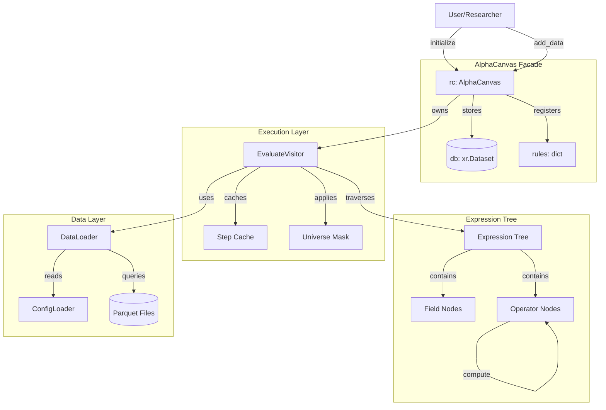
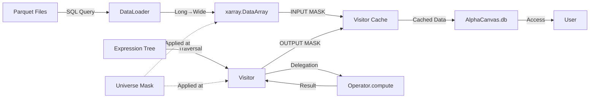
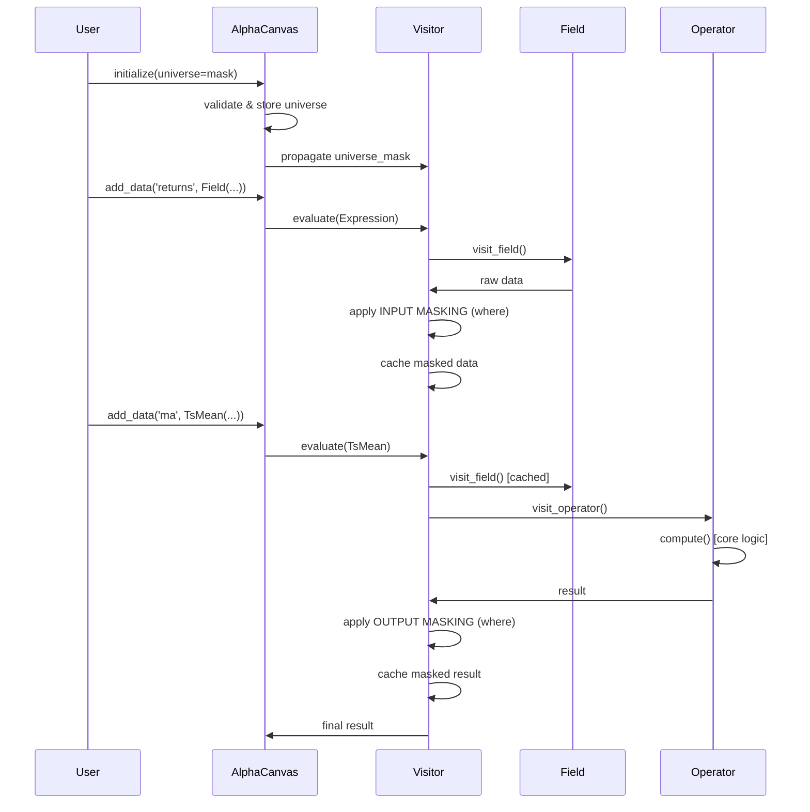

# 2\. 아키텍처 (Architecture)

PRD의 요구사항(F1, F2, F3)을 구현하기 위해 **퍼사드(Facade)**, **컴포짓(Composite)**, **비지터(Visitor)** 디자인 패턴을 기반으로 시스템을 설계합니다.

## 2.0. 시스템 개요

### 2.0.1. 컴포넌트 다이어그램



### 2.0.2. 데이터 흐름 다이어그램



## 2.1. 핵심 컴포넌트

* **A. `AlphaCanvas` (`rc` 객체): 퍼사드 (Facade) 🏛️**

  * **역할:** `rc` 객체는 "최상위 컨트롤러"이자 사용자를 위한 \*\*단일 통합 인터페이스(Facade)\*\*입니다. "홈시어터 퍼사드"가 `DvdPlayer`, `Projector`, `Amplifier` 등 복잡한 서브시스템을 지휘하듯, `rc`는 다음과 같은 내부 컴포넌트들을 지휘하고 조율합니다.
  * **소유 컴포넌트:**
        1. **`rc.db` (State):** `xarray.Dataset` 인스턴스. 이 `Dataset`은 `(time, asset)`이라는 **좌표(Coordinates)**를 공유하며, `market_cap` (float) 및 `add_data`로 추가된 `size` (string) 등 **타입이 다른 여러 데이터 변수(Data Variables)**들을 `data_vars` 딕셔너리에 저장합니다.
        2. **`rc.rules` (Registry):** `add_data`로 정의된 "룰"(`Expression` 객체)을 저장하는 `dict`입니다.
        3. **`rc._evaluator` (Executor):** `EvaluateVisitor`의 인스턴스. `Expression` "레시피"를 실행하는 "실행자"입니다.
        4. **`rc._config` (ConfigLoader):** `config/` 디렉토리의 타입별 YAML 파일(e.g., `data.yaml`)을 로드하는 설정 로더입니다.
        5. **`rc._tracer` (PnLTracer):** PnL 추적 및 분석을 담당하는 컴포넌트입니다.

* **B. `Expression` 트리: 컴포짓 (Composite) 📜**

  * **역할:** "계산법" 또는 "레시피"입니다. **컴포짓 패턴**을 따르는 데이터 구조입니다.
  * **구조:**
    * `Expression`은 모든 연산 노드의 추상 인터페이스입니다.
    * **Leaf (리프):** `Field('close')`와 같이 자식이 없는 노드입니다.
    * **Composite (복합):** `ts_mean(Field('close'), 10)`와 같이 다른 `Expression` 노드를 자식으로 갖는 트리(Tree) 구조입니다.
  * **특징:** `Expression` 객체는 실제 데이터(`(T, N)` 배열)를 전혀 가지지 않고, "계산 룰"에 대한 정의만 가집니다.

* **C. `Visitor` 패턴: 실행 및 추적 (Visitor) 👨‍🍳**

  * **역할:** `Expression` 트리(레시피)를 "방문(visit)"하며 **트리 순회 및 상태 수집**을 담당합니다. **`Expression` 객체와는 완전히 분리된 별개의 클래스**입니다.
  * **`EvaluateVisitor`:** `rc` 객체(`rc._evaluator`)가 소유하며, `Expression` 트리를 순회하며 다음을 수행합니다:
    1. **트리 순회(Traversal):** 깊이 우선 탐색으로 자식 노드를 먼저 방문
    2. **계산 위임(Delegation):** 각 연산자의 `compute()` 메서드를 호출하여 실제 계산 수행
    3. **유니버스 적용(Universe Application):** 필드 입력과 연산자 출력에 유니버스 마스킹 적용
    4. **상태 수집(State Collection):** 중간 결과를 정수 스텝 인덱스와 함께 캐시에 저장
  * **중요:** Visitor는 **계산 로직을 포함하지 않습니다**. 계산 로직은 각 연산자(`Expression`)가 소유합니다.
  * **제네릭 패턴:** 모든 연산자는 단일 `visit_operator()` 메서드를 통해 처리됩니다 (연산자별 개별 메서드 불필요).
    - `visit_field()`: Field 노드 전용 (데이터 로딩 + INPUT MASKING)
    - `visit_operator()`: 모든 연산자 공통 (순회 + 위임 + OUTPUT MASKING + 캐싱)

* **D. 연산자 책임 분리 (Operator Responsibility)**

  * **설계 원칙:** 각 연산자(`Expression`)는 자신의 계산 로직을 `compute()` 메서드로 캡슐화합니다.
  * **Visitor의 역할:**
    * ❌ **하지 않는 것:** 연산자별 계산 로직 구현 (예: rolling window 계산)
    * ✅ **하는 것:** 트리 순회, 계산 위임, 결과 캐싱
  * **연산자의 역할:**
    * ✅ **하는 것:** 자신의 핵심 계산 로직 구현 (`compute()` 메서드)
    * ✅ **하는 것:** Visitor 인터페이스 제공 (`accept()` 메서드)
  * **이점:**
    1. **단일 책임 원칙(SRP):** Visitor는 순회만, 연산자는 계산만
    2. **테스트 용이성:** `compute()` 메서드를 독립적으로 테스트 가능
    3. **유지보수성:** Visitor가 연산자 증가에 따라 비대해지지 않음
    4. **확장성:** 새 연산자 추가 시 Visitor 수정 최소화

## 2.2. 데이터 모델 아키텍처 (Data Model Architecture)

### A. `DataPanel` (MVP)

* `DataPanel`은 `alpha-canvas`의 핵심 데이터 모델이며, 그 실체는 `xarray.Dataset` 객체입니다.
* **좌표(Coordinates):** 모든 데이터는 `(time, asset)` 좌표를 공유합니다.
* **데이터 변수(Data Variables):**
  * `rc.add_data(name, expr)` 메서드는 `rc._evaluator`(Visitor)를 호출하여 `expr`를 평가하고, 그 결과 `(T, N) DataArray`를 `rc.db.assign({name: result_array})`를 통해 `data_vars`에 **새로운 데이터 변수(Data Variable)로 추가**합니다.
  * 예: `rc.add_data('size', cs_quantile(...))`는 `rc.db['size']`를 생성하며, 이는 `string` 타입의 레이블 배열입니다.

### B. "개방형 툴킷" (Open Toolkit) 구현

* **Eject (꺼내기):**
  * `rc` 객체는 `db` 프로퍼티(e.g., `@property def db`)를 제공하여, `rc.db` 호출 시 래핑된 `xarray.Dataset` 객체를 **순수(pure) `xarray.Dataset` 타입**으로 반환해야 합니다.
  * 이를 통해 사용자는 Jupyter에서 `scipy`, `statsmodels` 등 외부 라이브러리로 자유롭게 데이터를 조작할 수 있습니다.

* **Inject (주입하기):**
  * `rc.add_data(name, data)` 메서드는 `Expression` 객체뿐만 아니라, 외부에서 생성된 `xarray.DataArray`도 `data` 인자로 받아 `rc.db`에 "주입(inject)"할 수 있도록 오버로딩되어야 합니다.
  * 예: `rc.add_data('beta', beta_array)` (beta_array는 외부에서 scipy로 계산한 DataArray)

### C. 유니버스 마스킹 (Universe Masking) ✅ **IMPLEMENTED**

**투자 가능 유니버스(Investable Universe)**는 alpha-canvas의 핵심 설계 원칙입니다. 모든 데이터와 연산 결과는 정의된 유니버스를 자동으로 준수합니다.

#### 1. 설계 철학: 이중 마스킹 전략 (Double Masking Strategy)

**핵심 원칙**: 신뢰 체인(Trust Chain)을 구축하여 모든 데이터가 유니버스를 준수함을 보장합니다.

* **INPUT MASKING (입력 마스킹)**: `visit_field()`에서 필드 검색 시 적용
  - 원본 데이터가 시스템에 진입하는 순간 마스킹
  - `result = result.where(universe_mask, np.nan)`
  
* **OUTPUT MASKING (출력 마스킹)**: `visit_operator()`에서 연산 결과에 적용
  - 모든 연산자의 출력이 유니버스를 준수함을 보장
  - 연산자는 입력이 이미 마스킹되었다고 신뢰 가능

#### 2. 불변성 (Immutability)

* **초기화 시 설정**: `AlphaCanvas(universe=...)`로 세션 시작 시 한 번만 설정
* **변경 불가**: 한번 설정된 유니버스는 변경 불가 (read-only property로만 접근)
* **근거**: 공정한 PnL 단계별 비교를 위해 고정된 유니버스 필요
  - alpha_t와 alpha_{t+1}를 비교할 때 유니버스가 바뀌면 비교 불가능
  - 재현 가능한 백테스트 보장

#### 3. 아키텍처 흐름도



#### 4. 멱등성 (Idempotency)

* **검증됨**: 이중 마스킹은 멱등성을 가짐 (데이터 손상 없음)
* `data.where(mask, np.nan).where(mask, np.nan) == data.where(mask, np.nan)`
* 마스킹된 데이터는 재마스킹되어도 변하지 않음

#### 5. 성능 특성

* **오버헤드**: 13.6% (실측값, 500×100 데이터셋 기준)
* **결론**: xarray의 lazy evaluation 덕분에 무시 가능한 수준
* **최적화**: 이중 마스킹의 안전성 이득이 성능 비용보다 훨씬 큼

#### 6. Open Toolkit 통합

* **주입된 데이터도 마스킹**: `add_data(name, DataArray)` 시 자동 적용
* **Eject-Inject 패턴**: 외부에서 계산한 데이터도 유니버스 준수

#### 7. 미래 확장

* **데이터베이스 기반 유니버스**: `AlphaCanvas(universe=Field('univ500'))`
  - Parquet 파일에서 유니버스 로드: `date, security_id, univ100, univ200, univ500, univ1000`
  - Expression 평가 메커니즘 그대로 활용
  - 코드 변경 불필요

* **유니버스 생성 유틸리티**: 복잡한 조건의 유니버스 생성 및 영속화
  - `create_universe(price > 5, volume > 100000, market_cap > 1e9)`
  - 데이터베이스에 저장하여 재사용

### D. 데이터 로딩 아키텍처 (Data Loading Architecture) ✅ **IMPLEMENTED**

**DataLoader 컴포넌트**는 Parquet 파일 기반 데이터 검색을 담당합니다.

#### 1. 설계 목표

* **파일 기반 DB**: MVP에서는 Parquet 파일을 DB로 활용
* **SQL 기반 쿼리**: DuckDB를 사용하여 Parquet에 직접 SQL 실행
* **동적 파라미터**: 날짜 범위를 런타임에 주입
* **자동 변환**: Long 포맷 → Wide 포맷 `(T, N)` 자동 변환

#### 2. 아키텍처 흐름

```
ConfigLoader (config/data.yaml)
        ↓
   SQL 템플릿 로드
        ↓
DataLoader.load_field(field_name)
        ↓
   DuckDB 쿼리 실행
   (Parquet 직접 읽기)
        ↓
   Long → Wide 피벗팅
   (date × security_id → time × asset)
        ↓
   xr.DataArray 반환 (T, N)
```

#### 3. Config 기반 SQL 정의

**config/data.yaml 예시:**
```yaml
adj_close:
  query: >
    SELECT 
      date,
      security_id,
      close * adj_factor as adj_close
    FROM read_parquet('data/pricevolume.parquet')
    WHERE date >= '{start_date}' AND date <= '{end_date}'
  time_col: date
  asset_col: security_id
  value_col: adj_close
```

**핵심 특징:**
* `{start_date}`, `{end_date}`: 런타임 파라미터 치환
* `read_parquet()`: DuckDB의 네이티브 Parquet 읽기
* Long 포맷 반환: `(date, security_id, value)` 세 컬럼

#### 4. 데이터 로딩 책임

**DataLoader 역할:**
1. **쿼리 실행**: DuckDB로 Parquet 파일 쿼리
2. **파라미터 치환**: SQL 템플릿에 날짜 범위 주입
3. **피벗팅**: Long 포맷 → Wide 포맷 (T, N) 변환
4. **검증**: xarray.DataArray로 좌표계 통일

**데이터 흐름:**
```
Parquet File (Long Format)
         ↓
   DuckDB Query (SQL)
         ↓
   DataFrame (date × security_id × value)
         ↓
   Pivot Operation
         ↓
   xarray.DataArray (time × asset)
         ↓
   Visitor Cache
```

*구체적인 구현은 implementation.md 참조*

#### 5. Visitor 통합 흐름

**Field 노드 방문 로직:**
1. **캐시 확인**: Dataset에 이미 로드된 데이터인지 확인
2. **지연 로딩**: 없으면 DataLoader를 통해 Parquet에서 로드
3. **캐시 저장**: Dataset에 assign하여 재사용
4. **INPUT MASKING**: 유니버스 마스크 적용 (xarray.where)

**핵심 설계:**
- **Lazy Loading**: 필요할 때만 Parquet 파일 읽기
- **Caching**: 한 번 로드한 데이터는 Dataset에 캐싱
- **Universe Integration**: 데이터 진입 시점에 마스킹

#### 6. 미래 확장

* **다중 DB 지원**: PostgreSQL, ClickHouse 등 커넥터 추가
* **캐싱 전략**: 디스크 캐시로 반복 쿼리 최적화
* **병렬 로딩**: 여러 필드 동시 로드
* **증분 로드**: 새로운 날짜 범위만 추가 로드

## 2.3. 미래 확장: `DataTensor` 아키텍처 (Future Expansion)

### A. `DataTensor` 모델

* 향후 페어 트레이딩 지원을 위해 `(T, N, N)` (e.g., `dims=['time', 'asset_i', 'asset_j']`) 차원을 갖는 `DataTensor` 모델을 도입합니다.
* 예: 공분산 행렬, 상관관계 행렬 등

### B. 연산자 패밀리 (Operator Families)

`EvaluateVisitor`는 연산자의 입력/출력 타입을 검사하여 타입 안전성을 강제해야 합니다.

1. **다형성(Polymorphic) 연산자:** (`ts_mean` 등) `time` 차원에만 작동하며, `DataPanel`과 `DataTensor` 모두에 적용됩니다.
2. **`Panel` 전용 연산자:** (`cs_rank`, `cs_quantile` 등) `asset` 차원에 작동하며, `DataTensor` 입력 시 `EvaluateVisitor`가 `TypeError`를 발생시켜야 합니다.
3. **`Tensor` 전용 연산자:** (`matrix_eigenvector` 등) `(N, N)` 행렬 연산을 수행하며, `Panel` 입력 시 `TypeError`를 발생시켜야 합니다.

### C. 텐서 생명주기 (Tensor Lifecycle)

* 리서처는 `DataTensor`에 `matrix_` 연산자를 적용한 뒤, `matrix_row_mean(tensor)` (`(T, N)`로 **축소**) 또는 `flatten_pairs(tensor)` (`(T, M)`로 **평탄화**) 같은 연산자를 통해 `DataPanel`로 변환하여 `cs_rank` 등 `Panel` 전용 연산자를 다시 사용할 수 있습니다.

## 2.4. 기능별 아키텍처 구현 및 상태

### ✅ **F1 (데이터 검색) - IMPLEMENTED**

**구현 완료**: ConfigLoader + DataLoader + Parquet/DuckDB 통합

1. `rc` 초기화 시 `ConfigLoader`가 `config/` 디렉토리의 YAML 파일들을 읽습니다 (e.g., `config/data.yaml`).
2. `rc.add_data('close', Field('adj_close'))` 호출 시, `rc`는 `Field('adj_close')`를 `rc.rules`에 등록합니다.
3. 이후 `EvaluateVisitor`가 `Field('adj_close')` 노드를 방문하면:
   - `rc._config`에서 `adj_close` 설정을 조회하여 SQL 템플릿 획득
   - `DataLoader`가 날짜 파라미터를 치환하고 DuckDB로 Parquet 파일 쿼리
   - Long → Wide 피벗팅하여 `(T, N)` DataArray 생성
4. 결과를 `rc.db['close']`에 저장(캐시)합니다.

**현재 구현**: ConfigLoader, DataLoader, Field 노드, 파라미터 치환, 피벗팅

---

### 🔨 **F3 (심층 추적성) - PARTIAL**

**구현 완료**: 정수 기반 step 인덱싱 및 캐싱  
**미구현**: PnLTracer 및 trace_pnl() API

1. **설계 동기:**
   * 문자열 기반 step 이름(`step='ts_mean'`)은 연산자 이름 변경 시 깨지고, 동일 연산자가 여러 번 사용될 때 모호하며, 런타임 오류에 취약합니다.
   * 정수 인덱스는 견고하고(robust), 예측 가능하며(predictable), 타입 안전합니다(type-safe).

2. `rc._evaluator` (Visitor)는 **"Stateful(상태 저장)"** 객체입니다.

3. **Cache 구조 ✅**: `EvaluateVisitor`는 내부에 `_cache: dict[int, tuple[str, xr.DataArray]]`를 소유합니다.
   * 키: **정수 step 인덱스** (0부터 시작)
   * 값: `(노드_이름, DataArray)` 튜플 - 노드 이름은 디버깅용 메타데이터

4. **캐싱 로직 ✅**: Visitor는 `Expression` 트리를 **깊이 우선 탐색(depth-first)** 으로 순회하면서 **각 노드가 반환하는 중간 결과를 순차적으로 캐시**합니다.
   * 예시 Expression: `group_neutralize(ts_mean(Field('returns'), 3), 'subindustry')`
   * `cache[0]` = `('Field_returns', DataArray(...))`
   * `cache[1]` = `('TsMean', DataArray(...))`
   * `cache[2]` = `('GroupNeutralize', DataArray(...))`

5. **병렬 Expression 예시:**
   * `ts_mean(Field('returns'), 3) + rank(Field('market_cap'))`
   * step 0: `Field('returns')`
   * step 1: `ts_mean(Field('returns'), 3)`
   * step 2: `Field('market_cap')` ← 두 번째 브랜치
   * step 3: `rank(Field('market_cap'))`
   * step 4: `add(step1, step3)` ← 병합

6. **📋 미구현**: 선택적 추적 API
   * `rc.trace_pnl('alpha1', step=1)` - 계획만 있음
   * `rc.get_intermediate('alpha1', step=1)` - 계획만 있음
   * `PnLTracer` 컴포넌트 - 아직 구현 안 됨

7. **Visitor의 step 카운터 ✅**: `EvaluateVisitor._step_counter` 변수를 유지하며, 각 노드 방문 시 증가시켜 순차적 인덱스를 부여합니다.

---

### 📋 **F2 (셀렉터 인터페이스) - PLANNED**

**상태**: 설계 완료, 구현 예정

1. `rc.add_data('size', cs_quantile(rc.data.mcap, ...))` 호출 시, `rc`는 이 `cs_quantile` `Expression` 객체를 `rc.rules['size']`에 등록합니다.
2. `rc._evaluator`가 `Expression`을 평가하여 `(T, N)` 레이블 배열을 생성하고, `rc.db = rc.db.assign({'size': result})`로 `data_vars`에 추가합니다.
3. 사용자가 `mask = rc.axis.size['small']`을 호출합니다.
4. `rc.axis` accessor는 이를 `(rc.db['size'] == 'small')`이라는 표준 `xarray` 불리언 인덱싱으로 변환합니다.
5. `(T, N)` 불리언 마스크가 반환됩니다.
6. 사용자가 `rc[mask] = 1.0`을 호출하면, `rc`는 `rc.db['my_alpha']` 캔버스에 `xr.where`를 사용하여 값을 할당(overwrite)합니다.

**구현 필요 사항**:
- [ ] `cs_quantile` 연산자
- [ ] `AxisAccessor` 및 `AxisSelector`
- [ ] `rc[mask] = value` 할당 로직
- [ ] `init_signal_canvas()` 메서드

---

### 📋 **F4 (팩터 수익률 계산) - PLANNED**

**상태**: F2에 의존, 설계 완료

1. F2의 셀렉터 인터페이스를 활용하여 다차원 팩터 포트폴리오를 구성합니다.
2. **독립 정렬 (Independent Sort) 구현:**
   * 각 팩터를 `cs_quantile`로 버킷화하여 독립적인 축(axis)으로 등록합니다.
   * 모든 quantile 계산은 **전체 유니버스** 대상으로 수행됩니다.
   * 예: `rc.add_data('size', cs_quantile(rc.data.mcap, ...))`
3. **종속 정렬 (Dependent Sort) 구현:**
   * `cs_quantile`의 `group_by` 파라미터를 사용합니다. (pandas-like 인터페이스)
   * **구현 방식 (xarray.groupby 활용):**
     1. `cs_quantile(..., group_by='size')` 호출 시
     2. `EvaluateVisitor.visit_cs_quantile()`에서:
        - `group_by`가 문자열이면, `rc.db[group_by]`로 그룹 레이블 `DataArray`를 조회합니다.
        - `data_array.groupby(rc.db['size'])`로 xarray groupby 객체를 생성합니다.
        - `.apply(quantile_function, ...)`를 호출하여 각 그룹('small', 'big')별로 별도 quantile을 계산합니다.
   * 예: `rc.add_data('value', cs_quantile(rc.data.btm, group_by='size', ...))`
4. **로우레벨 마스크 (Mask) 구현:**
   * `cs_quantile(..., mask=boolean_mask)` 호출 시
   * `EvaluateVisitor`는 mask가 `True`인 항목들에 대해서만 quantile을 계산합니다.
5. **Fama-French 재현:** 이 패턴들로 독립/종속 이중 정렬 기반 SMB, HML 팩터를 정확히 재현할 수 있습니다.

**구현 필요 사항**:
- [ ] `cs_quantile` 연산자 (group_by, mask 파라미터)
- [ ] xarray.groupby().apply() 통합
- [ ] 셀렉터 기반 포트폴리오 구성 로직

## 2.3. 설계 원칙 및 근거

### 2.3.1. 왜 정수 기반 Step 인덱싱인가?

1. **견고성(Robustness)**: 연산자 이름이 변경되어도 인덱스는 절대 변하지 않습니다.
2. **예측 가능성(Predictability)**: 깊이 우선 탐색 순서는 알고리즘적이며 휴리스틱이 아닙니다.
3. **단순성(Simplicity)**: 정수 조회는 O(1)이며 타입 안전합니다.
4. **디버깅**: 메타데이터 튜플이 노드 이름을 보존하여 검사가 용이합니다.

### 2.3.2. 왜 `group_by` 방식인가?

1. **선언적(Declarative)**: 의도를 명확히 표현합니다 ("그룹 내 quantile 계산")
2. **Pandas-like**: `df.groupby()`와 유사한 친숙한 멘탈 모델
3. **단일 축**: 그룹별로 별도의 축을 만들 필요가 없습니다
4. **조합 가능(Composable)**: 여러 종속 정렬을 연쇄할 수 있습니다

### 2.3.3. 왜 `mask`도 제공하는가?

1. **유연성**: `group_by`로 표현 불가능한 커스텀 로직 처리
2. **성능**: 비용이 큰 quantile 계산 전 사전 필터링
3. **유니버스 정의**: "투자 가능 유니버스"를 명확히 표현
4. **점진적 학습**: 간단한 케이스는 `group_by`, 고급 케이스는 `mask` 사용
