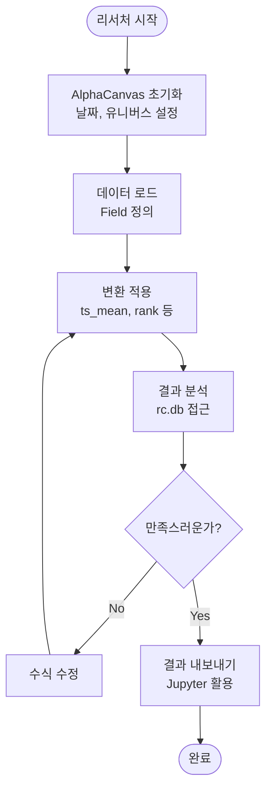
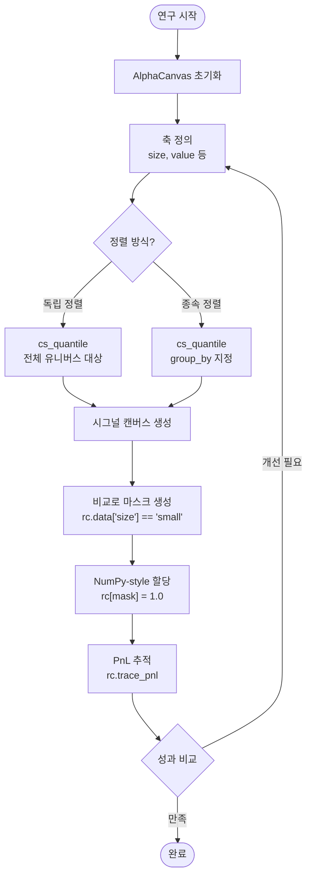
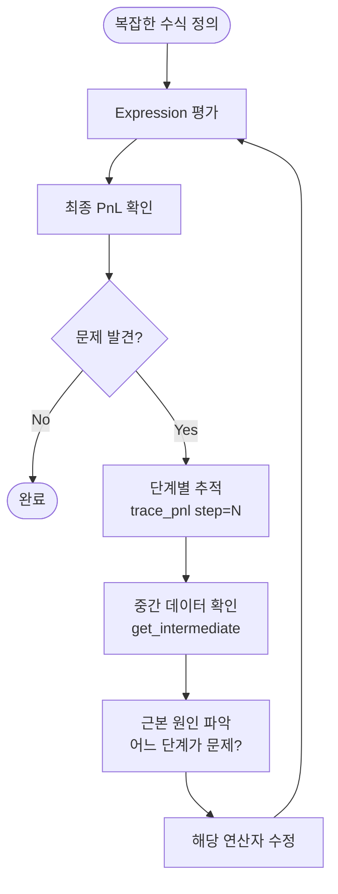

# 1\. 제품 요구사항 문서 (Product Requirement Document)

## 1.1. 개요

* **제품명:** alpha-canvas
* **목표:** 퀀트 리서처가 Python 네이티브 환경에서 복잡한 알파 아이디어를 빠르고 직관적으로 테스트하고, 그 과정을 투명하게 추적할 수 있는 차세대 리서치 플랫폼을 제공합니다.
* **비전:** 데이터 검색부터 팩터 생성, PnL 분석까지의 전 과정을 통합된 단일 인터페이스(`rc`)로 제공하여, 팩터 수익률(factor return) 계산을 포함한 아이디어의 프로토타이핑 속도를 획기적으로 단축시킵니다. MVP(Minimum Viable Product)는 `(T, N)` `DataPanel` 모델을 중심으로 팩터(Alpha)를 생성하고 검증하는 경험에 집중합니다. 또한, `alpha-canvas`를 Jupyter 환경과 완벽히 호환되는 **"개방형 툴킷(Open Toolkit)"**으로 제공하여, 기존 리서치 워크플로우에 유연하게 통합될 수 있도록 합니다.

## 1.2. 사용자 워크플로우 (User Workflows)

### 워크플로우 1: 기본 팩터 생성 및 분석



### 워크플로우 2: 다차원 팩터 포트폴리오 구성 (Fama-French)



### 워크플로우 3: 디버깅 및 추적성



## 1.3. 핵심 문제 (The Problem)

기존 퀀트 리서치 툴(e.g., WorldQuant BRAIN)은 강력하지만 다음과 같은 명확한 한계를 가집니다.

1. **복잡하고 비직관적인 문법:** `bucket(rank(x), range="0.1, 1, 0.1")`와 같이 문자열 파싱에 의존하는 복잡한 문법은 배우기 어렵고 오류를 유발하기 쉽습니다.
2. **조작 불가능한 "블랙박스" 버킷:**
      * 기존 인터페이스는 버킷(bucket) 연산의 결과로 `'small'`, `'mid'`와 같은 의미 있는 \*\*레이블(Label)\*\*이 아닌, `0, 1, 2` 같은 \*\*정수 인덱스(Index)\*\*를 반환합니다.
      * 이로 인해 리서처가 **"Small Size이면서 High Value인 그룹"**을 선택하거나, **"Mid Value 그룹은 제외"**하는 등 Fama-French 스타일의 정교한 포트폴리오 구성 및 데이터 조작이 불가능했습니다. 본 PRD는 이 문제를 "셀렉터 인터페이스"로 해결하는 것을 핵심 목표로 합니다.
3. **결과 중심의 불투명성 (낮은 추적성):** `group_neutralize(ts_mean('returns', 3), ...)`와 같은 복잡한 수식의 최종 PnL만 알 수 있을 뿐, *중간 단계*(`ts_mean` 적용 직후)에서 `NaN`이 발생했는지, 또는 어느 연산이 PnL을 하락시켰는지 추적하기 매우 어렵습니다.

## 1.4. 대상 사용자 (User Persona)

* **페르소나:** 바이사이드(Buy-side) 퀀트 리서처 / 포트폴리오 매니저
* **특징:**
  * Python 및 `pandas`/`numpy`/`xarray`에 익숙합니다.
  * 아이디어를 빠르게 프로토타이핑하고 싶어 합니다.
  * 단순히 PnL 결과만 보는 것이 아니라, 수식의 **각 단계별**로 PnL 기여도와 데이터 상태를 투명하게 추적할 수 있기를 원합니다.

## 1.5. 핵심 데이터 모델 (Core Data Model)

### MVP: `DataPanel` (T, N)

* `alpha-canvas`의 MVP는 `(T, N)` (time, asset) 차원을 갖는 `DataPanel` 모델에 집중합니다.
* `rc` 객체가 관리하는 모든 데이터(`market_cap`, `returns`, `size` 축 등)는 `(T, N)` 좌표계를 공유하며, MVP의 모든 연산자(e.g., `ts_mean`, `cs_quantile`)는 `DataPanel`을 입력받고 반환합니다.
* `DataPanel`의 실체는 `xarray.Dataset` 객체이며, 이는 표준 Python 생태계와의 완벽한 호환성을 보장합니다.

### 미래 확장 (Future Expansion): `DataTensor` 및 기타

* 향후 릴리스에서는 페어 트레이딩(Pair Trading) 및 공분산 분석을 위한 `DataTensor` `(T, N, N)` 모델을 지원하도록 확장합니다.
* 또한, 롤링 회귀(Rolling Regression) 파라미터(`alpha`, `beta`) 등을 저장하기 위한 `DataEstimates` `(T, N, K)` 모델도 지원 대상입니다.

## 1.6. "개방형 툴킷" (Open Toolkit) 철학

**요구사항:** `alpha-canvas`는 닫힌 시스템(Closed System)이 아닙니다.

* **Jupyter 호환성 (Eject):** 사용자는 언제든 `rc` 객체에서 계산된 `xarray` 데이터를 "꺼내어(eject)" Jupyter 환경에서 `scipy`, `statsmodels` 등 순수 Python 라이브러리로 자유롭게 조작할 수 있어야 합니다.
  
  ```python
  # Eject: rc에서 순수 xarray.Dataset 꺼내기
  pure_dataset = rc.db
  
  # 외부 라이브러리로 자유롭게 조작
  beta_values = run_rolling_regression(pure_dataset['returns'], pure_dataset['market'])
  ```

* **데이터 재주입 (Re-injection):** 사용자는 Jupyter에서 직접 생성한 커스텀 데이터(e.g., 롤링 회귀 베타값)를 다시 `rc` 객체에 새로운 `DataPanel`로 "주입(inject)"하여, `alpha-canvas`의 `ts_mean`과 같은 연산자를 이어서 적용할 수 있어야 합니다.
  
  ```python
  # Inject: 외부에서 생성한 데이터를 rc에 주입
  rc.add_data('beta', beta_values)  # xarray.DataArray 직접 주입
  
  # alpha-canvas 연산자 계속 사용
  beta_smoothed = rc.ts_mean('beta', 5)
  ```

## 1.7. 주요 기능 요구사항 (Key Features)

### F1: Config 기반 데이터 검색 (Data Retrieval)

* **요구사항:** 사용자는 `config/` 디렉토리 내의 타입별 YAML 파일(e.g., `data.yaml`, `db.yaml`)에 설정을 명시적으로 정의할 수 있어야 합니다. 이는 데이터 로직과 리서치 로직을 명확히 분리합니다.
* **Config 구조:**
  * `config/data.yaml`: 데이터 필드(field) 별칭 및 DB 접근 정보
  * `config/db.yaml`: 데이터베이스 연결 설정 (선택적)
  * `config/calc.yaml`: 기타 계산 관련 설정 (선택적)
* **Config 예시 (`config/data.yaml`):**

```yaml
# 'adj_close'라는 별칭(alias) 정의
adj_close:
    table: PRICEVOLUME  # 실제 DB 테이블명
    index_col: date
    security_col: securities
    value_col: adj_close
    # SQL 쿼리를 직접 사용하여 (T, N) 데이터를 가져옴
    query: >
    SELECT 
        TRD_DD as date, 
        TICKER as securities, 
        CLOSE * ADJ_FACTOR as adj_close 
    FROM PRICEVOLUME

# 'subindustry'라는 별칭 정의 (그룹핑/메타데이터용)
subindustry:
    table: SECURITY_MASTER
    index_col: date
    security_col: securities
    value_col: GICS_SUBINDUSTRY
```

### F2: 듀얼 인터페이스 (Dual Interface)

사용자는 리서치 목적에 따라 두 가지 방식의 인터페이스를 자유롭게 혼용할 수 있어야 합니다.

* **인터페이스 A: Excel-like Formula (수식 기반)**

  * **요구사항:** `ts_mean`, `rank` 등 WQ 스타일의 연산자를 단순하고 파이썬다운 함수 호출로 지원해야 합니다.
  * **시나리오:**

```python
# 1. 헬퍼 함수로 (T, N) DataArray 즉시 받기
returns_10d = rc.ts_mean('return', 10) 

# 2. 복잡한 룰(Expression)을 정의하고 'alpha1' 변수로 저장
alpha_expr = group_neutralize(ts_mean('return', 10), 'subindustry')
rc.add_data_var('alpha1', alpha_expr) 
```

* **인터페이스 B: 셀렉터 인터페이스 (Numpy-style)**

  * **요구사항:** (핵심 문제 2 해결) 분류 데이터(categorical labels)를 정의하고, `numpy`처럼 불리언 마스크를 생성하여 최종 시그널 캔버스에 값을 할당할 수 있어야 합니다.
  * **시나리오:**

```python
# 1. "시그널 캔버스" 초기화 (rc.db에 'my_alpha' DataArray 생성)
rc.init_signal_canvas('my_alpha') 

# 2. "데이터 룰" 등록 (필요시)
rc.add_data('mcap', Field('market_cap'))
rc.add_data('ret', Field('return'))

# 3. 분류 데이터(categorical labels) 생성
rc.add_data('size', cs_quantile(rc.data['mcap'], bins=2, labels=['small', 'big']))
rc.add_data('surge_event', ts_any(rc.data['ret'] > 0.3, window=504))

# 4. "비교 연산"으로 (T, N) 불리언 마스크 생성 
mask_long = (rc.data['size'] == 'small') & (rc.data['surge_event'] == True)

# 5. "Numpy-style 할당" (rc[mask] = 1.0)
rc[mask_long] = 1.0  
```

### F3: 심층 추적성 (Deep Traceability)

* **요구사항:** (핵심 문제 3 해결) 사용자는 복잡한 수식의 **각 중간 연산 단계별**로 `(T, N)` 데이터 상태와 PnL을 **선택적으로** 추적할 수 있어야 합니다. 단계는 **정수 인덱스(0부터 시작)**로 참조되며, Expression 트리를 **깊이 우선 탐색(depth-first traversal)**으로 순회하면서 부여됩니다.

* **단계 인덱싱 예시:**
  * Expression: `group_neutralize(ts_mean(Field('returns'), 3), 'subindustry')`
  * **step 0**: `Field('returns')` → 원본 returns 데이터
  * **step 1**: `ts_mean(Field('returns'), 3)` → 이동평균 적용 후
  * **step 2**: `group_neutralize(...)` → 그룹 중립화 후 (최종)

* **시나리오 1: 특정 단계 추적**
    1. 사용자가 `alpha_expr = group_neutralize(ts_mean(Field('returns'), 3), 'subindustry')` 룰을 정의합니다.
    2. `rc.add_data_var('alpha1', alpha_expr)`를 실행합니다.
    3. 이후 `rc.trace_pnl('alpha1', step=1)`를 호출합니다.
    4. 시스템은 **재계산 없이** step 1 (`ts_mean` 적용 후)의 중간 결과에 대한 PnL만 반환합니다.

* **시나리오 2: 전체 단계 추적**
    1. 사용자가 `rc.trace_pnl('alpha1', step=None)`를 호출합니다. (또는 `step` 생략)
    2. 시스템은 모든 중간 단계의 PnL 리포트를 순서대로 반환합니다:
          * **step 0**: 원본 `returns`의 PnL
          * **step 1**: `ts_mean` 적용 후의 PnL
          * **step 2**: `group_neutralize` 적용 후 최종 PnL

* **시나리오 3: 중간 데이터 접근**
    1. 사용자가 `rc.get_intermediate('alpha1', step=1)`를 호출합니다.
    2. 시스템은 step 1 (`ts_mean` 적용 후)의 `(T, N)` `DataArray`를 반환하여 직접 검사할 수 있게 합니다.

* **복잡한 Expression 예시:**
  * Expression: `ts_mean(Field('returns'), 3) + rank(Field('market_cap'))`
  * **step 0**: `Field('returns')` → 원본 returns
  * **step 1**: `ts_mean(Field('returns'), 3)` → returns의 이동평균
  * **step 2**: `Field('market_cap')` → 원본 market cap
  * **step 3**: `rank(Field('market_cap'))` → market cap의 순위
  * **step 4**: `add(step1, step3)` → 최종 합계

### F4: 팩터 수익률 계산 (Core Use Case)

* **요구사항:** F2의 듀얼 인터페이스를 활용하여 **다차원 팩터 포트폴리오 구성 및 수익률 계산**을 간결하게 수행할 수 있어야 합니다. 이는 alpha-canvas의 핵심 활용 사례입니다. 특히 **Fama-French 3-factor 모델**의 독립/종속 이중 정렬(independent/dependent double sort)을 쉽게 재현할 수 있어야 합니다.

* **시나리오 1: 독립 이중 정렬 (Independent Double Sort)**
    1. 사용자가 두 개의 팩터(Size, Value)를 정의합니다.
    2. 각 팩터를 **독립적으로** 버킷화(quantile)하여 등록합니다.
    3. 셀렉터 인터페이스를 사용하여 다차원 교차 선택을 수행합니다.
    4. 예시: Fama-French SMB (Small Minus Big) 팩터

```python
# 1. 독립 정렬: 전체 유니버스에서 각각 quantile 계산
rc.add_data('size', cs_quantile(rc.data['mcap'], bins=2, labels=['small', 'big']))
rc.add_data('value', cs_quantile(rc.data['btm'], bins=3, labels=['low', 'mid', 'high']))

# 2. Small-Value 포트폴리오 구성
rc.init_signal_canvas('smb')
rc[rc.data['size'] == 'small'] = 1.0   # Long small stocks
rc[rc.data['size'] == 'big'] = -1.0    # Short big stocks

# 3. 팩터 수익률 계산
smb_returns = rc.trace_pnl('smb')
```

* **시나리오 2: 종속 이중 정렬 (Dependent Double Sort)**
    1. 첫 번째 팩터(Size)로 먼저 정렬합니다.
    2. 두 번째 팩터(Value)는 **첫 번째 팩터의 각 그룹 내에서** 독립적으로 quantile을 계산합니다.
    3. 이를 위해 `group_by` 파라미터를 사용합니다.
    4. 예시: 종속 정렬 기반 HML (High Minus Low) 팩터

```python
# 1. 첫 번째 정렬: Size
rc.add_data('size', cs_quantile(rc.data['mcap'], bins=2, labels=['small', 'big']))

# 2. 종속 정렬: 각 Size 그룹 내에서 Value quantile 계산
rc.add_data('value', cs_quantile(rc.data['btm'], bins=3, labels=['low', 'mid', 'high'],
                                   group_by='size'))

# 3. HML 포트폴리오 구성 (각 Size 그룹 내에서 High-Low)
rc.init_signal_canvas('hml')
rc[rc.data['value'] == 'high'] = 1.0   # Long high B/M (value stocks)
rc[rc.data['value'] == 'low'] = -1.0   # Short low B/M (growth stocks)

# 4. 팩터 수익률 계산
hml_returns = rc.trace_pnl('hml')
```

* **시나리오 3: 로우레벨 마스크 기반 정렬 (고급)**
    1. `group_by`로 표현하기 어려운 커스텀 조건부 정렬이 필요한 경우
    2. `mask` 파라미터로 특정 조건을 만족하는 종목들에 대해서만 quantile 계산

```python
# 유동성이 충분한 종목들만 대상으로 모멘텀 quantile 계산
high_liquidity_mask = rc.data['volume'] > rc.data['volume'].quantile(0.5)
rc.add_data('momentum', cs_quantile(rc.data['returns'], bins=5, labels=['q1','q2','q3','q4','q5'],
                                      mask=high_liquidity_mask))
```

## 1.8. 포트폴리오 구성 (Portfolio Construction - F5)

### 개념

시그널(Signal) 생성 후, 실제 거래 가능한 포트폴리오 가중치(Portfolio Weights)로 변환하는 단계입니다. 임의의 시그널 값을 제약 조건(gross/net exposure, long-only 등)을 만족하는 정규화된 가중치로 스케일링합니다.

### 요구사항

* **전략 패턴(Strategy Pattern)**: 다양한 스케일링 전략을 플러그인 방식으로 지원
* **명시적 파라미터**: 스케일러는 항상 명시적으로 전달 (상태 저장 없음)
* **크로스-섹션 독립**: 각 시점(T)마다 독립적으로 스케일링
* **유니버스 준수**: 스케일링 후에도 유니버스 마스킹 유지

### 통합 프레임워크: Gross/Net Exposure

가장 범용적인 스케일링 방식은 **총 노출(Gross Exposure, G)**과 **순 노출(Net Exposure, N)**로 제약을 정의하는 것입니다:

$$L_{\text{target}} = \frac{G + N}{2}, \quad S_{\text{target}} = \frac{G - N}{2}$$

여기서:
- $G = \sum |w_i|$ (총 노출: 롱 + 숏의 절대값 합)
- $N = \sum w_i$ (순 노출: 롱 - 숏)
- $L$ = 롱 포지션 합
- $S$ = 숏 포지션 합 (음수 값)

### 사용 시나리오

```python
from alpha_canvas.portfolio import DollarNeutralScaler, GrossNetScaler, LongOnlyScaler

# 1. 시그널 생성 (임의의 값)
signal_expr = ts_mean(Field('returns'), 5)
signal_data = rc.evaluate(signal_expr)  # (T, N) DataArray

# 2. 달러 중립 포트폴리오 (Long=1.0, Short=-1.0)
scaler = DollarNeutralScaler()
weights = scaler.scale(signal_data)
# sum(weights[weights > 0]) = 1.0
# sum(weights[weights < 0]) = -1.0

# 3. 순 롱 바이어스 포트폴리오 (Long=1.1, Short=-0.9)
scaler = GrossNetScaler(target_gross=2.0, target_net=0.2)
weights = scaler.scale(signal_data)

# 4. 롱 온리 포트폴리오 (sum=1.0)
scaler = LongOnlyScaler(target_long=1.0)
weights = scaler.scale(signal_data)

# 5. 크립토 선물 (Gross=100%, Net=0%)
scaler = GrossNetScaler(target_gross=1.0, target_net=0.0)
weights = scaler.scale(signal_data)
# sum(abs(weights)) = 1.0 (롱 50% + 숏 50%)
```

### 파사드 통합 (편의 메서드)

```python
# AlphaCanvas에서 직접 스케일링 (Expression 자동 평가)
signal_expr = ts_mean(Field('returns'), 5)
scaler = DollarNeutralScaler()

# 편의 메서드: evaluate + scale 한 번에
weights = rc.scale_weights(signal_expr, scaler)
```

### 설계 근거

* **Stateless 설계**: 스케일러는 상태를 저장하지 않음 (재사용 가능)
* **명시적 우선**: 어떤 스케일러를 사용하는지 항상 명확함
* **연구 친화적**: 동일 시그널에 여러 스케일러를 쉽게 비교 가능
* **확장 가능**: 새로운 스케일링 전략 추가 용이 (Strategy Pattern)

### 미래 확장

* **리스크 기반 스케일링**: `RiskTargetScaler(target_vol, cov_matrix)`
* **최적화 기반**: `OptimizationScaler(constraints)` with cvxpy
* **포지션 제한**: `max_weight_per_asset`, `turnover_limit` 등

## 1.9. 유니버스 정의 (Universe Definition)

### 개념

**투자 가능 유니버스(Investable Universe)**는 백테스트에서 실제로 거래 가능한 종목의 집합을 정의합니다.

### 요구사항

* **초기화 시 설정**: `AlphaCanvas` 초기화 시 한 번 설정되며 세션 동안 불변
* **자동 적용**: 모든 데이터 검색과 연산 결과에 자동으로 적용
* **불리언 마스크**: `(T, N)` 형태의 불리언 DataArray로 표현
* **NaN 처리**: 유니버스 밖 종목은 모든 연산에서 NaN으로 처리

### 사용 시나리오

```python
# 시나리오 1: 간단한 가격 기반 유니버스
rc = AlphaCanvas(
    start_date='2024-01-01',
    end_date='2024-12-31',
    universe=rc.data['price'] > 5.0  # 페니스톡 제외
)

# 시나리오 2: 복합 조건 유니버스
universe_mask = (
    (rc.data['price'] > 5.0) &
    (rc.data['volume'] > 100000) &
    (rc.data['market_cap'] > 1e9)
)
rc = AlphaCanvas(..., universe=universe_mask)

# 시나리오 3: 데이터베이스 기반 유니버스 (미래 확장)
rc = AlphaCanvas(
    ...,
    universe=Field('univ500')  # Parquet에서 미리 정의된 유니버스 로드
)
```

### 설계 근거

* **불변성**: 단계별 PnL 비교를 위해 고정된 유니버스 필요
* **재현성**: 백테스트 재현을 위해 동일한 유니버스 보장
* **투명성**: 유니버스 변화에 따른 성과 왜곡 방지
* **편의성**: 수동 마스킹 불필요, 모든 연산에 자동 적용

-----
