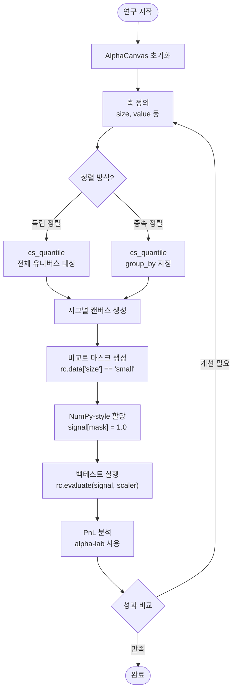
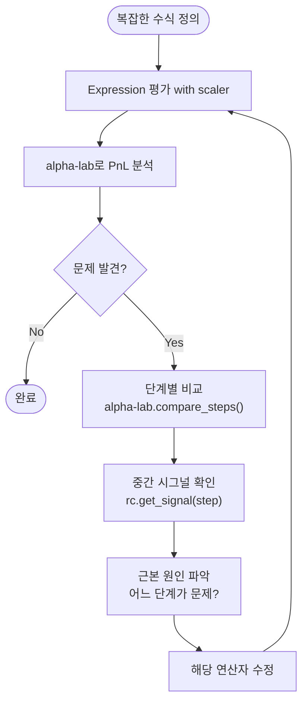

# 1\. 제품 요구사항 문서 (Product Requirement Document)

## 1.1. 개요

### 전체 생태계 (Ecosystem)

* **제품군:** alpha-canvas 생태계는 세 개의 독립 패키지로 구성됩니다:
  * **alpha-canvas**: 시그널 생성 엔진 (Expression 평가, 연산자, 캐싱)
  * **alpha-lab**: 분석 및 시각화 도구 (성과 지표, PnL 추적, 차트)
  * **alpha-database**: 영속성 레이어 (데이터셋/알파/팩터 저장)

* **통합 방식:** 세 패키지는 **공개 API를 통해 느슨하게 결합(Loosely Coupled)** 되어 있으며, 사용자는 Jupyter 노트북에서 필요에 따라 조합하여 사용합니다.

### alpha-canvas (본 문서)

* **제품명:** alpha-canvas
* **역할:** 시그널 생성 및 백테스트 엔진
* **목표:** 퀀트 리서처가 Python 네이티브 환경에서 복잡한 알파 아이디어를 빠르고 직관적으로 생성하고, 백테스트할 수 있는 컴퓨팅 엔진을 제공합니다.
* **비전:** 데이터 검색부터 팩터 생성, 포트폴리오 가중치 계산, 백테스트 실행까지의 과정을 통합된 단일 인터페이스(`rc`)로 제공하여, 시그널 프로토타이핑 속도를 획기적으로 단축시킵니다. MVP는 `(T, N)` `DataPanel` 모델을 중심으로 팩터(Alpha)를 생성하고 백테스트하는 경험에 집중합니다. 또한, `alpha-canvas`를 Jupyter 환경과 완벽히 호환되는 **"개방형 툴킷(Open Toolkit)"**으로 제공하여, 기존 리서치 워크플로우에 유연하게 통합될 수 있도록 합니다.

**중요:** PnL 분석 기능(trace_pnl, 성과 지표 등)은 alpha-canvas 범위를 벗어나며, **alpha-lab 패키지**에서 제공됩니다. 데이터 영속화 기능은 **alpha-database 패키지**에서 제공됩니다.

## 1.2. 사용자 워크플로우 (User Workflows)

### 워크플로우 1: 기본 팩터 생성 및 분석


### 워크플로우 2: 다차원 팩터 포트폴리오 구성 (Fama-French)



### 워크플로우 3: 디버깅 및 추적성



## 1.3. 핵심 문제 (The Problem)

기존 퀀트 리서치 툴(e.g., WorldQuant BRAIN)은 강력하지만 다음과 같은 명확한 한계를 가집니다.

1. **복잡하고 비직관적인 문법:** `bucket(rank(x), range="0.1, 1, 0.1")`와 같이 문자열 파싱에 의존하는 복잡한 문법은 배우기 어렵고 오류를 유발하기 쉽습니다.
   * **해결책 (alpha-canvas)**: Python 네이티브 문법 및 연산자 오버로딩 활용

2. **조작 불가능한 "블랙박스" 버킷:**
   * 기존 인터페이스는 버킷(bucket) 연산의 결과로 `'small'`, `'mid'`와 같은 의미 있는 **레이블(Label)**이 아닌, `0, 1, 2` 같은 **정수 인덱스(Index)**를 반환합니다.
   * 이로 인해 리서처가 **"Small Size이면서 High Value인 그룹"**을 선택하거나, **"Mid Value 그룹은 제외"**하는 등 Fama-French 스타일의 정교한 포트폴리오 구성 및 데이터 조작이 불가능했습니다.
   * **해결책 (alpha-canvas)**: 셀렉터 인터페이스 (레이블 기반 선택, Boolean Expression)

3. **결과 중심의 불투명성 (낮은 추적성):** `group_neutralize(ts_mean('returns', 3), ...)`와 같은 복잡한 수식의 최종 PnL만 알 수 있을 뿐, *중간 단계*(`ts_mean` 적용 직후)에서 `NaN`이 발생했는지, 또는 어느 연산이 PnL을 하락시켰는지 추적하기 매우 어렵습니다.
   * **해결책 (alpha-canvas + alpha-lab)**: 
     - alpha-canvas: 중간 결과 캐싱 및 접근 API 제공
     - alpha-lab: 단계별 PnL 분석 및 비교 도구 제공

## 1.4. 대상 사용자 (User Persona)

* **페르소나:** 바이사이드(Buy-side) 퀀트 리서처 / 포트폴리오 매니저
* **특징:**
  * Python 및 `pandas`/`numpy`/`xarray`에 익숙합니다.
  * 아이디어를 빠르게 프로토타이핑하고 싶어 합니다.
  * 단순히 PnL 결과만 보는 것이 아니라, 수식의 **각 단계별**로 PnL 기여도와 데이터 상태를 투명하게 추적할 수 있기를 원합니다.

## 1.5. 핵심 데이터 모델 (Core Data Model)

### MVP: `DataPanel` (T, N)

* `alpha-canvas`의 MVP는 `(T, N)` (time, asset) 차원을 갖는 `DataPanel` 모델에 집중합니다.
* `rc` 객체가 관리하는 모든 데이터(`market_cap`, `returns`, `size` 축 등)는 `(T, N)` 좌표계를 공유하며, MVP의 모든 연산자(e.g., `ts_mean`, `cs_quantile`)는 `DataPanel`을 입력받고 반환합니다.
* `DataPanel`의 실체는 `xarray.Dataset` 객체이며, 이는 표준 Python 생태계와의 완벽한 호환성을 보장합니다.

### 미래 확장 (Future Expansion): `DataTensor` 및 기타

* 향후 릴리스에서는 페어 트레이딩(Pair Trading) 및 공분산 분석을 위한 `DataTensor` `(T, N, N)` 모델을 지원하도록 확장합니다.
* 또한, 롤링 회귀(Rolling Regression) 파라미터(`alpha`, `beta`) 등을 저장하기 위한 `DataEstimates` `(T, N, K)` 모델도 지원 대상입니다.

## 1.6. "개방형 툴킷" (Open Toolkit) 철학

**요구사항:** `alpha-canvas`는 닫힌 시스템(Closed System)이 아닙니다.

* **Jupyter 호환성 (Eject):** 사용자는 언제든 `rc` 객체에서 계산된 `xarray` 데이터를 "꺼내어(eject)" Jupyter 환경에서 `scipy`, `statsmodels` 등 순수 Python 라이브러리로 자유롭게 조작할 수 있어야 합니다.
  
  ```python
  # Eject: rc에서 순수 xarray.Dataset 꺼내기
  pure_dataset = rc.db
  
  # 외부 라이브러리로 자유롭게 조작
  beta_values = run_rolling_regression(pure_dataset['returns'], pure_dataset['market'])
  ```

* **데이터 재주입 (Re-injection):** 사용자는 Jupyter에서 직접 생성한 커스텀 데이터(e.g., 롤링 회귀 베타값)를 다시 `rc` 객체에 새로운 `DataPanel`로 "주입(inject)"하여, `alpha-canvas`의 `ts_mean`과 같은 연산자를 이어서 적용할 수 있어야 합니다.
  
  ```python
  # Inject: 외부에서 생성한 데이터를 rc에 주입
  rc.add_data('beta', beta_values)  # xarray.DataArray 직접 주입
  
  # alpha-canvas 연산자 계속 사용
  beta_smoothed = rc.ts_mean('beta', 5)
  ```

## 1.7. 주요 기능 요구사항 (Key Features)

### F1: Config 기반 데이터 검색 (Data Retrieval)

* **요구사항:** 사용자는 `config/` 디렉토리 내의 타입별 YAML 파일(e.g., `data.yaml`, `db.yaml`)에 설정을 명시적으로 정의할 수 있어야 합니다. 이는 데이터 로직과 리서치 로직을 명확히 분리합니다.
* **Config 구조:**
  * `config/data.yaml`: 데이터 필드(field) 별칭 및 DB 접근 정보
  * `config/db.yaml`: 데이터베이스 연결 설정 (선택적)
  * `config/calc.yaml`: 기타 계산 관련 설정 (선택적)
* **Config 예시 (`config/data.yaml`):**

```yaml
# 'adj_close'라는 별칭(alias) 정의
adj_close:
    table: PRICEVOLUME  # 실제 DB 테이블명
    index_col: date
    security_col: securities
    value_col: adj_close
    # SQL 쿼리를 직접 사용하여 (T, N) 데이터를 가져옴
    query: >
    SELECT 
        TRD_DD as date, 
        TICKER as securities, 
        CLOSE * ADJ_FACTOR as adj_close 
    FROM PRICEVOLUME

# 'subindustry'라는 별칭 정의 (그룹핑/메타데이터용)
subindustry:
    table: SECURITY_MASTER
    index_col: date
    security_col: securities
    value_col: GICS_SUBINDUSTRY
```

### F2: 듀얼 인터페이스 (Dual Interface)

사용자는 리서치 목적에 따라 두 가지 방식의 인터페이스를 자유롭게 혼용할 수 있어야 합니다.

* **인터페이스 A: Excel-like Formula (수식 기반)**

  * **요구사항:** `ts_mean`, `rank` 등 WQ 스타일의 연산자를 단순하고 파이썬다운 함수 호출로 지원해야 합니다.
  * **시나리오:**

```python
# 1. 헬퍼 함수로 (T, N) DataArray 즉시 받기
returns_10d = rc.ts_mean('return', 10) 

# 2. 복잡한 룰(Expression)을 정의하고 'alpha1' 변수로 저장
alpha_expr = group_neutralize(ts_mean('return', 10), 'subindustry')
rc.add_data_var('alpha1', alpha_expr) 
```

* **인터페이스 B: 셀렉터 인터페이스 (Numpy-style)**

  * **요구사항:** (핵심 문제 2 해결) 분류 데이터(categorical labels)를 정의하고, `numpy`처럼 불리언 마스크를 생성하여 최종 시그널 캔버스에 값을 할당할 수 있어야 합니다.
  * **시나리오:**

```python
# 1. "시그널 캔버스" 초기화 (rc.db에 'my_alpha' DataArray 생성)
rc.init_signal_canvas('my_alpha') 

# 2. "데이터 룰" 등록 (필요시)
rc.add_data('mcap', Field('market_cap'))
rc.add_data('ret', Field('return'))

# 3. 분류 데이터(categorical labels) 생성
rc.add_data('size', cs_quantile(rc.data['mcap'], bins=2, labels=['small', 'big']))
rc.add_data('surge_event', ts_any(rc.data['ret'] > 0.3, window=504))

# 4. "비교 연산"으로 (T, N) 불리언 마스크 생성 
mask_long = (rc.data['size'] == 'small') & (rc.data['surge_event'] == True)

# 5. "Numpy-style 할당" (rc[mask] = 1.0)
rc[mask_long] = 1.0  
```

### F3: 중간 결과 캐싱 (Intermediate Result Caching)

* **요구사항:** (핵심 문제 3 해결을 위한 기반) 사용자가 복잡한 수식의 **각 중간 연산 단계별** 데이터 상태를 검사하고, alpha-lab에서 단계별 PnL 분석을 수행할 수 있도록 중간 결과를 캐싱하고 접근 API를 제공해야 합니다. 단계는 **정수 인덱스(0부터 시작)**로 참조되며, Expression 트리를 **깊이 우선 탐색(depth-first traversal)**으로 순회하면서 부여됩니다.

* **단계 인덱싱 예시:**
  * Expression: `rank(ts_mean(Field('returns'), 3))`
  * **step 0**: `Field('returns')` → 원본 returns 데이터
  * **step 1**: `ts_mean(Field('returns'), 3)` → 이동평균 적용 후
  * **step 2**: `rank(...)` → 순위 변환 후 (최종)

* **트리플 캐시 아키텍처:**
  * **Signal Cache** (영속적): 모든 중간 시그널 저장 (`_signal_cache`)
  * **Weight Cache** (갱신 가능): scaler가 제공된 경우 각 step의 포트폴리오 가중치 저장 (`_weight_cache`)
  * **Portfolio Return Cache** (갱신 가능): scaler가 제공된 경우 각 step의 포지션별 수익 저장 (`_port_return_cache`)

* **시나리오 1: 시그널 검사**
    1. 사용자가 `expr = rank(ts_mean(Field('returns'), 3))` Expression을 정의합니다.
    2. `result = rc.evaluate(expr)`를 실행합니다.
    3. `rc.get_signal(step=1)`로 `ts_mean` 적용 후 중간 시그널을 조회할 수 있습니다.
    4. 시스템은 **재계산 없이** 캐시된 `(T, N)` DataArray를 반환합니다.

* **시나리오 2: 가중치 검사 (with scaler)**
    1. 사용자가 `result = rc.evaluate(expr, scaler=DollarNeutralScaler())`를 실행합니다.
    2. 시스템은 각 step에서 자동으로 signal, weights, portfolio returns를 계산하고 캐싱합니다.
    3. `rc.get_weights(step=1)`로 중간 step의 포트폴리오 가중치를 조회할 수 있습니다.

* **시나리오 3: 백테스트 결과 접근**
    1. 백테스트 실행 후 `rc.get_port_return(step=2)`로 포지션별 수익을 조회합니다 (`(T, N)` shape 보존).
    2. `rc.get_daily_pnl(step=2)`로 일별 PnL을 조회합니다 (`(T,)` shape로 집계).
    3. `rc.get_cumulative_pnl(step=2)`로 누적 PnL을 조회합니다.

* **복잡한 Expression 예시:**
  * Expression: `ts_mean(Field('returns'), 3) + rank(Field('market_cap'))`
  * **step 0**: `Field('returns')` → 원본 returns
  * **step 1**: `ts_mean(Field('returns'), 3)` → returns의 이동평균
  * **step 2**: `Field('market_cap')` → 원본 market cap
  * **step 3**: `rank(Field('market_cap'))` → market cap의 순위
  * **step 4**: `add(step1, step3)` → 최종 합계

* **공개 API:**
  * `rc.get_signal(step)` → 중간 시그널 DataArray 반환
  * `rc.get_weights(step)` → 포트폴리오 가중치 DataArray 반환 (scaler 사용 시)
  * `rc.get_port_return(step)` → 포지션별 수익 DataArray 반환 (`(T, N)` shape)
  * `rc.get_daily_pnl(step)` → 일별 PnL DataArray 반환 (`(T,)` shape)
  * `rc.get_cumulative_pnl(step)` → 누적 PnL DataArray 반환 (`(T,)` shape)

**중요:** 이러한 캐시된 데이터는 **alpha-lab 패키지**에서 PnL 분석, 성과 지표 계산, 단계별 비교 등에 활용됩니다. alpha-canvas는 데이터 캐싱 및 접근만 담당하며, 분석 로직은 alpha-lab에서 제공합니다.

### F4: 팩터 수익률 계산 (Core Use Case)

* **요구사항:** F2의 듀얼 인터페이스를 활용하여 **다차원 팩터 포트폴리오 구성 및 수익률 계산**을 간결하게 수행할 수 있어야 합니다. 이는 alpha-canvas의 핵심 활용 사례입니다. 특히 **Fama-French 3-factor 모델**의 독립/종속 이중 정렬(independent/dependent double sort)을 쉽게 재현할 수 있어야 합니다.

* **시나리오 1: 독립 이중 정렬 (Independent Double Sort)**
    1. 사용자가 두 개의 팩터(Size, Value)를 정의합니다.
    2. 각 팩터를 **독립적으로** 버킷화(quantile)하여 등록합니다.
    3. 셀렉터 인터페이스를 사용하여 다차원 교차 선택을 수행합니다.
    4. 예시: Fama-French SMB (Small Minus Big) 팩터

```python
# 1. 독립 정렬: 전체 유니버스에서 각각 quantile 계산
rc.add_data('size', cs_quantile(rc.data['mcap'], bins=2, labels=['small', 'big']))
rc.add_data('value', cs_quantile(rc.data['btm'], bins=3, labels=['low', 'mid', 'high']))

# 2. SMB 시그널 구성
smb_signal = Constant(0.0)
smb_signal[rc.data['size'] == 'small'] = 1.0   # Long small stocks
smb_signal[rc.data['size'] == 'big'] = -1.0    # Short big stocks

# 3. 백테스트 실행
result = rc.evaluate(smb_signal, scaler=DollarNeutralScaler())

# 4. PnL 분석 (alpha-lab 사용)
# from alpha_lab import PerformanceAnalyzer
# analyzer = PerformanceAnalyzer(rc)
# smb_metrics = analyzer.compute_metrics(step=최종_step)
```

* **시나리오 2: 종속 이중 정렬 (Dependent Double Sort)**
    1. 첫 번째 팩터(Size)로 먼저 정렬합니다.
    2. 두 번째 팩터(Value)는 **첫 번째 팩터의 각 그룹 내에서** 독립적으로 quantile을 계산합니다.
    3. 이를 위해 `group_by` 파라미터를 사용합니다.
    4. 예시: 종속 정렬 기반 HML (High Minus Low) 팩터

```python
# 1. 첫 번째 정렬: Size
rc.add_data('size', cs_quantile(rc.data['mcap'], bins=2, labels=['small', 'big']))

# 2. 종속 정렬: 각 Size 그룹 내에서 Value quantile 계산
rc.add_data('value', cs_quantile(rc.data['btm'], bins=3, labels=['low', 'mid', 'high'],
                                   group_by='size'))

# 3. HML 시그널 구성 (각 Size 그룹 내에서 High-Low)
hml_signal = Constant(0.0)
hml_signal[rc.data['value'] == 'high'] = 1.0   # Long high B/M (value stocks)
hml_signal[rc.data['value'] == 'low'] = -1.0   # Short low B/M (growth stocks)

# 4. 백테스트 실행 및 PnL 분석 (alpha-lab)
result = rc.evaluate(hml_signal, scaler=DollarNeutralScaler())
# analyzer = PerformanceAnalyzer(rc)
# hml_metrics = analyzer.compute_metrics(step=최종_step)
```

* **시나리오 3: 로우레벨 마스크 기반 정렬 (고급)**
    1. `group_by`로 표현하기 어려운 커스텀 조건부 정렬이 필요한 경우
    2. `mask` 파라미터로 특정 조건을 만족하는 종목들에 대해서만 quantile 계산

```python
# 유동성이 충분한 종목들만 대상으로 모멘텀 quantile 계산
high_liquidity_mask = rc.data['volume'] > rc.data['volume'].quantile(0.5)
rc.add_data('momentum', cs_quantile(rc.data['returns'], bins=5, labels=['q1','q2','q3','q4','q5'],
                                      mask=high_liquidity_mask))
```

## 1.8. 포트폴리오 구성 (Portfolio Construction - F5)

### 개념

시그널(Signal) 생성 후, 실제 거래 가능한 포트폴리오 가중치(Portfolio Weights)로 변환하는 단계입니다. 임의의 시그널 값을 제약 조건(gross/net exposure, long-only 등)을 만족하는 정규화된 가중치로 스케일링합니다.

### 요구사항

* **전략 패턴(Strategy Pattern)**: 다양한 스케일링 전략을 플러그인 방식으로 지원
* **명시적 파라미터**: 스케일러는 항상 명시적으로 전달 (상태 저장 없음)
* **크로스-섹션 독립**: 각 시점(T)마다 독립적으로 스케일링
* **유니버스 준수**: 스케일링 후에도 유니버스 마스킹 유지

### 통합 프레임워크: Gross/Net Exposure

가장 범용적인 스케일링 방식은 **총 노출(Gross Exposure, G)**과 **순 노출(Net Exposure, N)**로 제약을 정의하는 것입니다:

$$L_{\text{target}} = \frac{G + N}{2}, \quad S_{\text{target}} = \frac{G - N}{2}$$

여기서:
- $G = \sum |w_i|$ (총 노출: 롱 + 숏의 절대값 합)
- $N = \sum w_i$ (순 노출: 롱 - 숏)
- $L$ = 롱 포지션 합
- $S$ = 숏 포지션 합 (음수 값)

### 사용 시나리오

```python
from alpha_canvas.portfolio import DollarNeutralScaler, GrossNetScaler, LongOnlyScaler

# 1. 시그널 생성 (임의의 값)
signal_expr = ts_mean(Field('returns'), 5)
signal_data = rc.evaluate(signal_expr)  # (T, N) DataArray

# 2. 달러 중립 포트폴리오 (Long=1.0, Short=-1.0)
scaler = DollarNeutralScaler()
weights = scaler.scale(signal_data)
# sum(weights[weights > 0]) = 1.0
# sum(weights[weights < 0]) = -1.0

# 3. 순 롱 바이어스 포트폴리오 (Long=1.1, Short=-0.9)
scaler = GrossNetScaler(target_gross=2.0, target_net=0.2)
weights = scaler.scale(signal_data)

# 4. 롱 온리 포트폴리오 (sum=1.0)
scaler = LongOnlyScaler(target_long=1.0)
weights = scaler.scale(signal_data)

# 5. 크립토 선물 (Gross=100%, Net=0%)
scaler = GrossNetScaler(target_gross=1.0, target_net=0.0)
weights = scaler.scale(signal_data)
# sum(abs(weights)) = 1.0 (롱 50% + 숏 50%)
```

### 파사드 통합 (편의 메서드)

```python
# AlphaCanvas에서 직접 스케일링 (Expression 자동 평가)
signal_expr = ts_mean(Field('returns'), 5)
scaler = DollarNeutralScaler()

# 편의 메서드: evaluate + scale 한 번에
weights = rc.scale_weights(signal_expr, scaler)
```

### 설계 근거

* **Stateless 설계**: 스케일러는 상태를 저장하지 않음 (재사용 가능)
* **명시적 우선**: 어떤 스케일러를 사용하는지 항상 명확함
* **연구 친화적**: 동일 시그널에 여러 스케일러를 쉽게 비교 가능
* **확장 가능**: 새로운 스케일링 전략 추가 용이 (Strategy Pattern)

### 미래 확장

* **리스크 기반 스케일링**: `RiskTargetScaler(target_vol, cov_matrix)`
* **최적화 기반**: `OptimizationScaler(constraints)` with cvxpy
* **포지션 제한**: `max_weight_per_asset`, `turnover_limit` 등

## 1.9. 백테스팅 (Backtesting - F6) ✅ **IMPLEMENTED**

### 개념

가중치 스케일링 이후, 실제 수익률 데이터를 사용하여 포트폴리오 성과를 시뮬레이션하는 단계입니다. alpha-canvas는 **포지션별 수익** `(T, N)` 을 계산하고 캐싱하여, alpha-lab에서 PnL 분석 및 attribution을 수행할 수 있도록 합니다.

### 요구사항

* **자동 백테스트 실행**: scaler 제공 시 자동으로 백테스트 실행
* **Forward-bias 방지**: Shift-mask 워크플로우로 미래 정보 사용 방지
* **포지션별 수익 보존**: `(T, N)` shape 유지하여 winner/loser attribution 가능
* **온디맨드 집계**: Daily/cumulative PnL은 사용자 요청 시 계산
* **NaN pollution 방지**: 유니버스 퇴출 시 포지션 자동 청산

### Shift-Mask 워크플로우

```python
# 내부 로직 (자동 실행):
# 1. Shift: 어제의 signal로 오늘 거래
weights_shifted = weights.shift(time=1)

# 2. Re-mask: 현재 유니버스로 재마스킹 (유니버스 퇴출 종목 청산)
final_weights = weights_shifted.where(universe_mask)

# 3. Element-wise multiply: 포지션별 수익 계산
port_return = final_weights * returns  # (T, N) shape 보존!
```

### 사용 시나리오

```python
# 시나리오 1: 기본 백테스트 (자동 실행)
result = rc.evaluate(signal_expr, scaler=DollarNeutralScaler())
# 내부적으로 각 step에서 자동으로:
#   - Signal 캐싱
#   - Weights 계산 및 캐싱
#   - Portfolio returns 계산 및 캐싱

# 시나리오 2: 포지션별 수익 조회 (attribution)
port_return = rc.get_port_return(step=2)  # (T, N) shape
total_contrib = port_return.sum(dim='time')  # 종목별 총 기여도
best_stock = total_contrib.argmax(dim='asset')  # 최고 수익 종목

# 시나리오 3: 일별/누적 PnL 조회
daily_pnl = rc.get_daily_pnl(step=2)  # (T,) shape
cumulative_pnl = rc.get_cumulative_pnl(step=2)  # Cumsum (not cumprod)
final_pnl = cumulative_pnl.isel(time=-1).values

# 시나리오 4: 효율적인 scaler 비교 (signal 재사용)
result1 = rc.evaluate(expr, scaler=DollarNeutralScaler())
pnl1 = rc.get_cumulative_pnl(2)

result2 = rc.evaluate(expr, scaler=GrossNetScaler(2.0, 0.3))
pnl2 = rc.get_cumulative_pnl(2)
# Signal 캐시 재사용, weights와 port_return만 재계산 (효율적!)
```

### 설계 근거

* **Forward-bias 방지**: `.shift(time=1)`로 어제의 signal로 오늘 거래
* **NaN pollution 방지**: Re-masking으로 유니버스 퇴출 시 포지션 청산
* **Attribution 분석**: `(T, N)` shape 보존으로 winner/loser 식별 가능
* **공정한 비교**: Cumsum (not cumprod) 사용으로 시간 불변 메트릭 제공
* **효율성**: Scaler 변경 시 signal 캐시 재사용 (재평가 불필요)

### 공개 API

* `rc.get_port_return(step)` → 포지션별 수익 `(T, N)` DataArray
* `rc.get_daily_pnl(step)` → 일별 PnL `(T,)` DataArray
* `rc.get_cumulative_pnl(step)` → 누적 PnL `(T,)` DataArray (cumsum)

**중요:** 백테스트 결과의 **분석 및 시각화**는 **alpha-lab 패키지**에서 제공됩니다. alpha-canvas는 포지션별 수익 계산 및 캐싱만 담당합니다.

## 1.10. 유니버스 정의 (Universe Definition)

### 개념

**투자 가능 유니버스(Investable Universe)**는 백테스트에서 실제로 거래 가능한 종목의 집합을 정의합니다.

### 요구사항

* **초기화 시 설정**: `AlphaCanvas` 초기화 시 한 번 설정되며 세션 동안 불변
* **자동 적용**: 모든 데이터 검색과 연산 결과에 자동으로 적용
* **불리언 마스크**: `(T, N)` 형태의 불리언 DataArray로 표현
* **NaN 처리**: 유니버스 밖 종목은 모든 연산에서 NaN으로 처리

### 사용 시나리오

```python
# 시나리오 1: 간단한 가격 기반 유니버스
rc = AlphaCanvas(
    start_date='2024-01-01',
    end_date='2024-12-31',
    universe=rc.data['price'] > 5.0  # 페니스톡 제외
)

# 시나리오 2: 복합 조건 유니버스
universe_mask = (
    (rc.data['price'] > 5.0) &
    (rc.data['volume'] > 100000) &
    (rc.data['market_cap'] > 1e9)
)
rc = AlphaCanvas(..., universe=universe_mask)

# 시나리오 3: 데이터베이스 기반 유니버스 (미래 확장)
rc = AlphaCanvas(
    ...,
    universe=Field('univ500')  # Parquet에서 미리 정의된 유니버스 로드
)
```

### 설계 근거

* **불변성**: 단계별 PnL 비교를 위해 고정된 유니버스 필요
* **재현성**: 백테스트 재현을 위해 동일한 유니버스 보장
* **투명성**: 유니버스 변화에 따른 성과 왜곡 방지
* **편의성**: 수동 마스킹 불필요, 모든 연산에 자동 적용

-----

# 2. Alpha-Lab 요구사항 (Analysis Suite)

## 2.1. 개요

**alpha-lab**은 alpha-canvas가 생성한 시그널 및 백테스트 결과를 분석하고 시각화하는 독립 패키지입니다.

### 핵심 원칙

* **Loosely Coupled**: alpha-canvas의 공개 API만 사용 (`get_signal()`, `get_weights()`, `get_port_return()`)
* **Jupyter-First**: 노트북 환경에 최적화된 인터랙티브 분석 및 시각화
* **Pluggable**: 확장 가능한 분석기 및 시각화 컴포넌트
* **No Internal Access**: Expression 트리나 Visitor 내부 접근 금지 (공개 API만 사용)

### 패키지 구조

```python
alpha_lab/
├── core/                    # 기반 클래스
│   ├── analyzer.py         # BaseAnalyzer (alpha-canvas 공개 API 소비)
│   └── metrics.py          # Metric 계산 함수들
├── performance/            # 성과 분석
│   ├── metrics.py          # PerformanceAnalyzer
│   ├── risk.py             # RiskAnalyzer
│   └── attribution.py      # Attribution 분석
├── visualization/          # 시각화
│   ├── base.py             # Visualizer 베이스
│   ├── heatmaps.py         # 2D 히트맵 (signal, weights, returns)
│   ├── curves.py           # PnL 곡선, underwater charts
│   └── themes.py           # 색상 스킴 (Korean vs US)
├── factor/                 # 팩터 분석
│   ├── exposure.py         # 팩터 노출 회귀
│   ├── ic.py               # Information Coefficient
│   └── turnover.py         # Turnover 분석
├── comparison/             # 비교 도구
│   ├── strategy.py         # 전략 비교
│   └── scaler.py           # Scaler 비교
└── advanced/               # 고급 기능 (미래)
    ├── sensitivity.py      # 민감도 분석
    ├── regime.py           # 체제 분석
    └── monte_carlo.py      # Monte Carlo 시뮬레이션
```

## 2.2. 핵심 기능 (MVP Scope)

### L1: 성과 지표 계산 (Performance Metrics)

**요구사항**: 백테스트 결과로부터 포괄적인 성과 지표를 계산합니다.

**MVP 지표**:
- **수익성**: Sharpe ratio, Sortino ratio, Calmar ratio, Total return
- **리스크**: Volatility (annualized), Max drawdown, Drawdown duration
- **거래**: Turnover (daily, annualized), Margin (PnL per dollar traded)
- **포지션**: Long/short stock counts (average), Position concentration
- **정확도**: Hit ratio (direction correctness: sign(weight) == sign(return))

**시간 집계**: Daily → Monthly → Yearly 변환 기능

**사용 예시**:

```python
from alpha_lab import PerformanceAnalyzer

# 분석기 초기화 (alpha-canvas 인스턴스 소비)
analyzer = PerformanceAnalyzer(rc)

# 단일 step 지표 계산
metrics = analyzer.compute_metrics(step=2)
print(f"Sharpe: {metrics['sharpe']:.2f}")
print(f"Max Drawdown: {metrics['max_drawdown']:.2%}")
print(f"Turnover: {metrics['turnover_annual']:.2%}")

# Step 비교 (N vs N-1)
diff = analyzer.compare_steps(step_from=1, step_to=2)
print(f"Sharpe improvement: {diff['sharpe_delta']:+.2f}")

# Multi-step 진화
evolution = analyzer.step_evolution(steps=[0, 1, 2])
# Returns DataFrame: rows=steps, cols=metrics
```

### L2: PnL 추적 및 비교 (PnL Tracing)

**요구사항**: 단계별 PnL 변화를 추적하고 비교합니다.

**핵심 질문에 답변**:
- "이 연산자를 추가하니 성과가 개선되었나?"
- "어느 단계에서 PnL이 하락했나?"
- "최종 시그널과 원본 시그널의 차이는?"

**사용 예시**:

```python
# Step N vs Step N-1 비교
comparison = analyzer.compare_steps(1, 2)
print(f"Sharpe: {comparison['sharpe_before']:.2f} → {comparison['sharpe_after']:.2f}")
print(f"Change: {comparison['sharpe_delta']:+.2f}")

# 전체 step 진화 보기
df_evolution = analyzer.step_evolution(steps=[0, 1, 2])
#       Sharpe  MaxDD  Turnover
# Step0   0.5   -0.15    0.30
# Step1   0.7   -0.12    0.35
# Step2   0.6   -0.10    0.40
```

## 2.3. 시각화 기능 (Future Expansion)

### V1: 2D 히트맵 (Heatmaps)

**요구사항**: Signal, weights, returns를 2D (T × N) 히트맵으로 시각화합니다.

**특징**:
- **색상 스킴 선택 가능**:
  - Korean: 파란색(음수), 흰색(0), 빨간색(양수)
  - US: 빨간색(음수), 흰색(0), 초록색(양수)
- **인터랙티브**: Plotly 기반, zoom/pan/hover

```python
from alpha_lab import Visualizer

viz = Visualizer(rc, color_scheme='korean')

# Signal 히트맵
fig = viz.heatmap_signal(step=2)
fig.show()  # Jupyter 출력

# Weights 히트맵
fig = viz.heatmap_weights(step=2)

# Portfolio returns 히트맵
fig = viz.heatmap_returns(step=2)
```

### V2: PnL Evolution Curves

**요구사항**: 시간에 따른 PnL 변화를 라인 플롯으로 시각화합니다.

**Option B (Multi-step comparison)**: 여러 step의 누적 PnL을 겹쳐서 표시하여 연산자 추가 효과를 시각적으로 확인합니다.

```python
# 단일 step PnL 곡선
fig = viz.pnl_curve(step=2, cumulative=True)

# Multi-step 비교 (핵심!)
fig = viz.compare_pnl_curves(
    steps=[0, 1, 2],
    labels=['Raw Signal', 'After TsMean', 'After Rank']
)
# 3개 라인이 겹쳐져서 표시됨
# → 어느 연산자가 PnL을 개선/악화시켰는지 즉시 확인

# Underwater chart (drawdown 시각화)
fig = viz.underwater_chart(step=2)
```

### V3: Attribution Waterfall

**요구사항**: Winner/loser 기여도를 바 차트로 시각화합니다.

```python
# Top 10 winners, bottom 10 losers
fig = viz.attribution_waterfall(step=2, top_n=10)
# Green bars: winners, Red bars: losers
```

## 2.4. 고급 분석 기능 (Future Expansion)

### A1: Factor Exposure Analysis

**요구사항**: 시그널의 암묵적 팩터 노출을 분석합니다.

```python
from alpha_lab import FactorAnalyzer

factor_analyzer = FactorAnalyzer(rc)

# 팩터 회귀
exposures = factor_analyzer.regress_on_factors(
    step=2,
    factors=['market', 'size', 'value', 'momentum']
)
# Returns: betas, R², alpha

# Rolling factor betas
rolling_betas = factor_analyzer.rolling_betas(step=2, window='1Y')
```

### A2: IC (Information Coefficient) Analysis

**요구사항**: 시그널의 예측력을 분석합니다.

```python
from alpha_lab import ICAnalyzer

ic_analyzer = ICAnalyzer(rc)

# Signal predictiveness
ic = ic_analyzer.compute_ic(step=2, forward_returns=1)
# Returns: Pearson IC, Spearman Rank IC

# IC decay (signal persistence)
ic_decay = ic_analyzer.ic_decay(step=2, horizons=[1, 5, 10, 20])

# Rolling IC (stability)
rolling_ic = ic_analyzer.rolling_ic(step=2, window='3M')
```

### A3: Sensitivity Analysis (민감도 분석)

**요구사항**: 입력 데이터 변화에 대한 PnL 민감도를 분석합니다 ("diff" feature).

```python
from alpha_lab import SensitivityAnalyzer

sensitivity = SensitivityAnalyzer(rc)

# Field 데이터 perturbation
field_sensitivity = sensitivity.perturb_field(
    field_name='market_cap',
    perturbation=0.01,  # +1%
    step=2
)
# Returns: {'original_pnl': X, 'perturbed_pnl': Y, 'delta': Y-X}

# Intermediate signal perturbation
signal_sensitivity = sensitivity.perturb_signal(
    step=1,  # TsMean 결과 perturb
    perturbation=0.05,
    final_step=2
)

# Tornado chart (어느 입력이 가장 중요한가?)
fig = sensitivity.tornado_chart(
    fields=['market_cap', 'returns', 'volume'],
    perturbation_range=[-0.1, 0.1]
)
```

## 2.5. MVP 구현 우선순위

**Phase 1 (Immediate)**:
- ✅ PerformanceAnalyzer (metrics computation)
- ✅ Step comparison (step N vs N-1)
- ✅ 기본 통계 (Sharpe, volatility, drawdown, turnover)

**Phase 2 (Near-term)**:
- [ ] Visualizer (heatmaps, PnL curves)
- [ ] Color scheme support (Korean/US)
- [ ] Attribution waterfall charts

**Phase 3 (Future)**:
- [ ] Factor analysis (exposure, IC)
- [ ] Sensitivity analysis (diff feature)
- [ ] Regime analysis
- [ ] Monte Carlo simulation

-----

# 3. Alpha-Database 요구사항 (Data Infrastructure Layer)

## 3.1. 개요

**alpha-database**는 퀀트 리서치를 위한 **통합 데이터 인프라 패키지**입니다. 단순한 저장소를 넘어, 데이터 수집(fetching), 저장(storage), 검색(retrieval), 그리고 계보 추적(lineage tracking)까지 담당하는 엔드-투-엔드 데이터 관리 솔루션입니다.

### 역할 및 책임

1. **데이터 수집 (Data Fetching)**: 외부 API에서 데이터 다운로드 및 내부 저장
2. **데이터 검색 (Data Retrieval)**: Config-driven 데이터 로딩 (alpha-canvas에서 포팅)
3. **데이터 저장 (Data Storage)**: Alpha, factor, dataset 영구 저장
4. **메타데이터 관리 (Metadata)**: 데이터 카탈로그 및 계보 추적

### 핵심 원칙

* **Loosely Coupled**: alpha-canvas 공개 API를 통해 데이터 추출/제공
* **Source Agnostic**: 다양한 데이터 소스 지원 (Parquet, CSV, Excel, API, DB)
* **Format Aware**: 소스별 특수 포맷 처리 (FnGuide, Bloomberg 등)
* **Lineage Tracking**: 데이터 의존성 그래프 유지
* **Reproducibility**: Expression 직렬화로 재현성 보장

### 패키지 구조

```python
alpha_database/
├── __init__.py
├── core/
│   ├── config.py          # ConfigLoader (포팅: alpha-canvas)
│   ├── data_loader.py     # DataLoader (포팅: alpha-canvas)
│   └── data_source.py     # 통합 DataSource facade
├── readers/               # 소스별 데이터 리더
│   ├── base.py            # BaseReader ABC
│   ├── parquet.py         # ParquetReader
│   ├── csv.py             # CSVReader
│   ├── excel.py           # ExcelReader (generic)
│   ├── fnguide.py         # FnGuideExcelReader (special format)
│   ├── bloomberg.py       # BloombergReader (future)
│   └── postgres.py        # PostgresReader (future)
├── fetchers/              # 데이터 수집 (NEW)
│   ├── base.py            # BaseFetcher ABC
│   ├── ccxt_fetcher.py    # CCXT crypto data fetcher
│   ├── api_fetcher.py     # Generic API fetcher
│   └── scheduler.py       # Fetch scheduling & orchestration
├── writers/               # 데이터 저장
│   ├── dataset.py         # DatasetWriter (computed fields)
│   ├── alpha.py           # AlphaWriter (versioned alphas)
│   └── factor.py          # FactorWriter (factor returns)
├── catalog/               # 메타데이터 관리
│   ├── meta_table.py      # 중앙 메타 테이블
│   ├── lineage.py         # 의존성 그래프 관리
│   └── explorer.py        # 카탈로그 탐색 유틸리티
├── serialization/         # Expression 직렬화 (NEW)
│   ├── expression.py      # Expression.to_dict() / from_dict()
│   └── cache.py           # Evaluator step cache 직렬화
└── integration/           # alpha-canvas 통합
    └── canvas_adapter.py  # AlphaCanvas 어댑터
```

## 3.2. 우선순위 및 구현 로드맵

### **P0 (MVP - Essential)**: 데이터 검색 (Data Retrieval)
1. Config-driven data loading (포팅: alpha-canvas)
2. Multi-source reader facade
3. Alpha-canvas 통합 및 검증

### **P1 (Core)**: 데이터 저장 (Data Storage)
1. Dataset catalog (computed fields)
2. Alpha catalog (versioned alphas with Expression)
3. Factor catalog (factor returns with Expression)
4. 중앙 메타 테이블

### **P2 (Important)**: 데이터 수집 (Data Fetching)
1. CCXT crypto fetcher
2. API fetcher framework
3. Hive-partitioned Parquet storage
4. Scheduling & error handling

### **P3 (Enhancement)**: 계보 추적 (Lineage Tracking)
1. 의존성 그래프 관리
2. Impact analysis tools

### **P4 (Future)**: 고급 기능
1. PostgreSQL backend
2. ClickHouse backend
3. Data quality checks

---

## 3.3. P0: Config-Driven Data Loading (MVP)

### 개요

alpha-canvas의 `core/config.py`와 `core/data_loader.py`를 alpha-database로 포팅합니다. 이는 alpha-database의 **핵심 가치 제안**이며, alpha-canvas와의 통합 지점입니다.

### 요구사항

**R1**: 기존 `config/data.yaml` 파싱 및 필드 정의 로드
**R2**: Parameterized SQL 쿼리 지원 (`:start_date`, `:end_date`)
**R3**: Long → Wide pivoting (date × security_id → time × asset)
**R4**: `xarray.DataArray` 반환 with `(time, asset)` dimensions
**R5**: Backward compatibility: 기존 alpha-canvas 코드 변경 최소화

### 포팅 범위

**From alpha-canvas**:
- `src/alpha_canvas/core/config.py` → `alpha_database/core/config.py`
- `src/alpha_canvas/core/data_loader.py` → `alpha_database/core/data_loader.py`

**새로 구현**:
- `alpha_database/core/data_source.py`: 통합 facade

### 사용 시나리오

```python
from alpha_database import DataSource

# 시나리오 1: 기존 config 사용
ds = DataSource(config_path='config/data.yaml')
data = ds.load_field(
    'adj_close',
    start_date='2024-01-01',
    end_date='2024-12-31'
)
# Returns: xr.DataArray with (time, asset) dimensions

# 시나리오 2: Alpha-canvas 통합
from alpha_canvas import AlphaCanvas

rc = AlphaCanvas(data_source=ds)  # Dependency injection
rc.add_data('price', Field('adj_close'))  # Triggers ds.load_field()
```

---

## 3.4. P0: Multi-Source Reader Facade

### 개요

다양한 데이터 소스(Parquet, CSV, Excel, DB)와 특수 포맷(FnGuide, Bloomberg)을 통합 인터페이스로 지원합니다.

### 설계 원칙

**원칙 1**: **독립적 Reader 구현** (not layered abstraction)
- `ExcelReader`: Generic Excel 파일 (*.xlsx, *.xls)
- `FnGuideExcelReader`: FnGuide 특수 포맷 Excel
- 각 Reader는 독립적으로 구현, 일부 코드 중복 허용

**원칙 2**: **Source Agnostic** facade
- 사용자는 Reader 선택 불필요
- Config에 `db_type` 또는 `reader` 지정 시 자동 선택

### Reader 구조

```python
# Base interface
class BaseReader(ABC):
    @abstractmethod
    def read(
        self,
        query: str,
        params: dict
    ) -> pd.DataFrame:
        """Read data and return long-format DataFrame."""
        pass
```

**구현 목록 (MVP)**:
1. **ParquetReader**: DuckDB SQL on Parquet files (현재 구현 포팅)
2. **CSVReader**: Generic CSV files
3. **ExcelReader**: Generic Excel files
4. **FnGuideExcelReader**: FnGuide-specific Excel format

**Future**:
5. **BloombergReader**: Bloomberg CSV/API
6. **PostgresReader**: PostgreSQL database

### Config 예시

```yaml
# config/data.yaml

# Parquet source
adj_close:
  reader: parquet  # or db_type: parquet
  query: >
    SELECT date, security_id, close * adj_factor as adj_close
    FROM read_parquet('data/pricevolume.parquet')
    WHERE date >= :start_date AND date <= :end_date

# FnGuide Excel source (special format)
fnguide_financials:
  reader: fnguide_excel
  file_path: 'data/fnguide/financials_2024.xlsx'
  sheet_name: 'IS'
  header_row: 3  # FnGuide-specific: skip header rows
  date_col: '결산일'
  security_col: '종목코드'
```

### 통합 사용

```python
from alpha_database import DataSource

ds = DataSource(config_path='config/data.yaml')

# Automatically selects ParquetReader
data1 = ds.load_field('adj_close', start_date='2024-01-01', end_date='2024-12-31')

# Automatically selects FnGuideExcelReader
data2 = ds.load_field('fnguide_financials')
```

---

## 3.5. P0: Alpha-Canvas 통합

### 개요

Alpha-canvas가 alpha-database를 **의존성 주입(Dependency Injection)** 패턴으로 사용하도록 통합합니다.

### 통합 패턴

```python
from alpha_canvas import AlphaCanvas
from alpha_database import DataSource

# Step 1: DataSource 초기화
ds = DataSource(config_path='config/data.yaml')

# Step 2: Alpha-canvas에 주입
rc = AlphaCanvas(
    start_date='2024-01-01',
    end_date='2024-12-31',
    data_source=ds  # Dependency injection
)

# Step 3: Field 사용 시 자동으로 DataSource 호출
rc.add_data('price', Field('adj_close'))
# Internally: ds.load_field('adj_close', start_date=..., end_date=...)
```

### Backward Compatibility 전략

**Phase 1**: Dual mode (alpha-canvas 유지)
```python
# Option A: 기존 방식 (backward compatible)
rc = AlphaCanvas(start_date='2024-01-01', end_date='2024-12-31')
# 내부적으로 기존 data_loader 사용

# Option B: 새로운 방식 (alpha-database)
ds = DataSource(config_path='config/data.yaml')
rc = AlphaCanvas(start_date='2024-01-01', end_date='2024-12-31', data_source=ds)
# alpha-database 사용
```

**Phase 2**: 모든 테스트를 alpha-database로 전환

**Phase 3**: 기존 `core/config.py`, `core/data_loader.py` 제거

---

## 3.6. P1: Dataset Catalog (Computed Field Storage)

### 개요

계산된 필드(derived characteristics)를 저장하고 스키마를 동적으로 진화시킵니다. 예: PBR, EV/EBITDA 등의 파생 지표를 계산하여 재사용합니다.

### 요구사항

**R1**: Dataset 생성 및 컬럼 추가 (schema evolution)  
**R2**: 의존성 추적 (어떤 raw field에서 파생되었는지)  
**R3**: Upsert 로직 (날짜 중복 시 덮어쓰기)  
**R4**: 중앙 메타 테이블 자동 업데이트

### 사용 시나리오

```python
from alpha_database import DatasetWriter

writer = DatasetWriter(base_path='./data')

# 시나리오 1: PBR 계산 및 저장
pbr = price / book_value
result = rc.evaluate(pbr)

writer.save_field(
    dataset_name='fundamental',
    field_name='pbr',
    data=result,  # xr.DataArray (T, N)
    dependencies=['adj_close', 'book_value'],  # Lineage tracking
    metadata={'description': 'Price to Book Ratio', 'created': '2025-01-23'}
)
# Result: data/fundamental.parquet with [date, asset, pbr]
# Meta table updated automatically

# 시나리오 2: 동일 dataset에 EV/EBITDA 추가 (schema evolution)
ev_ebitda = ev / ebitda
result2 = rc.evaluate(ev_ebitda)

writer.save_field(
    dataset_name='fundamental',  # SAME dataset
    field_name='ev_ebitda',      # NEW column
    data=result2,
    dependencies=['ev', 'ebitda']
)
# Result: fundamental.parquet now [date, asset, pbr, ev_ebitda]

# 시나리오 3: 나중에 로드
ds = DataSource(config_path='config/data.yaml')
fundamental = ds.load_field('pbr')  # From fundamental.parquet
```

---

## 3.7. P1: Alpha Catalog (Versioned Alpha with Expression)

### 개요

완전한 알파(signal + weights + returns + Expression)를 메타데이터와 함께 저장합니다. **Expression 직렬화**를 통해 재현성을 보장합니다.

### 핵심 요구사항 (Critical)

**R1**: **자동 데이터 추출** - `canvas`와 `step`만 전달, 자동으로 signal/weights/returns 추출  
**R2**: **Expression 직렬화** - Expression tree를 구조화된 dict로 저장 (재현 가능)  
**R3**: **인간 가독성** - `str(expr)`도 함께 저장 (디버깅용)  
**R4**: **의존성 추적** - Expression에서 자동으로 의존 field 추출  
**R5**: **버전 관리** - alpha_id로 자동 버전 관리 (v1, v2, v3)  
**R6**: **No 성과 지표** - Sharpe 등 저장하지 않음 (alpha-lab에서 on-demand 계산)

### Evaluator 수정 필요사항

**현재**: Evaluator는 data (signal, weights, port_return)만 캐싱  
**필요**: Evaluator는 **Expression steps**도 캐싱해야 함

```python
# In EvaluateVisitor
class EvaluateVisitor:
    def __init__(self, ...):
        self._signal_cache: Dict[int, xr.DataArray] = {}
        self._weight_cache: Dict[int, Optional[xr.DataArray]] = {}
        self._port_return_cache: Dict[int, Optional[xr.DataArray]] = {}
        
        # NEW: Expression cache
        self._expression_cache: Dict[int, Expression] = {}  # Store Expression objects!
    
    def visit_operator(self, node):
        ...
        # Cache the Expression itself
        self._expression_cache[self._step_counter] = node
        ...
```

### Expression 직렬화

```python
# In alpha_database/serialization/expression.py

class ExpressionSerializer:
    @staticmethod
    def to_dict(expr: Expression) -> dict:
        """Serialize Expression to dict (reproducible)."""
        if isinstance(expr, Field):
            return {
                'type': 'Field',
                'name': expr.name
            }
        elif isinstance(expr, TsMean):
            return {
                'type': 'TsMean',
                'child': ExpressionSerializer.to_dict(expr.child),
                'window': expr.window
            }
        elif isinstance(expr, Rank):
            return {
                'type': 'Rank',
                'child': ExpressionSerializer.to_dict(expr.child),
                'ascending': expr.ascending
            }
        # ... handle all Expression types
    
    @staticmethod
    def from_dict(data: dict) -> Expression:
        """Deserialize dict to Expression (reconstruct)."""
        if data['type'] == 'Field':
            return Field(data['name'])
        elif data['type'] == 'TsMean':
            child = ExpressionSerializer.from_dict(data['child'])
            return TsMean(child, window=data['window'])
        # ... reconstruct all Expression types
    
    @staticmethod
    def extract_dependencies(expr: Expression) -> List[str]:
        """Extract all Field dependencies from Expression tree."""
        deps = []
        if isinstance(expr, Field):
            deps.append(expr.name)
        elif hasattr(expr, 'child'):
            deps.extend(ExpressionSerializer.extract_dependencies(expr.child))
        elif hasattr(expr, 'left') and hasattr(expr, 'right'):
            deps.extend(ExpressionSerializer.extract_dependencies(expr.left))
            deps.extend(ExpressionSerializer.extract_dependencies(expr.right))
        return list(set(deps))  # Deduplicate
```

### 사용 시나리오

```python
from alpha_database import AlphaWriter
from alpha_canvas import AlphaCanvas, Field
from alpha_canvas.ops import TsMean, Rank
from alpha_canvas.portfolio import DollarNeutralScaler

# Step 1: Create alpha in alpha-canvas
rc = AlphaCanvas(start_date='2024-01-01', end_date='2024-12-31')
expr = Rank(TsMean(Field('returns'), window=5))
result = rc.evaluate(expr, scaler=DollarNeutralScaler())

# Step 2: Save alpha with auto-extraction
writer = AlphaWriter(base_path='./alphas')

writer.save_alpha(
    alpha_id='momentum_ma5_rank',  # Will auto-version as v1, v2, etc.
    canvas=rc,                     # Pass canvas reference
    step=2,                        # Specify step (0=Field, 1=TsMean, 2=Rank)
    metadata={
        'description': 'Momentum strategy with 5-day MA and rank',
        'created': '2025-01-23',
        'author': 'researcher_name',
        'tags': ['momentum', 'mean-reversion']
    }
)

# Internally, AlphaWriter does:
# 1. Auto-extract: signal = rc.get_signal(step=2)
# 2. Auto-extract: weights = rc.get_weights(step=2)
# 3. Auto-extract: returns = rc.get_port_return(step=2)
# 4. Auto-extract: expr = rc._evaluator._expression_cache[2]  # NEW!
# 5. Serialize: expr_dict = ExpressionSerializer.to_dict(expr)
# 6. Dependencies: deps = ExpressionSerializer.extract_dependencies(expr)  # ['returns']
# 7. Save to disk:
#    - alphas/momentum_ma5_rank_v1/signal.parquet
#    - alphas/momentum_ma5_rank_v1/weights.parquet
#    - alphas/momentum_ma5_rank_v1/returns.parquet
#    - alphas/momentum_ma5_rank_v1/metadata.json:
#      {
#        'alpha_id': 'momentum_ma5_rank',
#        'version': 1,
#        'step': 2,
#        'expression': {  # Serialized Expression (machine-readable)
#          'type': 'Rank',
#          'child': {
#            'type': 'TsMean',
#            'child': {'type': 'Field', 'name': 'returns'},
#            'window': 5
#          },
#          'ascending': False
#        },
#        'expression_str': 'Rank(TsMean(Field("returns"), 5))',  # Human-readable
#        'dependencies': ['returns'],
#        'description': 'Momentum strategy with 5-day MA and rank',
#        'created': '2025-01-23',
#        'author': 'researcher_name',
#        'tags': ['momentum', 'mean-reversion']
#      }
# 8. Update meta_table:
#    name='momentum_ma5_rank_v1', type='alpha', location='alphas/momentum_ma5_rank_v1/', dependencies=['returns']
```

### 알파 재현 (Reproducibility)

```python
from alpha_database import AlphaReader

reader = AlphaReader(base_path='./alphas')

# Load alpha metadata
metadata = reader.load_alpha_metadata('momentum_ma5_rank_v1')

# Reconstruct Expression
expr_reconstructed = ExpressionSerializer.from_dict(metadata['expression'])

# Re-run with same Expression (exact reproduction)
rc_new = AlphaCanvas(start_date='2024-01-01', end_date='2024-12-31')
result_reproduced = rc_new.evaluate(expr_reconstructed, scaler=DollarNeutralScaler())

# Or load pre-computed data
alpha_data = reader.load_alpha_data('momentum_ma5_rank_v1')
# Returns: {'signal': DataArray, 'weights': DataArray, 'returns': DataArray, 'metadata': dict}
```

---

## 3.8. P1: Factor Catalog (Factor Returns with Expression)

### 개요

팩터 수익률 time series와 생성 Expression을 함께 저장합니다. Alpha와 유사하지만 **time series `(T,)` shape**로 저장됩니다.

### 요구사항

**R1**: 팩터 수익률 `(T,)` 저장  
**R2**: Expression 직렬화 (어떻게 생성되었는지)  
**R3**: 의존성 추적  
**R4**: 버전 관리 (선택적)

### 사용 시나리오

```python
from alpha_database import FactorWriter

writer = FactorWriter(base_path='./factors')

# Step 1: Generate factor in alpha-canvas
# ... (Fama-French SMB example)
expr = Constant(0.0)
expr[rc.data['size'] == 'small'] = 1.0
expr[rc.data['size'] == 'big'] = -1.0
result = rc.evaluate(expr, scaler=DollarNeutralScaler())

# Step 2: Save factor
writer.save_factor(
    factor_id='fama_french_smb',
    canvas=rc,
    step=final_step,
    metadata={
        'description': 'Fama-French Size Factor (Small Minus Big)',
        'construction': 'Independent 2x3 sort on size/value',
        'rebalance': 'monthly',
        'universe': 'KOSPI200'
    }
)

# Saved structure:
# - factors/fama_french_smb/daily_returns.parquet (T,) shape
# - factors/fama_french_smb/metadata.json (with Expression)
```

---

## 3.9. P1: Meta Table (Central Metadata Registry)

### 개요

모든 dataset, alpha, factor의 메타데이터를 **단일 테이블**로 관리합니다. 복잡한 ORM 대신 간단한 Parquet 테이블 사용.

### Schema

```python
meta_table = pd.DataFrame({
    'name': str,           # 'adj_close', 'pbr', 'momentum_v1', etc.
    'type': str,           # 'raw_field', 'derived_field', 'alpha', 'factor'
    'location': str,       # File path
    'dependencies': list,  # List of dependent field names
    'created': datetime,   # Creation timestamp
    'updated': datetime,   # Last update
    'description': str,    # Human-readable description
    'tags': list,          # Searchable tags
    'version': int         # For alphas/factors (optional)
})
```

### 사용 시나리오

```python
from alpha_database import MetaTable

meta = MetaTable(path='./data/meta_table.parquet')

# Query 1: List all datasets
datasets = meta.query(type='derived_field')

# Query 2: Find all entities dependent on 'adj_close'
dependents = meta.find_dependents('adj_close')
# Returns: ['pbr', 'momentum_v1', 'value_factor', ...]

# Query 3: Search by tags
momentum_alphas = meta.search(tags__contains='momentum')

# Query 4: Get lineage graph
lineage = meta.get_lineage('momentum_v1')
# Returns: momentum_v1 → pbr → [adj_close, book_value]
```

### 자동 업데이트

모든 Writer (DatasetWriter, AlphaWriter, FactorWriter)는 저장 시 자동으로 meta_table 업데이트:
```python
# When saving field
writer.save_field(..., dependencies=['adj_close', 'book_value'])
# → meta_table에 자동 추가

# When saving alpha
writer.save_alpha(..., canvas=rc, step=2)
# → Expression에서 dependencies 자동 추출 → meta_table 업데이트
```

---

## 3.10. P2: Data Fetching (Infrastructure Feature)

### 개요

외부 API에서 데이터를 다운로드하여 내부 **hive-partitioned Parquet** 파일로 저장합니다. 이는 인프라 수준의 기능이지만 alpha-database의 필수 기능입니다.

### 요구사항

**R1**: CCXT 통합 (crypto intraday data)  
**R2**: Generic API fetcher framework  
**R3**: Hive partitioning (`year=2025/month=01/day=23/`)  
**R4**: Scheduling & orchestration  
**R5**: Error handling & retry logic  
**R6**: Incremental updates (fetch only new data)

### CCXT Crypto Fetcher

```python
from alpha_database import CCXTFetcher

fetcher = CCXTFetcher(
    exchange='binance',
    base_path='./data/crypto'
)

# Scenario 1: Fetch single symbol
fetcher.fetch_ohlcv(
    symbol='BTC/USDT',
    timeframe='1h',
    start_date='2025-01-01',
    end_date='2025-01-23'
)
# Saves to: data/crypto/binance/BTCUSDT/year=2025/month=01/part-*.parquet

# Scenario 2: Fetch multiple symbols (parallel)
fetcher.fetch_multiple(
    symbols=['BTC/USDT', 'ETH/USDT', 'SOL/USDT'],
    timeframe='1h',
    start_date='2025-01-01'
)

# Scenario 3: Incremental update (fetch only new data)
fetcher.update_latest(
    symbol='BTC/USDT',
    timeframe='1h'
)
# Automatically detects last saved timestamp, fetches only new data
```

### Generic API Fetcher

```python
from alpha_database import APIFetcher

# Scenario: Custom API (e.g., FnGuide API, KRX API)
fetcher = APIFetcher(
    api_key='your_api_key',
    base_url='https://api.fnguide.com/v1'
)

response = fetcher.fetch(
    endpoint='/financials',
    params={'ticker': '005930', 'quarter': '2024Q4'}
)

# Transform & save
df = fetcher.transform_response(response)
fetcher.save_to_parquet(
    df,
    base_path='./data/fnguide/financials',
    partition_cols=['year', 'quarter']
)
# Saves to: data/fnguide/financials/year=2024/quarter=Q4/part-*.parquet
```

### Scheduling (Future Enhancement)

```python
from alpha_database import FetchScheduler

scheduler = FetchScheduler()

# Schedule daily crypto data fetch
scheduler.add_job(
    job_id='crypto_hourly',
    fetcher=CCXTFetcher(exchange='binance'),
    schedule='0 * * * *',  # Every hour
    symbols=['BTC/USDT', 'ETH/USDT']
)

# Schedule weekly financial data fetch
scheduler.add_job(
    job_id='fnguide_weekly',
    fetcher=FnGuideFetcher(),
    schedule='0 0 * * 0',  # Every Sunday
    universe='KOSPI200'
)

scheduler.start()
```

### Hive Partitioning Rationale

**장점**:
- Parquet 파일을 날짜별로 분할하여 query 성능 향상
- DuckDB SQL로 효율적으로 필터링: `WHERE year=2025 AND month=01`
- 증분 업데이트 용이: 최신 파티션만 덮어쓰기

**구조 예시**:
```
data/crypto/binance/BTCUSDT/
├── year=2024/
│   ├── month=12/
│   │   ├── day=01/part-0.parquet
│   │   ├── day=02/part-0.parquet
│   │   └── ...
│   └── ...
└── year=2025/
    ├── month=01/
    │   ├── day=01/part-0.parquet
    │   ├── day=02/part-0.parquet
    │   └── ...
    └── ...
```

**DuckDB 쿼리**:
```sql
SELECT *
FROM read_parquet('data/crypto/binance/BTCUSDT/**/*.parquet',
                  hive_partitioning=true)
WHERE year = 2025 AND month = 1 AND day BETWEEN 10 AND 20
```

---

## 3.11. P3: Lineage Tracking (Dependency Graph)

### 개요

데이터 의존성을 **그래프 구조**로 추적합니다. Impact analysis 및 재현성 보장에 필수적입니다.

### 요구사항

**R1**: 의존성 그래프 생성 및 저장  
**R2**: Impact analysis (상위 의존 항목 찾기)  
**R3**: Lineage visualization (future)

### 그래프 구조

```
Raw Fields (Leaf nodes):
    - adj_close
    - book_value
    - ev
    - ebitda

Derived Fields:
    - pbr → depends on [adj_close, book_value]
    - ev_ebitda → depends on [ev, ebitda]

Alphas:
    - momentum_v1 → depends on [pbr]  (via Expression)
    - value_factor → depends on [pbr, ev_ebitda]

Factors:
    - fama_french_smb → depends on [adj_close, book_value]  (via size classification)
```

### Implementation (Simple Approach)

**Option A**: Store in meta_table as list column (already done above)

**Option B**: Separate graph table (if complex queries needed)
```python
dependency_graph = pd.DataFrame({
    'child': str,   # 'momentum_v1'
    'parent': str,  # 'pbr'
    'depth': int    # 1 (pbr → momentum_v1)
})
```

### 사용 시나리오

```python
from alpha_database import LineageTracker

tracker = LineageTracker(meta_table_path='./data/meta_table.parquet')

# Query 1: Find all dependents of 'adj_close'
dependents = tracker.find_dependents('adj_close')
# Returns: ['pbr', 'momentum_v1', 'value_factor', 'fama_french_smb', ...]

# Query 2: Find all dependencies of 'momentum_v1'
dependencies = tracker.find_dependencies('momentum_v1')
# Returns: ['pbr', 'adj_close', 'book_value']  (recursive)

# Query 3: Impact analysis
# If 'adj_close' data changes, what needs to be recomputed?
impact = tracker.get_impact('adj_close')
# Returns: ['pbr', 'momentum_v1', 'value_factor', ...]  (in topological order)

# Query 4: Get full lineage path
lineage = tracker.get_lineage('momentum_v1')
# Returns: momentum_v1 → pbr → [adj_close, book_value]
```

### Automatic Dependency Extraction

```python
# When saving alpha, dependencies are auto-extracted from Expression
writer.save_alpha(canvas=rc, step=2, ...)

# Internally:
expr = rc._evaluator._expression_cache[2]
deps = ExpressionSerializer.extract_dependencies(expr)  # ['returns', 'book_value', ...]
# → Save to meta_table
```

---

## 3.12. MVP Implementation Priorities

### Phase 1: Data Retrieval (P0) - 2-3 weeks
1. ✅ Port ConfigLoader from alpha-canvas
2. ✅ Port DataLoader from alpha-canvas
3. ✅ Implement DataSource facade
4. ✅ Implement ParquetReader
5. ✅ Implement CSVReader
6. ✅ Implement ExcelReader
7. ✅ Implement FnGuideExcelReader
8. ✅ Alpha-canvas integration (dependency injection)
9. ✅ Backward compatibility validation
10. ✅ All tests pass with alpha-database

### Phase 2: Data Storage (P1) - 2-3 weeks
1. ✅ Implement DatasetWriter
2. ✅ Implement Meta Table
3. ✅ Implement Expression serialization (to_dict/from_dict)
4. ✅ Modify Evaluator to cache Expression steps
5. ✅ Implement AlphaWriter (auto-extraction)
6. ✅ Implement FactorWriter
7. ✅ Implement dependency extraction from Expression
8. ✅ Implement LineageTracker

### Phase 3: Data Fetching (P2) - 1-2 weeks
1. ✅ Implement CCXTFetcher
2. ✅ Implement APIFetcher
3. ✅ Implement hive partitioning
4. ✅ Implement incremental update logic
5. ✅ Error handling & retry

### Phase 4: Advanced Features (P3-P4) - Future
1. [ ] PostgreSQL reader
2. [ ] ClickHouse reader
3. [ ] Fetch scheduler
4. [ ] Lineage visualization
5. [ ] Data quality checks

---

**Total Estimated Effort**: 5-8 weeks for P0-P2 (MVP)

-----
